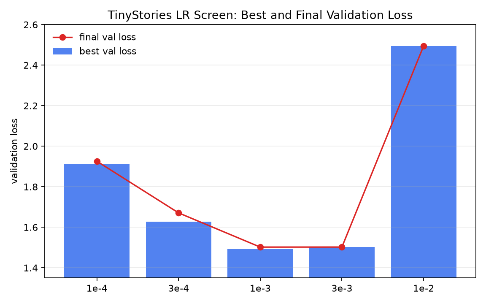
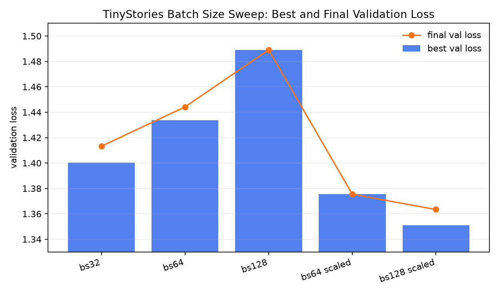
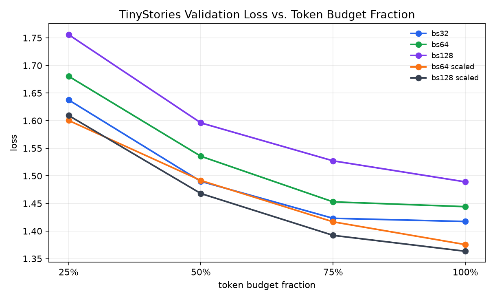
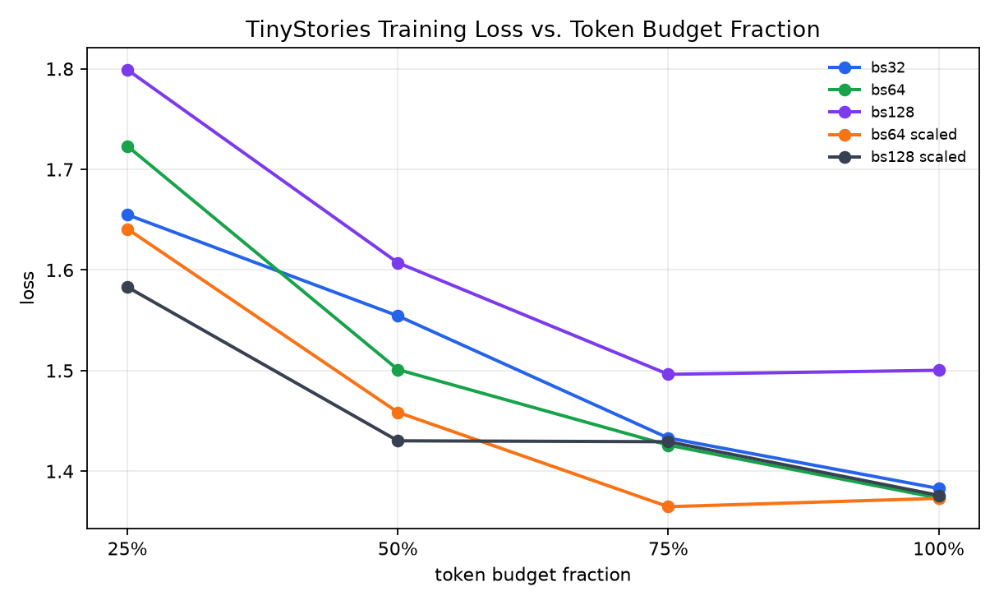
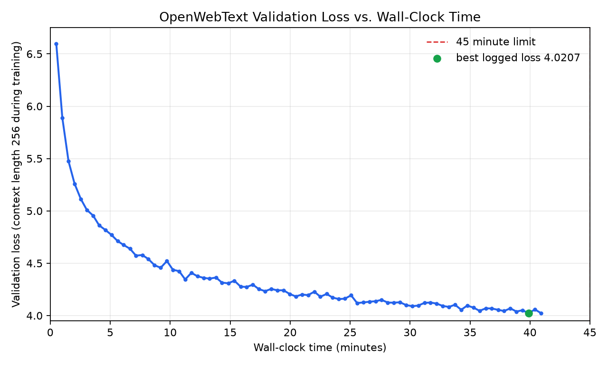
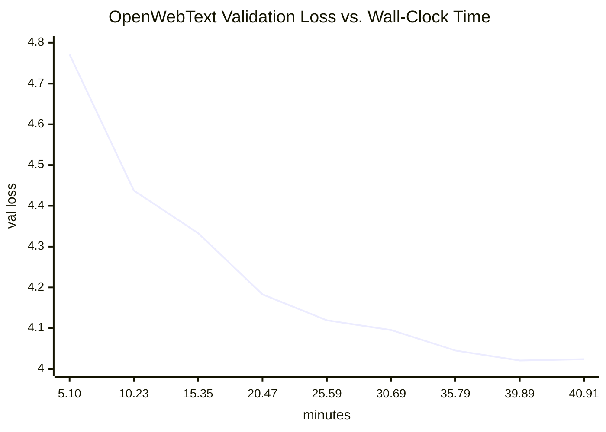
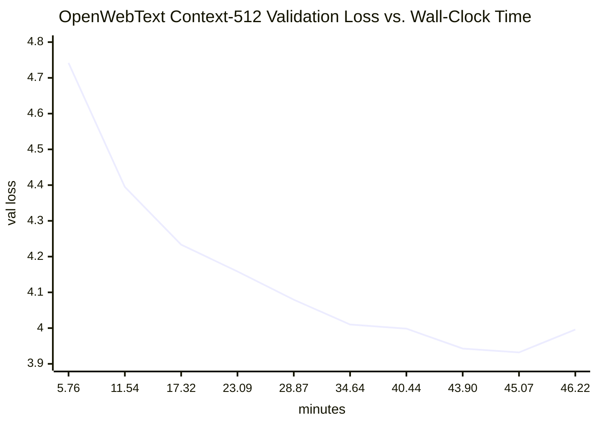
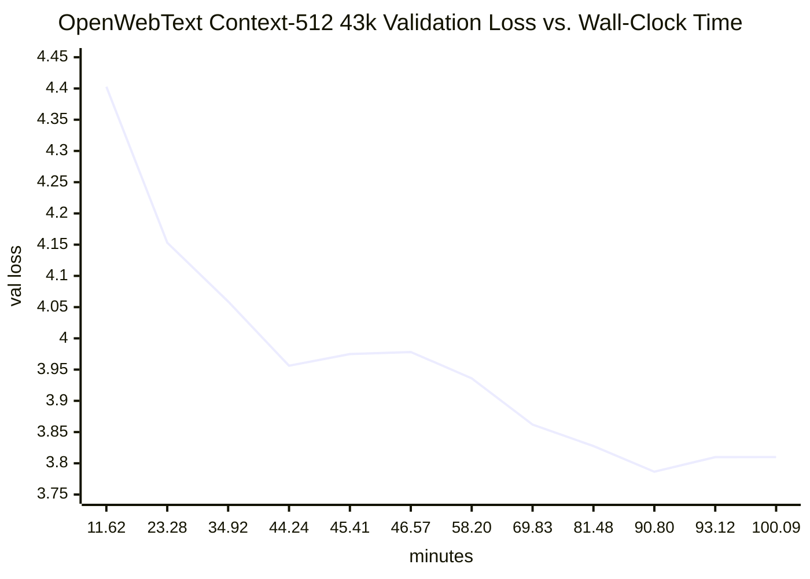

# AML Experiment Plan: TinyStories Transformer

This document is the running plan and report for the CS336 Assignment 1 TinyStories
training experiments on Azure ML. The goals are to tune the learning rate, vary
batch size, collect learning curves in the AML Metrics tab, generate sample text
from the best checkpoint, and run the required structural ablations without
disturbing the baseline implementation.

## Current Baseline

Baseline configuration:

| Setting | Value |
| --- | --- |
| Vocab size | 10,000 |
| Context length | 256 |
| `d_model` | 512 |
| `d_ff` | 1344 |
| Layers | 4 |
| Heads | 16 |
| RoPE theta | 10,000 |
| Batch size | 32 |
| Max iterations | 40,000 |
| Tokens processed | 327,680,000 |
| Max LR | 3e-4 |
| Min LR | 3e-5 |
| Warmup | 1,000 iterations |
| Weight decay | 0.01 |

Completed baseline run:

| Run | Final val loss | Final val ppl | Notes |
| --- | ---: | ---: | --- |
| `nifty_wheel_60w7xkssmw` | 1.4251 | 4.16 | Completed 40k iterations; best visible eval was about 1.3909 / 4.02. |
| `sweet_quince_8l0ndwyylm` | TBD | TBD | Metrics-enabled rerun submitted as `cs336-transformer-tinystories-h100-basic-jSqCl`; currently running. |

The baseline already satisfies the assignment target of validation loss at most
1.45. The follow-up experiments are for learning curves, hyperparameter evidence,
and generation quality.

## Metrics To Collect

New AML submissions use `job.metrics_backend: "azureml"`, so the run should show
these metrics in the Azure ML Metrics tab through the native Azure ML run context:

| Metric | Meaning |
| --- | --- |
| `train_loss` | Training loss at each logging interval. |
| `val_loss` | Validation loss at each evaluation interval. |
| `val_ppl` | Validation perplexity at each evaluation interval. |
| `learning_rate` | Active cosine-scheduled learning rate. |
| `elapsed_seconds` | Runtime progress from inside the training loop. |
| `checkpoint_iteration` | Iteration when `outputs/checkpoint.pt` was saved. |
| `final_val_loss` | Final validation loss after training. |
| `final_val_ppl` | Final validation perplexity after training. |

For each run, record:

| Run | Config change | Status | Best val loss | Final val loss | Final val ppl | Runtime | Notes |
| --- | --- | --- | ---: | ---: | ---: | --- | --- |
|  |  |  |  |  |  |  |  |

## Phase 1: Learning Rate Sweep

Question from the assignment: find learning rates that work, include at least one
divergent run, and explain how divergence relates to the best learning rate.

Keep these fixed for the sweep:

| Setting | Value |
| --- | --- |
| Batch size | 32 |
| Context length | 256 |
| Warmup | 1,000 iterations |
| Weight decay | 0.01 |
| Model shape | Baseline model |

Use a two-stage sweep:

1. Short screening runs, enough to see stability and early validation trend.
2. Full 40k-token-budget runs for the best one or two learning rates.

Suggested short screening runs:

| Run label | `max_lr` | `min_lr` | `max_iters` | `cosine_cycle_iters` | Expected outcome |
| --- | ---: | ---: | ---: | ---: | --- |
| `lr_1e-4_short` | 1e-4 | 1e-5 | 10,000 | 10,000 | Stable but likely slower learning. |
| `lr_2e-4_short` | 2e-4 | 2e-5 | 10,000 | 10,000 | Stable candidate. |
| `lr_3e-4_short` | 3e-4 | 3e-5 | 10,000 | 10,000 | Baseline candidate. |
| `lr_5e-4_short` | 5e-4 | 5e-5 | 10,000 | 10,000 | Higher-risk candidate. |
| `lr_1e-3_short` | 1e-3 | 1e-4 | 10,000 | 10,000 | Likely edge-of-stability or divergent. |

Submitted first screening batch:

| Run | Display name | Config | `max_lr` | Status | Notes |
| --- | --- | --- | ---: | --- | --- |
| `cyan_office_vvg3sytpy9` | `cs336-lr-1e-4-short-riKfo` | `training/aml/tinystories_lr_1e-4_short.yaml` | 1e-4 | Completed | Conservative low-LR screen. |
| `honest_lemon_mhplxq1sz6` | `cs336-lr-3e-4-short-OsGcM` | `training/aml/tinystories_lr_3e-4_short.yaml` | 3e-4 | Completed | Baseline LR short screen. |
| `olive_pillow_jrt4mwb4cc` | `cs336-lr-1e-3-short-TXeTQ` | `training/aml/tinystories_lr_1e-3_short.yaml` | 1e-3 | Completed | High-LR probe; stable, not divergent. |
| `cyan_cart_w00177qq62` | `cs336-lr-3e-3-short-dI6G0` | `training/aml/tinystories_lr_3e-3_short.yaml` | 3e-3 | Completed | Aggressive follow-up; stable, not divergent. |
| `upbeat_lock_54rymc868v` | `cs336-lr-1e-2-short-lcNiA` | `training/aml/tinystories_lr_1e-2_short.yaml` | 1e-2 | Completed | Stable numerically, but degraded loss badly. |

Short-run comparison from downloaded AML logs:

| Run | `max_lr` | Max iters | First val loss | Best val loss | Final val loss | Final val ppl | Runtime | Stability |
| --- | ---: | ---: | ---: | ---: | ---: | ---: | ---: | --- |
| `cyan_office_vvg3sytpy9` | 1e-4 | 10,000 | 4.2007 | 1.9102 | 1.9257 | 6.86 | 460.1s | Stable but slowest learning. |
| `honest_lemon_mhplxq1sz6` | 3e-4 | 10,000 | 3.3341 | 1.6272 | 1.6709 | 5.32 | 458.6s | Stable baseline LR. |
| `olive_pillow_jrt4mwb4cc` | 1e-3 | 10,000 | 2.7654 | 1.4913 | 1.5021 | 4.49 | 454.9s | Stable and best short-run LR. |
| `cyan_cart_w00177qq62` | 3e-3 | 10,000 | 2.5214 | 1.5023 | 1.5023 | 4.49 | 554.1s | Stable; no divergence, slightly worse than 1e-3. |
| `upbeat_lock_54rymc868v` | 1e-2 | 10,000 | 2.7691 | 2.4947 | 2.4947 | 12.12 | 465.5s | No NaNs, but far outside useful LR range. |
| `sweet_quince_8l0ndwyylm` | 3e-4 | 40,000 | 3.3044 | 1.4004 | 1.4132 | 4.11 | 1825.8s | Stable full baseline. |



Interpretation: at this model size and 10k-step screening budget, higher LR
improved early learning substantially. The 1e-4 run was stable but underfit the
short budget; 3e-4 was much better; 1e-3 was best; 3e-3 remained stable but did
not improve over 1e-3; and 1e-2 did not produce NaNs but degraded badly. Because
the assignment asks for at least one divergent run, any strict loss-explosion
probe would need to be more aggressive than `max_lr=1e-2`, such as `3e-2`.

Escalate the best two short runs to full budget:

| Run label | `max_lr` | `min_lr` | `batch_size` | `max_iters` | Tokens |
| --- | ---: | ---: | ---: | ---: | ---: |
| `lr_best_full` | TBD | TBD | 32 | 40,000 | 327,680,000 |
| `lr_runner_up_full` | TBD | TBD | 32 | 40,000 | 327,680,000 |

Report notes to write after runs:

- Which learning rate reached the lowest validation loss?
- Which learning rate diverged or became unstable?
- Did the best learning rate sit below the first clearly unstable rate?
- Did a lower learning rate improve more slowly but more smoothly?

## Phase 2: Batch Size Variation

Question from the assignment: vary batch size from small to near the GPU memory
limit, include typical values such as 64 and 128, and discuss impact on training.

To keep total tokens processed approximately fixed, use:

```text
max_iters = 327,680,000 / (batch_size * 256)
```

Suggested runs:

| Run label | Batch size | Max iters | Tokens processed | LR plan |
| --- | ---: | ---: | ---: | --- |
| `bs_16` | 16 | 80,000 | 327,680,000 | Use best LR or slightly lower if unstable. |
| `bs_32` | 32 | 40,000 | 327,680,000 | Baseline / best LR. |
| `bs_64` | 64 | 20,000 | 327,680,000 | Start with best LR; optionally retune. |
| `bs_128` | 128 | 10,000 | 327,680,000 | Try if memory allows; retune LR if needed. |

Submitted first batch-size runs:

| Run | Display name | Config | Batch size | Max iters | Status | Notes |
| --- | --- | --- | ---: | ---: | --- | --- |
| `sweet_quince_8l0ndwyylm` | `cs336-transformer-tinystories-h100-basic-jSqCl` | `training/aml/tinystories_h100_basic.yaml` | 32 | 40,000 | Completed | Baseline comparison point. |
| `helpful_prune_8z4yxx70r8` | `cs336-bs-64-pVlMr` | `training/aml/tinystories_bs_64.yaml` | 64 | 20,000 | Completed | Same token budget as baseline; modest quality drop. |
| `bold_vulture_1btmdqq51c` | `cs336-bs-128-Exiao` | `training/aml/tinystories_bs_128.yaml` | 128 | 10,000 | Completed | Same token budget as baseline; fastest but worse validation loss. |

Batch-size comparison from downloaded AML logs:

| Run | Batch size | Max iters | Tokens | Best val loss | Final val loss | Final val ppl | Runtime | Notes |
| --- | ---: | ---: | ---: | ---: | ---: | ---: | ---: | --- |
| `sweet_quince_8l0ndwyylm` | 32 | 40,000 | 327,680,000 | 1.4004 | 1.4132 | 4.11 | 1825.8s | Best validation quality. |
| `helpful_prune_8z4yxx70r8` | 64 | 20,000 | 327,680,000 | 1.4337 | 1.4442 | 4.24 | 1706.1s | Slightly faster, small quality drop. |
| `bold_vulture_1btmdqq51c` | 128 | 10,000 | 327,680,000 | 1.4891 | 1.4891 | 4.43 | 1616.0s | Fastest, largest quality drop. |

Interpretation: batch size 32 remains the best quality default at fixed token
budget, likely because it receives 40k optimizer updates. Batch size 64 is a
reasonable speed/quality compromise. Batch size 128 is viable and fastest, but
quality degrades noticeably under the same LR schedule and token budget. If a
large batch is preferred for throughput, retuning LR upward or changing the
schedule could be a follow-up, but the first controlled comparison favors batch
32 for quality.

LR-scaling follow-up to test that assumption:

| Run label | Config | Batch size | Max iters | `max_lr` | `min_lr` | Warmup | Status | Purpose |
| --- | --- | ---: | ---: | ---: | ---: | ---: | --- | --- |
| `keen_machine_r8h2z3s4jm` / `cs336-bs-64-lr-scaled-yBKBL` | `training/aml/tinystories_bs_64_lr_scaled.yaml` | 64 | 20,000 | 6e-4 | 6e-5 | 500 | Completed | Linear LR scaling improved final val loss to 1.3755. |
| `loving_leg_8qkg5smb8w` / `cs336-bs-128-lr-scaled-5lavL` | `training/aml/tinystories_bs_128_lr_scaled.yaml` | 128 | 10,000 | 1.2e-3 | 1.2e-4 | 250 | Completed | Linear LR scaling improved final val loss to 1.3634. |

Scaled-LR follow-up comparison:

| Run | Batch size | Max LR | Best val loss | Final val loss | Final val ppl | Runtime | Change vs same-batch unscaled |
| --- | ---: | ---: | ---: | ---: | ---: | ---: | --- |
| `helpful_prune_8z4yxx70r8` | 64 | 3e-4 | 1.4337 | 1.4442 | 4.24 | 1706.1s | Baseline bs64. |
| `keen_machine_r8h2z3s4jm` | 64 | 6e-4 | 1.3755 | 1.3755 | 3.96 | 1708.3s | Final val improved by 0.0687. |
| `bold_vulture_1btmdqq51c` | 128 | 3e-4 | 1.4891 | 1.4891 | 4.43 | 1616.0s | Baseline bs128. |
| `loving_leg_8qkg5smb8w` | 128 | 1.2e-3 | 1.3510 | 1.3634 | 3.91 | 1607.2s | Final val improved by 0.1257. |







Interpretation: the scaled-LR follow-ups strongly support the hypothesis that
the first large-batch runs underperformed mainly because the LR schedule was too
conservative for the larger batch sizes. With linear LR scaling, both large
batches beat the original batch-32 baseline on final validation loss, and batch
128 with `max_lr=1.2e-3` produced the best validation result among the batch-size
runs.

Practical summary: larger batches need a larger LR to learn fast enough per
optimizer update when the token budget is fixed. Increasing LR for small batches
is riskier because their gradients are noisier; a modest batch-32 probe such as
`max_lr=1e-3` is plausible, but very large values already hurt quality. For the
current report, the best observed batch-size setting is batch 128 with
`max_lr=1.2e-3`, with batch 64 and `max_lr=6e-4` as the more conservative
large-batch alternative.

GPU memory-limit fit probes:

These short runs are not quality comparisons. They are intended to bracket the
largest batch size that can complete forward/backward training at
`context_length=256` on the H100 instance. Each uses `max_iters=1000`,
`eval_every=100`, and `ckpt_every=100`.

| Run label | Config | Batch size | Max iters | Eval every | Checkpoint every | Status | Outcome |
| --- | --- | ---: | ---: | ---: | ---: | --- | --- |
| `heroic_owl_0n479k5wpp` / `cs336-bs-256-fit-eIiz8` | `training/aml/tinystories_bs_256_fit.yaml` | 256 | 1,000 | 100 | 100 | Completed | Fits. Final val loss 2.1555, final val ppl 8.63. |
| `plum_bag_nflv2nk5nh` / `cs336-bs-512-fit-hantK` | `training/aml/tinystories_bs_512_fit.yaml` | 512 | 1,000 | 100 | 100 | Completed | Fits. Final val loss 2.1037, final val ppl 8.20. |
| `elated_yuca_hrd3wytv79` / `cs336-bs-1024-fit-SHjx6` | `training/aml/tinystories_bs_1024_fit.yaml` | 1024 | 1,000 | 100 | 100 | Failed | CUDA OOM before training completed; PyTorch had allocated 73.91 GiB on a 79.18 GiB H100 and failed trying to allocate another 4.00 GiB. |

Conclusion: for this model and `context_length=256`, batch 512 is the largest
tested batch size that fits on the H100 configuration. Batch 1024 is beyond the
memory limit without additional memory-saving changes such as gradient
accumulation, activation checkpointing, mixed precision, or a smaller model.

Attention-memory scaling explains the batch 1024 OOM. This implementation
materializes the full attention score matrix and attention probability matrix in
`scaled_dot_product_attention`. For one layer, one such matrix has shape
`batch_size * num_heads * context_length * context_length`. With `num_heads=16`,
`context_length=256`, and fp32 tensors, one matrix costs:

```text
batch_size * 16 * 256^2 * 4 bytes
```

| Batch size | One attention matrix | Scores + probabilities per layer | Scores + probabilities across 4 layers | QKV activations per layer | Final logits |
| ---: | ---: | ---: | ---: | ---: | ---: |
| 32 | 0.12 GiB | 0.25 GiB | 1.00 GiB | 0.05 GiB | 0.31 GiB |
| 64 | 0.25 GiB | 0.50 GiB | 2.00 GiB | 0.09 GiB | 0.61 GiB |
| 128 | 0.50 GiB | 1.00 GiB | 4.00 GiB | 0.19 GiB | 1.22 GiB |
| 256 | 1.00 GiB | 2.00 GiB | 8.00 GiB | 0.38 GiB | 2.44 GiB |
| 512 | 2.00 GiB | 4.00 GiB | 16.00 GiB | 0.75 GiB | 4.88 GiB |
| 1024 | 4.00 GiB | 8.00 GiB | 32.00 GiB | 1.50 GiB | 9.77 GiB |

For example, the batch-256 row is computed as follows:

```text
one attention matrix
= batch_size * num_heads * context_length * context_length * bytes_per_value
= 256 * 16 * 256 * 256 * 4 bytes
= 268,435,456 fp32 values * 4 bytes
= 1,073,741,824 bytes
= 1.00 GiB

scores + probabilities per layer
= 1.00 GiB for scores + 1.00 GiB for softmax probabilities
= 2.00 GiB

scores + probabilities across 4 layers
= 2.00 GiB per layer * 4 layers
= 8.00 GiB
```

The failed batch-1024 log reported `torch.cuda.OutOfMemoryError` while trying to
allocate another `4.00 GiB`, matching exactly one fp32 attention matrix at
`batch_size=1024`. The full training footprint is larger than this table because
autograd also saves intermediate activations, gradients, optimizer state, model
parameters, and temporary buffers.

Report notes to write after runs:

- Does larger batch size reduce runtime per token?
- Does larger batch size reach the same validation loss with fewer optimizer
  steps?
- Is the best validation loss better, worse, or similar after controlling for
  total tokens?
- Which batch size is the best practical default for this implementation?

## Phase 3: Generation Evaluation

Use the best checkpoint from the learning-rate and batch-size experiments.
Generation samples are saved in `docs/generation_samples.md`. The run used the
downloaded batch-128 scaled-LR checkpoint.

Completed decoding settings:

| Run label | Temperature | Top-p | Seed | Notes |
| --- | ---: | ---: | --- |
| `greedy` | 0.0 | none | 11 | Very coherent and safe; generic but well-formed TinyStories-style output. |
| `t0.8_p0.9` | 0.8 | 0.9 | 12 | Conservative fluent sample; coherent repair-story structure. |
| `t1.0_p0.9` | 1.0 | 0.9 | 13 | More varied and still mostly coherent; one odd mosquito/ball interaction. |
| `t1.1_p0.95` | 1.1 | 0.95 | 14 | More diverse but less grounded; semantic drift around the magic pencil, ball, school, and microscope. |

Qualitative notes:

- The outputs strongly resemble TinyStories style: simple vocabulary, short
  sentences, child protagonist, small conflict, resolution, and `<|endoftext|>`.
- Greedy and `temperature=0.8, top_p=0.9` are the most coherent. They are also
  the most generic.
- `temperature=1.0, top_p=0.9` improves variety while staying readable, but has
  small causal oddities.
- `temperature=1.1, top_p=0.95` increases diversity but drifts semantically; it
  is less suitable as the default decoding setting.
- Best practical generation setting from these samples: `temperature=0.8,
  top_p=0.9` for reliable fluency, or `temperature=1.0, top_p=0.9` when a little
  more variety is desired.

## Phase 4: Structural Ablation Implementation Plan

The structural experiments should not rewrite the main baseline implementation.
The default `transformer_lm` constructor and current training path should continue
to instantiate the baseline pre-norm RoPE SwiGLU model unless an explicit feature
flag asks for a variant.

Implementation guardrails:

| Concern | Plan |
| --- | --- |
| Baseline compatibility | Keep default CLI flags equal to the current model: pre-norm, RMSNorm enabled, RoPE enabled, SwiGLU FFN. |
| Test stability | Do not change behavior used by existing unit tests unless the test explicitly targets a variant. |
| Variant selection | Add explicit flags such as `--norm_mode`, `--position_encoding`, and `--ffn_type`. |
| Code organization | Use separate helper functions or variant classes rather than editing the baseline forward pass in place. |
| Run metadata | Log variant flags as AML metrics/params so each learning curve is unambiguous. |
| Checkpoint safety | Include variant settings in the run label and report table, because variant checkpoints may not be interchangeable. |

Suggested feature flags:

| Flag | Baseline value | Ablation values | Purpose |
| --- | --- | --- | --- |
| `--norm_mode` | `pre` | `none`, `post` | Controls RMSNorm placement/removal. |
| `--position_encoding` | `rope` | `none` | Controls RoPE vs. NoPE. |
| `--ffn_type` | `swiglu` | `silu` | Controls gated SwiGLU vs. ungated SiLU FFN. |
| `--variant_label` | `baseline` | Experiment-specific label | Makes AML display names and checkpoint names easier to track. |

Suggested code shape for a later implementation:

| Component | Suggested isolation |
| --- | --- |
| Model construction | Add a `build_transformer_model(args, device)` factory that selects baseline or variants. |
| Attention | Add `run_attention(..., position_encoding="rope")`; call existing RoPE attention for baseline and no-RoPE attention for NoPE. |
| Normalization | Add separate pre-norm, post-norm, and no-norm block variants, or a small block factory. |
| Feed-forward | Keep `swiglu` unchanged; add a separate `silu_ffn` module for the ablation. |
| YAML config | Add variant fields under `model:` or `experiment:` and pass them through the AML submit command. |

Recommended implementation order:

1. Add flags and logging first, with defaults matching the current baseline.
2. Add the NoPE path using the already existing non-RoPE attention function.
3. Add the SiLU FFN as a separate module with `d_ff = 4 * d_model` for matched parameter count.
4. Add no-norm and post-norm block variants last, because they have the highest stability risk.
5. Run a tiny local smoke test for each variant before spending AML GPU time.

Smoke-test checklist before each cloud run:

| Check | Expected result |
| --- | --- |
| `py_compile` | No syntax errors. |
| One local forward pass | Logits shape is `(batch, context, vocab_size)`. |
| One train step | Loss is finite and gradients are finite. |
| Short AML dry run command | Command contains the intended flags and run label. |

## Phase 5: RMSNorm And Norm Placement Ablations

Assignment questions:

- What happens when all RMSNorms are removed at the previous best learning rate?
- Can stability be recovered by lowering the learning rate?
- How does post-norm compare with the current pre-norm baseline?

Keep the baseline implementation as `--norm_mode pre`. Add variants only behind
`--norm_mode none` and `--norm_mode post`.

Suggested runs:

| Run label | `norm_mode` | Max LR | Min LR | Max iters | Expected outcome |
| --- | --- | ---: | ---: | ---: | --- |
| `norm_pre_baseline` | `pre` | Best LR | Best min LR | 10,000 or 40,000 | Reference learning curve. |
| `norm_none_best_lr` | `none` | Best LR | Best min LR | 10,000 | Tests whether removing RMSNorm destabilizes training. |
| `norm_none_low_lr` | `none` | 0.3x best LR | 0.3x best min LR | 10,000 | Recovery run if the best LR diverges. |
| `norm_post_best_lr` | `post` | Best LR | Best min LR | 10,000 | Tests post-norm stability at baseline LR. |
| `norm_post_low_lr` | `post` | 0.3x best LR | 0.3x best min LR | 10,000 | Recovery run if post-norm is unstable. |

Escalate only the best stable no-norm and post-norm runs to longer runs if the
short learning curves are meaningful. For the report, compare learning curves
against the pre-norm baseline at the same token budget.

Report notes to write after runs:

- Did removing RMSNorm diverge, plateau, or simply learn more slowly?
- Was a lower learning rate enough to make the no-norm model train?
- Did post-norm require a lower learning rate than pre-norm?
- Which norm choice gave the best stability-to-speed tradeoff?

## Phase 6: Position Encoding Ablation

Assignment question: compare the current RoPE model with NoPE, where no explicit
position information is applied.

Keep the baseline implementation as `--position_encoding rope`. Add NoPE only
behind `--position_encoding none`. For implementation, prefer calling the existing
non-RoPE multi-head attention helper rather than threading conditionals through
the RoPE helper.

Suggested runs:

| Run label | `position_encoding` | Max LR | Min LR | Max iters | Notes |
| --- | --- | ---: | ---: | ---: | --- |
| `pos_rope_baseline` | `rope` | Best LR | Best min LR | 10,000 or 40,000 | Reference curve. |
| `pos_nope_short` | `none` | Best LR | Best min LR | 10,000 | First NoPE comparison. |
| `pos_nope_full` | `none` | Best stable LR | Best stable min LR | 40,000 | Run if short curve is stable. |

Report notes to write after runs:

- How much validation loss is lost or gained by removing RoPE?
- Does NoPE learn more slowly early in training?
- Is NoPE coherent during generation, especially over longer contexts?
- Does the result support the idea that causal attention can infer position information implicitly on TinyStories?

## Phase 7: SwiGLU Vs. SiLU FFN Ablation

Assignment question: compare the current gated SwiGLU feed-forward network with
an ungated SiLU feed-forward network while approximately matching parameter count.

Keep the baseline implementation as `--ffn_type swiglu`. Add a separate `silu_ffn`
module for `--ffn_type silu`; do not modify the existing `swiglu` module. For the
SiLU variant, use `d_ff = 4 * d_model` unless a later memory test requires a
smaller value.

Suggested runs:

| Run label | `ffn_type` | `d_ff` | Max LR | Max iters | Notes |
| --- | --- | ---: | ---: | ---: | --- |
| `ffn_swiglu_baseline` | `swiglu` | 1344 | Best LR | 10,000 or 40,000 | Reference curve. |
| `ffn_silu_short` | `silu` | 2048 | Best LR | 10,000 | Parameter-matched ablation screen. |
| `ffn_silu_low_lr` | `silu` | 2048 | 0.5x best LR | 10,000 | Stability follow-up if needed. |
| `ffn_silu_full` | `silu` | 2048 | Best stable LR | 40,000 | Longer comparison if short run is useful. |

Report notes to write after runs:

- Does SwiGLU outperform SiLU at similar parameter count?
- Does the ungated SiLU FFN train stably with the same learning rate?
- Is the gap visible early, or only after longer training?
- Does generation quality differ even when validation losses are close?

## Phase 8: OpenWebText Main Experiment

Assignment question: train on OpenWebText with the same model architecture and
total training iterations as TinyStories, then interpret the losses.

Completed runs:

| Run ID | Display name | Dataset | Vocab | Batch size | Max iters | Max LR | Runtime | Best val loss | Final val loss | Final val ppl | Status |
| --- | --- | --- | ---: | ---: | ---: | ---: | ---: | ---: | ---: | ---: | --- |
| `orange_camel_9jgt9nv15m` | `cs336-owt-h100-basic-DVj5J` | OpenWebText | 32,000 | 32 | 40,000 | 3e-4 | 2454.5s / 40.91m | 4.0207 | 4.0239 | 55.92 | Completed |
| `kind_crayon_rwxzg555zv` | `cs336-owt-h100-ctx512-ywQ7r` | OpenWebText | 32,000 | 32 | 20,000 | 6e-4 | 2773.3s / 46.22m | 3.9320 | 3.9960 | 54.38 | Completed |
| `hungry_kitchen_73m4w3vd00` | `cs336-owt-h100-ctx512-43k-Xv3Zh` | OpenWebText | 32,000 | 32 | 43,000 | 6e-4 | 6005.6s / 100.09m | 3.7865 | 3.7975 | 44.59 | Completed |

All OWT runs used the TinyStories baseline architecture, with the vocabulary
size changed to 32,000 for the OWT tokenizer. The first run trained/evaluated at
context length 256. The second run trained/evaluated natively at context length
512 for leaderboard alignment with the same token count as the context-256 run:

```text
32 * 40,000 * 256 = 32 * 20,000 * 512 = 327,680,000 tokens
```

The 43k context-512 follow-up was a longer leaderboard-style iteration-count
probe. It processed `704,512,000` tokens and improved the best overall loss, but
it took about `100.09` H100 minutes, so it is not a strict 45-minute H100 result.

Learning curve points from the downloaded AML log:

Context-256 run:



| Iteration | Wall-clock minutes | Val loss | Val ppl |
| ---: | ---: | ---: | ---: |
| 5,000 | 5.10 | 4.7711 | 118.04 |
| 10,000 | 10.23 | 4.4374 | 84.55 |
| 15,000 | 15.35 | 4.3330 | 76.17 |
| 20,000 | 20.47 | 4.1829 | 65.56 |
| 25,000 | 25.59 | 4.1194 | 61.52 |
| 30,000 | 30.69 | 4.0955 | 60.07 |
| 35,000 | 35.79 | 4.0453 | 57.13 |
| 39,000 | 39.89 | 4.0207 | 55.74 |
| 40,000 | 40.91 | 4.0239 | 55.92 |



Context-512 run:


| Iteration | Wall-clock minutes | Val loss | Val ppl |
| ---: | ---: | ---: | ---: |
| 2,500 | 5.76 | 4.7418 | 114.64 |
| 5,000 | 11.54 | 4.3947 | 81.02 |
| 7,500 | 17.32 | 4.2334 | 68.95 |
| 10,000 | 23.09 | 4.1584 | 63.97 |
| 12,500 | 28.87 | 4.0795 | 59.11 |
| 15,000 | 34.64 | 4.0101 | 55.15 |
| 17,500 | 40.44 | 3.9985 | 54.52 |
| 19,000 | 43.90 | 3.9428 | 51.56 |
| 19,500 | 45.07 | 3.9320 | 51.01 |
| 20,000 | 46.22 | 3.9960 | 54.38 |



Context-512 43k follow-up:


The first attempt was interrupted after 4,900 iterations and retried by AML. The
table below uses the completed `retry_001` training attempt.

| Iteration | Wall-clock minutes | Val loss | Val ppl |
| ---: | ---: | ---: | ---: |
| 5,000 | 11.62 | 4.4029 | 81.69 |
| 10,000 | 23.28 | 4.1532 | 63.64 |
| 15,000 | 34.92 | 4.0590 | 57.92 |
| 19,000 | 44.24 | 3.9562 | 52.26 |
| 19,500 | 45.41 | 3.9748 | 53.24 |
| 20,000 | 46.57 | 3.9782 | 53.42 |
| 25,000 | 58.20 | 3.9360 | 51.22 |
| 30,000 | 69.83 | 3.8620 | 47.56 |
| 35,000 | 81.48 | 3.8276 | 45.95 |
| 39,000 | 90.80 | 3.7865 | 44.10 |
| 40,000 | 93.12 | 3.8098 | 45.14 |
| 43,000 | 100.09 | 3.8100 | 45.15 |



Comparison to TinyStories:

| Dataset/run | Vocab | Best val loss | Final val loss | Final val ppl | Runtime | Notes |
| --- | ---: | ---: | ---: | ---: | ---: | --- |
| TinyStories baseline `sweet_quince_8l0ndwyylm` | 10,000 | 1.4004 | 1.4132 | 4.11 | 1825.8s | Simple, narrow story distribution. |
| TinyStories best scaled-batch `loving_leg_8qkg5smb8w` | 10,000 | 1.3510 | 1.3634 | 3.91 | 1607.2s | Best TinyStories validation result so far. |
| OpenWebText `orange_camel_9jgt9nv15m` | 32,000 | 4.0207 | 4.0239 | 55.92 | 2454.5s | Much broader web-text distribution. |
| OpenWebText ctx512 `kind_crayon_rwxzg555zv` | 32,000 | 3.9320 | 3.9960 | 54.38 | 2773.3s | Native context-512 run; best under 45m was 3.9428. |
| OpenWebText ctx512 43k `hungry_kitchen_73m4w3vd00` | 32,000 | 3.7865 | 3.7975 | 44.59 | 6005.6s | Longer H100 run; best under 45m was 3.9562. |

The OWT validation loss is much higher than TinyStories, but this does not mean
the training failed. OpenWebText contains broader topics, names, dates, URLs,
quotations, news prose, code-like fragments, and inconsistent formatting. The
same 45M-parameter model and 327.7M-token training budget are therefore spread
over a much harder distribution. TinyStories is narrow, repetitive, and designed
for simple story language, so the model can assign much sharper probabilities
after the same number of tokens.

OWT samples are saved in `docs/owt_generation_samples.md`. Qualitatively, the
model learned web/news style and can produce article-like paragraphs, but it is
less grounded than the TinyStories model. Greedy decoding loops on repeated
government/military phrases. Moderate nucleus sampling is more diverse and more
article-like, while high temperature produces citation-like clutter and factual
nonsense.

## Leaderboard Budget Note

The leaderboard rule asks for a run under `0.75` B200-hours, which the handout
equates to a learning curve with a wall-clock x-axis below 45 minutes. The
leaderboard README also says reported validation loss should be calculated with
`context_length=512`.

The 20k native context-512 run remains the strict H100-under-45-minute
leaderboard candidate. Its best validation loss before the 45-minute cutoff was
`3.9428` at `43.90` minutes. The absolute best logged loss was `3.9320`, but it
occurred at `45.07` minutes, just past the cutoff, so the budget-compliant
leaderboard number should be `3.9428`.

The 43k follow-up reached a better overall loss, `3.7865` at `90.80` minutes,
and finished at final validation loss `3.7975`. However, on this H100 run its
best validation loss before 45 minutes was `3.9562`, which is worse than the 20k
run's `3.9428`. The 43k result is useful evidence for what a faster B200-style
budget may support, but it should not replace the strict H100-under-45-minute
reported number unless rerun or validated under the target B200 budget.

This beats both the naive `5.0` baseline and the previous context-256 checkpoint
re-evaluation loss (`4.484289`). For the leaderboard PR, disclose the hardware,
wall-clock time, model size, context length `512`, and that the run used
`max_lr=6e-4`, `min_lr=6e-5`, and 20,000 iterations.

Artifacts prepared for submission:

- Context-256 learning curve image: `docs/figures/owt/owt_wallclock_learning_curve.png`
- Context-512 learning curve image: `docs/figures/owt/owt_ctx512_wallclock_learning_curve.png`
- Context-512 43k learning curve image: `docs/figures/owt/owt_ctx512_43k_wallclock_learning_curve.png`
- Draft PR/table text: `docs/leaderboard_submission_draft.md`

## AML Submission Workflow

For each experiment:

1. Copy `training/aml/tinystories_h100_basic.yaml` to a run-specific YAML, or edit
   the base YAML carefully.
2. Change `experiment.name_prefix` so the run name includes the experiment label.
3. Change only the intended hyperparameters.
  For structural ablations, also set only the intended variant flags, such as
  `norm_mode`, `position_encoding`, or `ffn_type`; keep omitted flags at their
  baseline defaults.
4. Submit from the repo root:

```powershell
uv run --with azure-ai-ml --with azure-identity --with pyyaml python training\aml\submit_transformer_train.py --config training\aml\tinystories_h100_basic.yaml
```

5. In AML Studio, collect `val_loss`, `val_ppl`, `train_loss`, `learning_rate`,
   runtime, and status.
6. Confirm the Metrics tab shows the variant params/flags for any structural
  ablation run.
7. Download or preserve `outputs/checkpoint.pt` for the best run.

## Report Template

Use this section as the final write-up.

### Learning Rate Sweep

| Run | Max LR | Min LR | Max iters | Best val loss | Final val loss | Status | Notes |
| --- | ---: | ---: | ---: | ---: | ---: | --- | --- |
| `cyan_office_vvg3sytpy9` | 1e-4 | 1e-5 | 10,000 | 1.9102 | 1.9257 | Completed | Stable but learned much more slowly. |
| `honest_lemon_mhplxq1sz6` | 3e-4 | 3e-5 | 10,000 | 1.6272 | 1.6709 | Completed | Stable baseline LR short run. |
| `olive_pillow_jrt4mwb4cc` | 1e-3 | 1e-4 | 10,000 | 1.4913 | 1.5021 | Completed | Stable and best short-run result. |
| `sweet_quince_8l0ndwyylm` | 3e-4 | 3e-5 | 40,000 | 1.4004 | 1.4132 | Completed | Full baseline comparison. |

Summary:

The 10k-step screen favored the highest tested LR, 1e-3, which reached final
validation loss 1.5021 without NaN/Inf or obvious loss explosion. The 3e-4
baseline was stable but slower, ending at 1.6709, while 1e-4 was clearly too
conservative for this short budget, ending at 1.9257. Since 1e-3 did not
diverge, the sweep has not yet identified the edge of stability; run a more
aggressive short probe such as 3e-3 before writing the final divergence analysis.

### Batch Size Experiment

| Run | Batch size | Max iters | Tokens | Best val loss | Runtime | Status | Notes |
| --- | ---: | ---: | ---: | ---: | --- | --- | --- |
|  |  |  |  |  |  |  |  |

Summary:

TODO: Explain how batch size affected speed, stability, and final validation loss.

### Generation

Prompt:

```text
TODO
```

Generated text:

```text
TODO
```

Commentary:

TODO: Briefly describe fluency and at least two factors that affected generation
quality.

### Structural Ablations

Use feature flags for these experiments so the baseline implementation remains
the default path.

#### RMSNorm And Norm Placement

| Run | `norm_mode` | Max LR | Max iters | Best val loss | Final val loss | Status | Notes |
| --- | --- | ---: | ---: | ---: | ---: | --- | --- |
|  |  |  |  |  |  |  |  |

Summary:

TODO: Explain whether no-norm or post-norm needed a lower learning rate, and how
their learning curves compare to pre-norm.

#### Position Encoding

| Run | `position_encoding` | Max LR | Max iters | Best val loss | Final val loss | Status | Notes |
| --- | --- | ---: | ---: | ---: | ---: | --- | --- |
|  |  |  |  |  |  |  |  |

Summary:

TODO: Explain the validation-loss and generation-quality impact of removing RoPE.

#### Feed-Forward Network

| Run | `ffn_type` | `d_ff` | Max LR | Max iters | Best val loss | Final val loss | Status | Notes |
| --- | --- | ---: | ---: | ---: | ---: | ---: | --- | --- |
|  |  |  |  |  |  |  |  |  |

Summary:

TODO: Explain whether SwiGLU outperformed parameter-matched SiLU and whether the
ungated FFN changed stability or generation quality.
