# Unicode and Encoding Summary

## Core Ideas

- Unicode defines characters and assigns each a code point (an integer ID), for example U+0041 for A.
- A code point is not the same thing as bytes on disk or network.
- Encoding is the rule that converts code points to bytes and back.
- Byte-level tokenization uses a fixed 256-symbol base vocabulary (byte values 0 to 255), which avoids out-of-vocabulary issues at the byte level.

## Why Encoding Is Needed (Not Just Storage)

- Systems store and transmit bytes, not abstract code points.
- You need a shared, unambiguous format so different systems decode the same bytes the same way.
- Encoding defines boundaries, validity rules, and error handling for byte streams.
- Different encodings trade off size, compatibility, and simplicity.

## UTF-8, UTF-16, UTF-32 (High-Level)

- UTF-8: 1 to 4 bytes per character, dominant on the web, very efficient for ASCII-heavy text.
- UTF-16: 2 or 4 bytes per character (surrogate pairs for some characters), common in some platform APIs.
- UTF-32: always 4 bytes per character, simplest conceptually, usually largest storage cost.

## Key Numeric Facts

- U+0041 is A, decimal 65.
- U+0073 is s, decimal 115.
- U+10FFFF is decimal 1114111 (max Unicode code point value).
- Unicode 17.0 (Sep 2025) reports 159801 assigned characters across 172 scripts.

## UTF-8 Prefix Rule (How Length Is Known)

- First byte pattern indicates total bytes:
  - 0xxxxxxx: 1 byte
  - 110xxxxx: 2 bytes
  - 1110xxxx: 3 bytes
  - 11110xxx: 4 bytes
- Continuation bytes are always 10xxxxxx.
- This is why decoding is unambiguous even though a short bit pattern could be a prefix of longer raw bits.

## Main Q and A From This Session

1. Q: What does __repr__() mean?
	A: It is the official developer-facing string representation of an object, typically unambiguous and useful for debugging. repr(obj) calls obj.__repr__().

2. Q: How can 4 bytes represent so many Unicode characters?
	A: 4 bytes give 2^32 possible values, far more than the number of assigned Unicode characters; a code point is just an integer ID.

3. Q: How many bytes is U+0073?
	A: A code point itself is an integer; bytes depend on encoding. U+0073 uses 1 byte in UTF-8, 2 in UTF-16, 4 in UTF-32.

4. Q: What is the integer value of 0x10FFFF?
	A: 1114111.

5. Q: Why not use code points directly and skip encoding?
	A: You still need a byte format for files/networks and cross-system agreement. Choosing that byte format is exactly what encoding is.

6. Q: Is encoding only for storage savings?
	A: No. It also ensures interoperability, clear byte boundaries, and valid decoding behavior.

7. Q: What does compact for ASCII-heavy text mean?
	A: In UTF-8, ASCII characters use 1 byte each, so English-like text is often smaller than UTF-16 or UTF-32.

8. Q: Why is U+007F one byte, and where are leading zeros?
	A: U+007F is value 127, binary 01111111, which fits in one byte. Leading zeros are implied by numeric notation, not stored as extra bytes.

9. Q: If 01111111 can be a prefix of longer bits, how is decoding safe?
	A: UTF-8 is parsed byte-by-byte with prefix rules. 0xxxxxxx is a complete single-byte character; continuation bytes must start with 10.

10. Q: Are first bits used to encode byte length?
	 A: Yes. UTF-8 leading bits are metadata for total length; remaining bits carry payload.

11. Q: Examples for each UTF-8 byte length?
	 A:
	 - 1-byte: A -> 41
	 - 2-byte: é -> C3 A9
	 - 3-byte: 你 -> E4 BD A0
	 - 4-byte: 🙂 -> F0 9F 99 82

12. Q: Any reason to use UTF-16 or UTF-32 rather than UTF-8?
	 A: Yes. UTF-16 can be useful for compatibility with platform/runtime APIs and can be smaller for some text mixes; UTF-32 can simplify fixed-width indexing and certain low-level algorithms, but costs more memory/bandwidth.

## Practical Takeaway For Tokenization

- Byte-level tokenization is robust because all text can always be represented as bytes 0 to 255.
- UTF-8 is usually preferred in modern pipelines due to ecosystem compatibility and good size efficiency on typical web text.

## When UTF-16 or UTF-32 Can Make Sense

- Use UTF-16 when existing systems/APIs already operate in UTF-16 and minimizing conversions is important.
- UTF-16 may be size-competitive for some corpora with many non-ASCII characters.
- Use UTF-32 when fixed-width code units simplify implementation (for example, direct code-point indexing).
- UTF-32 is typically the easiest to reason about internally but usually the worst for storage and bandwidth.
- For most NLP and web-scale text pipelines, UTF-8 remains the practical default.

## Python's bytes Type

- `bytes` is an immutable sequence of byte values (integers 0 to 255).
- Type: `type(b"hello")` -> `<class 'bytes'>`.
- Immutable: once created, individual elements cannot be changed.
- Indexing returns `int`: `b"ABC"[0]` -> `65` (not `b"A"`).
- Can be created three ways:
  - Byte literal: `b"hello"`
  - From integers: `bytes([65, 66, 67])`
  - From string encoding: `"hello".encode("utf-8")`
- Can be decoded back to `str`: `b"hello".decode("utf-8")` -> `"hello"`.
- Key relationship: encoding converts `str` -> `bytes`; decoding converts `bytes` -> `str`.

## GPT-Style Pre-Tokenization Regex (PAT)

- Pattern:
	- `'(?:[sdmt]|ll|ve|re)| ?\p{L}+| ?\p{N}+| ?[^\s\p{L}\p{N}]+|\s+(?!\S)|\s+`
- Purpose:
	- Split raw text into coarse chunks before BPE merges are learned.
	- Keep common contraction endings separate.
	- Attach a leading space to the following token when possible, which lets the tokenizer learn frequent tokens like ` the` or ` and`.

- Main alternatives, left to right:
	- `'(?:[sdmt]|ll|ve|re)`:
		matches common English contractions such as `'s`, `'d`, `'m`, `'t`, `'ll`, `'ve`, `'re`.
	- ` ?\p{L}+`:
		matches one optional leading space plus one or more Unicode letters.
	- ` ?\p{N}+`:
		matches one optional leading space plus one or more Unicode number characters.
	- ` ?[^\s\p{L}\p{N}]+`:
		matches one optional leading space plus one or more punctuation/symbol characters.
	- `\s+(?!\S)`:
		matches trailing whitespace, especially whitespace right before end of text.
	- `\s+`:
		matches any other remaining whitespace.

---

# BPE Tokenizer (Concepts)

How byte-level BPE is defined and *why* it is defined that way. The performance
sections below are about how to implement it fast; this section is about what the
algorithm actually does and the design choices behind it.

## 1. What BPE Produces

Training a BPE tokenizer produces two artifacts:

- **`vocab: dict[int, bytes]`** — a mapping from integer token ID to the raw bytes
  that token represents. The vocab always starts with:
  - **256 single-byte tokens** for byte values `0x00..0xFF` (ensures *every* byte
    sequence is encodable — no out-of-vocabulary at the byte level).
  - **Special tokens** like `<|endoftext|>` (added explicitly; never produced by
    merges).
  - **Merged tokens** — one new token per merge.
- **`merges: list[tuple[bytes, bytes]]`** — an *ordered* list of byte-pair merges,
  in the order they were learned. The order *is* the priority.

The relationship is exact:

```
len(vocab) = 256 + |special_tokens| + len(merges)
```

So for OpenWebText with `vocab_size=32000` and one special token,
`len(merges) = 32000 - 256 - 1 = 31743`.

## 2. Training (Conceptual)

1. **Pre-tokenize** the corpus into "pre-tokens" (e.g. with the GPT regex). Each
   pre-token is converted into a sequence of single-byte tokens.
2. **Count adjacent byte pairs** across all pre-tokens (weighted by pre-token
   frequency).
3. **Pick the most frequent pair**, append it to `merges`, and add it as a new
   token in `vocab`.
4. **Apply that merge everywhere** — every adjacent occurrence of the pair becomes
   the new token. Update pair counts incrementally.
5. **Repeat** until `len(vocab) == vocab_size`.

The merges list is therefore "most frequent first," roughly. Each merge created
during training reflects a pattern that was statistically common in the corpus.

## 3. Encoding (Inference): Priority-Ordered Merges

Given a new pre-token, BPE encoding is **not** "find the longest matching vocab
token" and **not** "minimize total token count." It is:

> Repeatedly find the **lowest-indexed merge** (highest priority) that applies to
> any adjacent pair in the current symbol sequence, and apply it. Stop when no
> merge applies.

Pseudocode:

```python
def encode_pretoken(pre_token_bytes, merge_rank):
    symbols = [bytes([b]) for b in pre_token_bytes]
    while True:
        best_rank, best_idx = None, -1
        for i in range(len(symbols) - 1):
            r = merge_rank.get((symbols[i], symbols[i+1]))
            if r is not None and (best_rank is None or r < best_rank):
                best_rank, best_idx = r, i
        if best_rank is None:
            break
        symbols = symbols[:best_idx] + [symbols[best_idx] + symbols[best_idx+1]] + symbols[best_idx+2:]
    return symbols
```

**Worked example.** Vocab includes `b'th'`, `b'the'`; merges = `[(b't',b'h'),
(b' ',b'c'), (b' ',b'a'), (b'th',b'e'), (b' a',b't')]`. Pre-token `'the'` →
`[b't', b'h', b'e']`:

- Scan merges in order: #0 `(b't',b'h')` is present → apply → `[b'th', b'e']`.
- Scan again: #0–#2 not present, #3 `(b'th',b'e')` is present → apply →
  `[b'the']`. Done. → token ID `9`.

## 4. Why Priority-Ordered (and Not "Longest Match")

Several segmentations might give valid token sequences. BPE specifically uses
priority-ordered merging because of one critical invariant:

> **Encoding must reproduce the same segmentation that training would have
> produced on this exact pre-token.**

The model's embeddings were trained on *that* segmentation. If you encode
differently at inference time, you feed the model token IDs it never saw together
during training, and quality drops.

Counter-example showing the rules disagree. Suppose merges =
`[(b'b',b'c'), (b'a',b'b')]`, vocab contains `b'ab'` and `b'bc'`, input is `b'abc'`:

| Strategy | Result | Reasoning |
|---|---|---|
| Longest-match left-to-right | `[b'ab', b'c']` | Greedy from left |
| Shortest-tokenization DP | tied at 2 tokens | Either segmentation |
| **BPE priority-ordered** ✓ | `[b'a', b'bc']` | Merge #0 `(b,c)` fires first |

Same length, different token IDs. Only the BPE-priority output matches training.

## 5. Why Merge at All

The compression benefit *is* real, and it is the practical reason BPE works:

- **Shorter sequences** — attention is O(n²) in sequence length; halving tokens
  per sentence is ~4× compute savings.
- **More text per context window** — a 2048-token window covers more characters.
- **Better learning signal** — the model sees `b'the'` as one unit rather than
  having to learn that `[t][h][e]` always co-occurs.

Minimum token count is a near-side-effect, not the formal objective. Because
merges were learned by frequency, common patterns become single tokens and the
resulting segmentations are usually close to minimal — but the algorithm
optimizes "reproducibility," not "compactness."

## 6. Domain Matters: Tokenizer ↔ Inference Data

Because the tokenizer encodes the *training distribution* of byte patterns,
mismatched domains cause two distinct problems:

1. **Compression drops.** A web-trained tokenizer fed Chinese text or chemistry
   formulas falls back to per-byte tokens (3–4 tokens per character), inflating
   sequence length 2–3×. Measure with **bytes-per-token**.
2. **Unfamiliar token IDs.** Even within "English," a sports article might
   trigger merges the model rarely saw, so its embeddings for those tokens are
   weak.

Common practice:

- **Broad mixed corpus** for the tokenizer (GPT-2: WebText; Llama: + code +
  multilingual).
- **Domain-specific tokenizers** for specialized models (CodeLlama, BioBERT).
- **Tokenizer extension**: add merges/tokens for a new domain, then continue
  pre-training the model with the extended embedding table (common in
  English → Chinese adaptation).

Rule of thumb: **train the tokenizer on data as similar as possible to what the
model will encode**. The expected per-corpus contrast on this assignment:

- **TinyStories tokenizer** — heavy on simple narrative vocabulary
  (`b' little'`, `b' said'`). Great on TinyStories, weak on news/code.
- **OpenWebText tokenizer** — broader (URLs, news terms, code fragments). Better
  general coverage, but "wastes" vocab capacity on TinyStories.

## 7. Special Tokens Are Never Produced by Merges

Special tokens like `<|endoftext|>` are added to `vocab` directly and are never
created by, or considered for, BPE merging. The training pipeline:

- **Splits documents on special-token boundaries** before pre-tokenization, so
  merge counts never cross a `<|endoftext|>`.
- **Tokenizes specials as a single unit** at encoding time, bypassing the
  byte-level merge loop. They must be matched in the input text *before* the
  pre-token regex runs.

This is what the assignment hint refers to: "The `<|endoftext|>` token is
handled as a special case before the BPE merges are applied."

---

# BPE Training: Key Performance Improvements

Lessons learned while optimizing a Python BPE tokenizer from **14.4 s → 0.77 s** on the
small fixture (`corpus.en`, vocab 500) and from **~10 min → target ~30 s** on TinyStories
(2 GB, vocab 10,000). Listed roughly in order of biggest impact for a typical
all-Python BPE implementation.

## 1. Pre-Tokenization: Parallelize with `multiprocessing.Pool`

- Pre-tokenization is **embarrassingly parallel** — split the corpus on a special-token
  boundary (e.g. `<|endoftext|>`), tokenize each chunk independently, merge `Counter`s
  at the end.
- Use `Pool.imap_unordered` for lazy result aggregation (lower memory than `map`).
- On Windows, the `if __name__ == '__main__':` guard is mandatory because workers are
  spawned (not forked).
- Use a `Pool` `initializer` to load the file handle / regex once per worker instead of
  re-importing on every task.
- **Skip the pool entirely for `num_workers == 1`** — pool startup costs ~3 s, which
  dominates on small fixtures.

## 2. Algorithmic: Incremental Pair-Count Updates (don't rebuild every iteration)

Naïve BPE merge rebuilds the entire `pair → count` dictionary from scratch every
iteration. With 9700 iterations on TinyStories, this is the **#1 bottleneck**.

Instead, during each merge: subtract the counts of the **old** pairs that disappeared
from the changed sequences, then add counts for the **new** pairs created by the merge.

| Approach           | TinyStories merge time |
|--------------------|-----------------------:|
| Full rebuild       | ~460 s                 |
| Incremental update | ~80–140 s              |

Implementation hint: use `defaultdict(int)` for the counts so missing keys auto-init to
0 when a merge creates a brand-new pair. Add **zero-cleanup** — if a count drops to ≤ 0,
delete the key, so the dict doesn't grow forever.

## 3. Algorithmic: Inverted Index `pair → {seq: count}`

Even with incremental updates, the merge loop still scans **all** ~700 K unique
sequences each iteration to find the ones touched by the max pair. Most are irrelevant.

Maintain an inverted index alongside the pair counts:

```python
pair_to_count: dict[(bytes, bytes), int]                              # for max selection
pair_to_seqs:  dict[(bytes, bytes), dict[tuple[bytes, ...], int]]     # nested inner dict
```

The inner dict stores `seq → count` so iterating `pair_to_seqs[max_pair].items()` gives
both the affected sequence **and** its count in one lookup — no second dict access.

Then `bpe_merge` only iterates `pair_to_seqs[max_pair]` — typically ~1 % of all
sequences. **Measured: 6× faster merge** on `corpus.en` (0.77 s → 0.13 s).

Invariants to maintain on every change:

- When a pair's count drops to ≤ 0: `del pair_to_count[pair]` (and ideally drop empty
  inner dicts in `pair_to_seqs` too).
- When a new merge creates a new pair: add it to both `pair_to_count` and
  `pair_to_seqs` in lockstep.
- The seq's count is **invariant** across merges — copy the same `seq_count` to the
  new seq entry. Do not `+=` on the inner dict for the same seq.

Watch out for: iterating `pair_to_seqs[max_pair]` while the inner loops mutate it.
Snapshot with `list(...)` first if the merge body removes entries from the same dict
you're iterating.

Memory cost: ~100–200 MB on TinyStories (storing pointers, not copies). Worth it.


## 4. Use `defaultdict` Instead of `dict.get()` + Assignment

```python
# Slow: 2 hash lookups + Python function call
d[key] = d.get(key, 0) + 1

# Fast: 1 hash lookup, all C-level
d[key] += 1            # with d = defaultdict(int)
```

In the BPE profile this dropped 5.6 M `dict.get()` calls (≈ 1.04 s) to 34 K (≈ 6 ms) —
a **170×** reduction at that call site.

## 5. Push Hot Loops Into C: Generator + `max()`

A hand-written "find the max pair" loop in Python runs ~8–12 bytecode dispatches per
iteration. Replacing it with a generator expression lets the comparison happen in C:

```python
# ~2–4× faster than a hand-written loop
max_count, max_pair = max((c, p) for p, c in pair_to_count.items())
```

Bonus: tuple comparison `(count, pair)` is lexicographic, so the BPE tie-breaking rule
("on equal counts, prefer the lexicographically larger pair") is free — no `elif`
branch needed.

Avoid `max(..., key=lambda)` — the lambda becomes a Python call per item and cancels
most of the win.

## 6. Cache `len()` Outside Hot Loops

`len()` is a C function but each call still pays Python-name-resolution + frame setup
overhead. In a tight inner loop running ~10 M times, this adds up to seconds.

```python
# Bad: len called every iteration
while i < len(seq) - 1: ...

# Good: hoist invariant
seq_len = len(seq)
while i < seq_len - 1: ...
```

Profiled impact: 13.5 M `len()` calls (1.28 s) → 10.2 M (0.95 s).

## 7. Don't Convert Tuples to Lists Just to Index

Tuples support `t[i]` indexing and iteration with the same `O(1)` complexity as lists.
The only thing they lack is **mutation**. A common reflex is `list(some_tuple)` —
which is a pure waste if you only read.

```python
# Bad: O(n) allocation + copy per call
seq = list(byte_seq_tuple)
while i < seq_len - 1:
    if seq[i] == ...

# Good: tuples are already indexable
while i < seq_len - 1:
    if byte_seq_tuple[i] == ...
```

At ~700 K sequences × 9700 iterations, that's roughly 7 billion fewer Python-level
copy operations.

## 8. Early-Exit `not in` Check Before Doing Real Work

For pairs of single bytes, `max_first not in byte_seq_tuple` short-circuits in C using
`PyObject_RichCompareBool`. Interned single-byte `bytes` objects compare by identity
first, making this very fast.

```python
if max_first not in byte_seq_tuple or max_second not in byte_seq_tuple:
    # Most sequences don't contain the pair — skip the merge work entirely
    merged[byte_seq_tuple] += seq_count
    continue
```

Once you have an inverted index (Tip #3), this check becomes unnecessary because you
only iterate sequences known to contain the pair.

## 9. Local Aliases for Method Lookups in Tight Loops

```python
# Bad: attribute lookup every iteration
for x in items:
    result.append(x)

# Good: bind once
append = result.append
for x in items:
    append(x)
```

Small per-call savings, but in a 10 M-iteration loop it adds up.

## 10. Pre-allocate Single-Byte `bytes` Objects

`bytes([x])` allocates a new object each call. Build a 256-entry lookup table once:

```python
_BYTE_TABLE = [bytes([i]) for i in range(256)]
byte_seqs = [_BYTE_TABLE[x] for x in byte_list]
```

Bonus: subsequent `==` and `+` operations short-circuit via `is` on the cached objects.

## 11. Max-Heap with Lazy Deletion (Replace Full-Scan `max()`)

After the inverted index (#3) the bottleneck shifts to `bpe_find_max_freq` — every
iteration scans **all** pairs to find the maximum. With ~30 K active pairs over ~10 K
merges that's ~300 M comparisons.

A `heapq` max-heap reduces it to amortized O(log N) per lookup. The trick is that
`heapq` is a min-heap and BPE needs ties broken by lexicographically-larger pair, so
wrap entries in a class with a custom `__lt__`:

```python
class _PairHeapEntry:
    __slots__ = ('count', 'pair')   # ~30% faster attribute access; smaller objects

    def __init__(self, count, pair):
        self.count = count
        self.pair = pair

    def __lt__(self, other):
        # Invert: higher count → "smaller" in heap (pops first).
        if self.count != other.count:
            return self.count > other.count
        return self.pair > other.pair   # tie: larger pair pops first
```

### Lazy deletion pattern

Updating an arbitrary entry in a heap is O(N) — impractical. Instead:

- Push a **new** `_PairHeapEntry(new_count, pair)` every time a pair's count changes.
- Keep `pair_to_count` as the authoritative source of truth.
- At pop time, discard entries whose `count` doesn't match `pair_to_count[pair]`.

```python
def find_max_from_heap(counts, heap):
    while heap:
        top = heapq.heappop(heap)
        if top.count == counts.get(top.pair):   # fresh entry?
            return top.pair, top.count
        # stale — keep popping
    return None, None
```

### Critical: don't push when count drops to 0

When a pair disappears (count reaches 0), do **not** push to the heap. The entry would
be stale immediately and waste pop work later:

```python
counts[pair] -= seq_count
if counts[pair] <= 0:
    del counts[pair]
    # no push — pair is gone; future pops will detect via counts.get() == None
else:
    heapq.heappush(heap, _PairHeapEntry(counts[pair], pair))
```

### Build with `heapify`, not N pushes

Initial seeding is O(N) with `heapify`, vs O(N log N) with N successive `heappush`:

```python
heap = [_PairHeapEntry(c, p) for p, c in counts.items()]
heapq.heapify(heap)   # O(N) — uses sift-down on lower half of array
```

Profiled impact on TinyStories: `bpe_find_max_freq` dropped from **~113 s → ~2 s**
(60× speedup at that call site).

## 12. Encode Once Per Unique Token, Not Per Occurrence

A subtle but enormous waste in a tokenization hot loop:

```python
# Bad: encodes the SAME word to bytes millions of times
for m in regex_re.finditer(pat, segment):
    counts[m.group(0).encode('utf-8')] += 1
```

For TinyStories: ~10 K unique tokens but ~500 M total occurrences. That's
**~500 M calls to `.encode()`** producing ~500 M `bytes` objects identical to ones
just created. At ~200 ns per call, that's ~100 s of wasted work.

The fix: count as strings first, encode each **unique** string once at the end.

```python
# Good: ~10 K encode calls instead of ~500 M
str_counts = Counter()
for segment in segments:
    for tok in regex_re.findall(pat, segment):
        str_counts[tok] += 1
return Counter({s.encode('utf-8'): c for s, c in str_counts.items()})
```

This pattern generalizes whenever the value space is much smaller than the call count:
**don't repeatedly transform values you've already transformed**. Cache, batch, or
defer to the end.

## 13. `findall` vs `finditer` in Tight Loops

`finditer` returns `Match` objects; `findall` returns plain strings. When you only
need the matched substring (no positions, no groups), `findall` is **noticeably
faster** in a hot loop:

```python
# finditer path: per iteration
#   1. C: scan to next match
#   2. Python: alloc Match object (~100 bytes, GC-tracked)
#   3. Python: m.group(0) — method dispatch + slice
#   4. Python: Match becomes garbage
for m in regex_re.finditer(pat, segment):
    token = m.group(0)

# findall path: stays in C, builds list of strings directly
for token in regex_re.findall(pat, segment):
    ...
```

Even better, hand the list straight to `Counter.update()`, which uses a C helper
(`_count_elements`) that bumps dict slots without round-tripping through Python:

```python
str_counts.update(regex_re.findall(pat, segment))   # all C-level
```

### When NOT to switch to `findall`

- You need match positions (`.span()`) or groups → `finditer` is required.
- Memory pressure: `findall` materializes the whole list at once. For a 30 MB chunk
  with millions of tokens this is ~500 MB. Fine for batch tokenization, problematic
  for streaming.
- You want to short-circuit (`break` early) → `finditer` is lazy.

Typical speedup for the BPE tokenizer hot loop: **15–25 %** on top of the
encode-once-per-unique-token fix.


- Use `cProfile` for deterministic, function-level breakdowns. On Windows put the
  profiling call inside `if __name__ == '__main__':` so child processes don't recurse.
- For notebook profiling, use `%%prun -s cumulative -l 25`.
- For multiprocessing visibility (`cProfile` doesn't see child processes), use `py-spy
  record --subprocesses` to get a flamegraph that includes workers.
- Sort by **`cumtime`** first (where is time going overall?) then by **`tottime`**
  (which function itself is slow?).
- Look for high `ncalls` on built-ins like `len`, `dict.get` — those are micro-opt
  candidates. Look for high `tottime` on your own functions — those need algorithmic
  fixes.

## What NOT to Do

- **Don't** assume more workers always helps. Pool startup is ~3 s. For small inputs
  single-threaded wins.
- **Don't** rewrite hot loops in Python `for ... else`, list comprehensions over
  generators, etc., unless they replace a measurable bottleneck. Comprehensions are
  faster than `for + append`, but only by ~20 %.
- **Don't** use `Counter.most_common(1)` for BPE max selection — it doesn't apply the
  lexicographic tie-break.
- **Don't** keep a per-iteration `dict(counts)` cast on the return value. `defaultdict`
  is a `dict` subclass; callers can use it transparently and you save an O(N) copy
  every iteration.

## Cheat Sheet: From Slowest to Fastest Implementation

Measured on `tests/fixtures/corpus.en` (vocab 500, single-threaded, cProfile time):

| Stage                                                    | corpus.en time  | `bpe_merge` time |
|----------------------------------------------------------|----------------:|-----------------:|
| Naïve: rebuild pair counts from scratch each iter        | ~14.4 s         | dominant         |
| + `defaultdict`, cache `len`, tuple indexing, `not in`   | ~2.5 s          | 2.10 s           |
| + Incremental pair-count updates (in-place)              | ~1.02 s         | 0.77 s           |
| + Inverted index `pair → {seq: count}`                   | ~0.41 s         | 0.13 s           |
| + Max-heap with lazy deletion (Tip #11)                  | **~0.28 s**     | **0.10 s**       |

After the inverted index the bottleneck shifts from `bpe_merge` to `bpe_find_max_freq`
(~47 % of remaining time). The max-heap (Tip #11) addresses exactly that — on
TinyStories it dropped `bpe_find_max_freq` from ~113 s to ~2 s.

For the multiprocess pre-tokenization stage on TinyStories, the dominant remaining
cost is the per-token `.encode()` and `m.group(0)` overhead inside workers — see
Tips #12 and #13 for ~3× speedup of `bpe_pre_tokenize`.

## TinyStories End-to-End Status (current best on Windows, 4 workers)

`vocab_size=10000`, `<|endoftext|>` special token, 2 GB train file:

| Stage                                | Time     | Notes |
|--------------------------------------|---------:|-------|
| `bpe_pre_tokenize`                   | ~77 s    | After Tips #12/#13 (find_iter→`findall`, encode at end). Was 145 s before. |
| `bpe_pre_token_bytes_seqs_with_counts` | ~0.5 s   | Trivial. |
| Merge loop (9743 merges)             | ~33 s    | Dominated by heap maintenance (`__lt__`, stale `heappop`s). |
| **Total wall clock**                 | **~111 s** | Hint target was < 120 s — done. |

**Hot remaining costs** (from cProfile):

```
9743         bpe_find_max_freq_from_heap   19 s cumtime
2,097,884    heapq.heappop                 17 s cumtime   ← 215 stale pops/merge
9743         bpe_merge                     13 s cumtime
45,652,688   _PairHeapEntry.__lt__          8 s tottime   ← Python-level comparator
```

### Future improvement candidates (not applied — all under 2 min already)

1. **Tuple keys instead of `_PairHeapEntry`.** `_PairHeapEntry.__lt__` is invoked 45 M
   times via `heapq` callbacks; each is a Python method dispatch. Switching to tuple
   keys lets `heapq` use the C-level tuple comparator:
   ```python
   # max-heap key: (-count, INV(pair))
   # heappush(heap, (-count, INV(pair)))
   # On pop, compare with counts.get(pair) for staleness.
   ```
   The trick is encoding the BPE tie-break (larger pair wins). One option: precompute
   `INV(pair) = (~pair[0], ~pair[1])`, but bytes don't support `~`. Cleaner: store
   `(-count, neg_pair_key, pair)` where `neg_pair_key` is a sortable inversion (e.g.
   subtract from a sentinel). Estimate: trims ~6-8 s.

2. **Periodic heap compaction.** Heap grows to ~2 M entries while `counts` holds only
   ~30 K. Every ~500 merges, if `len(heap) > 4 * len(counts)`, rebuild:
   ```python
   heap = [_PairHeapEntry(c, p) for p, c in counts.items()]
   heapq.heapify(heap)
   ```
   Cuts the 2.1 M `heappop` calls (currently popping ~99 % stale) by ~70 %. Estimate:
   trims ~10 s.

3. **More workers + smaller chunks for `bpe_pre_tokenize`.** Currently 4 chunks, 4
   workers, ~500 MB each. With `num_workers=8` and `num_chunks = num_workers * 16`,
   memory pressure drops and load-balances better. Estimate: 77 s → ~40-50 s on a
   4-core / 8-thread machine.

4. **Pre-compile regex in `_init_worker`.** `regex_re.finditer(pat_str, segment)`
   does a cache lookup per segment. Compiling `_worker_token_re = regex_re.compile(pat)`
   in `_init_worker` and using `_worker_token_re.findall(segment)` saves the lookup.
   Estimate: 5-10 % of pre-tokenize time.

5. **Skip newline normalization on Linux-formatted files.** `chunk_data.replace(...)`
   does two full-string passes (~60 MB each on a 30 MB chunk × 4 workers). Guard with
   `if '\r' in chunk_data:` to skip when the file has only `\n`. Estimate: ~5 s on
   TinyStories (which is `\n`-only).

6. **`bpe_merge` micro-opts.** 13 s for 9743 merges = ~1.3 ms/call. The append loop
   that scans `byte_seq_tuple` for matches is Python-level. Could be faster with
   `bytes.find` on a packed representation, but readability suffers.

Apply 1+2 together first if pushing for sub-60 s. Apply 3+5 if reducing memory
footprint. Apply 4 only if it shows up in profile.

## Pool Cleanup on Windows (Side Quest)

`with multiprocessing.Pool(...)` calls `terminate()` on exit, which on Windows blocks
~150 s in `SemLock.acquire` waiting for child-process state cleanup. `close() + join()`
also blocks (just on the helper threads instead). Workaround: hand cleanup off to a
**daemon thread** so the main thread returns immediately:

```python
pool = Pool(...)
try:
    for r in pool.imap_unordered(work, items):
        ...
except BaseException:
    pool.terminate(); pool.join(); raise

def _cleanup(p): p.close(); p.join()
threading.Thread(target=_cleanup, args=(pool,), daemon=True).start()
return result
```

Daemon threads are killed when the interpreter exits, so leaked workers eventually
die. Acceptable for batch jobs (call `bpe_train` 1-3 times). Not acceptable for
long-running services.

This shaved ~150 s of misleading "function call" time off our profile, even though
the actual work was ~30 s the whole time — profile was attributing pool teardown to
`bpe_pre_tokenize` because that's the call site.


- Important regex pieces:
	- `\p{L}` means any Unicode letter.
	- `\p{N}` means any Unicode number.
	- `[^...]` means any character not in that set.
	- `(?:...)` is a non-capturing group.
	- `(?!...)` is a negative lookahead.

- Example idea:
	- `hello world` is often split more like `hello` and ` world` than `hello`, ` `, `world`.
	- `can't` is often split as `can` and `'t`.

- Python detail:
	- `\p{L}` and `\p{N}` are not supported by the built-in `re` module.
	- This pattern usually requires the third-party `regex` package instead of `re`.

## Byte-Level BPE and UTF-8 Validity

- `text.encode("utf-8")` returns bytes encoded with UTF-8, but a Python `bytes` object does not carry a built-in encoding label.
- `raw = text.encode("utf-8")` gives the byte stream; interpretation depends on how you later decode it (for example, UTF-8).
- Splitting bytes as `[bytes([x]) for x in raw]` creates one-byte tokens.
- One-byte tokens are not guaranteed to be valid standalone UTF-8 characters.
	- ASCII bytes can be valid single-byte UTF-8 characters.
	- Many non-ASCII characters require multiple bytes, so individual bytes are only partial pieces.
- Byte-level BPE learns merges over adjacent byte pieces and can create tokens that are not valid UTF-8 by themselves.
- This is expected behavior in byte-level tokenization.
- Correctness rule:
	- Individual tokens do not need to decode as UTF-8.
	- The concatenation of all token bytes must reproduce the original byte stream.
	- Decode after concatenation, not per token.


---

# Transformer (Concepts)

A reference map for the components we implement in
[cs336_basics/](cs336_basics/) and exercise via the adapters in
[tests/adapters.py](tests/adapters.py). Goal: connect the **math**, the **shapes**,
and the **PyTorch idioms** so the code reads as a direct transcription of the
formulas, not a maze.

## 1. The Decoder-Only Transformer in One Picture

```
input ids       (B, T)
  │
  ▼
Embedding       (B, T, D)
  │
  ▼  ──── ╮  N× TransformerBlock
          │    ├─ RMSNorm
          │    ├─ MultiHeadSelfAttention (causal, with RoPE)
          │    ├─ + residual
          │    ├─ RMSNorm
          │    ├─ SwiGLU FFN
          │    └─ + residual
  ▼  ──── ╯
RMSNorm         (B, T, D)
  │
  ▼
Linear (LM head, no bias, often tied with embedding)
                (B, T, V)   ← logits
  │
  ▼
softmax/CE      next-token probabilities
```

Symbols used throughout:

| Symbol | Meaning | Typical |
|---|---|---|
| `B` | batch size | 8–512 |
| `T` | sequence length | 256–8192 |
| `D` (d_model) | residual-stream width | 512–4096 |
| `H` | num attention heads | 8–32 |
| `d_k = D / H` | per-head dim | 64–128 |
| `d_ff` | FFN inner width | ~(8/3)·D for SwiGLU |
| `V` | vocab size | 10k–50k |
| `N` | num transformer blocks | 6–32 |

## 2. Building Blocks (in implementation order)

### 2.1 `Linear` (no bias)

`y = x @ W.T`, where `W` has shape `(out_features, in_features)`. Modern LMs
**omit bias** — RMSNorm cancels the mean-shift role bias used to play, and
removing bias saves params with no measurable quality loss.

```python
class Linear(nn.Module):
    def __init__(self, in_f, out_f):
        super().__init__()
        self.W = nn.Parameter(torch.empty(out_f, in_f))
        nn.init.trunc_normal_(self.W, std=(2.0 / (in_f + out_f)) ** 0.5)
    def forward(self, x):
        return x @ self.W.T
```

### 2.2 `Embedding`

A lookup table `(V, D)`. Forward = indexing. Initialized with truncated normal,
std ~ `1`. May be **tied** with the LM head (same weight) — common in small models.

### 2.3 `RMSNorm`

Layer-norm variant that drops the mean-centering:

$$\text{RMSNorm}(x) = \frac{x}{\sqrt{\text{mean}(x^2) + \varepsilon}} \cdot g$$

`g` is a learned per-feature scale of shape `(D,)`. Cheaper than LayerNorm
(no mean op, no bias), and empirically just as good for transformers.

**Precision tip:** compute in `float32` even if inputs are bf16/fp16 — the
sum-of-squares is what blows up in low precision. Cast back at the end.

### 2.4 `SiLU` and `SwiGLU` FFN

SiLU (a.k.a. Swish): `silu(x) = x * sigmoid(x)`.

SwiGLU FFN replaces the classic `Linear → GELU → Linear` with a **gated** variant:

$$\text{SwiGLU}(x) = (\,\text{SiLU}(xW_1) \;\odot\; xW_3\,)\,W_2$$

Three Linear layers (`W1`, `W2`, `W3`), no bias. The gate `xW_3` modulates the
activation `SiLU(xW_1)` element-wise. Because of the gate, set
`d_ff ≈ (8/3)·D` (rounded to multiples of 64) instead of `4·D` to keep parameter
count comparable to a standard FFN.

### 2.5 Scaled Dot-Product Attention

The kernel everything builds on:

$$\text{Attention}(Q,K,V) = \text{softmax}\!\left(\frac{QK^\top}{\sqrt{d_k}} + M\right) V$$

- `Q, K, V` shapes: `(..., T, d_k)`. The `...` dims are typically `(B, H)`.
- `M` is the **causal mask**: `0` where attention is allowed, `-inf` where it
  must be masked. For autoregressive LMs, `M[i, j] = -inf if j > i else 0`.
- The `1/√d_k` scaling keeps the pre-softmax variance roughly constant as `d_k`
  grows; without it softmax saturates to one-hot for large `d_k`.

PyTorch one-liner (for reference, but we write it ourselves):
`F.scaled_dot_product_attention(q, k, v, is_causal=True)`.

### 2.6 RoPE (Rotary Position Embedding)

Position info is injected into `Q` and `K` (not `V`) by rotating consecutive
pairs of dimensions by an angle that depends on token position `t` and dim
index `i`:

$$\theta_{t, i} = t \cdot \Theta^{-2i/d_k}, \quad \Theta \approx 10000$$

For each pair of features `(x_{2i}, x_{2i+1})`, apply a 2-D rotation:

$$\begin{pmatrix} x'_{2i} \\ x'_{2i+1} \end{pmatrix} = \begin{pmatrix} \cos\theta & -\sin\theta \\ \sin\theta & \cos\theta \end{pmatrix} \begin{pmatrix} x_{2i} \\ x_{2i+1} \end{pmatrix}$$

Properties:

- **Relative-position aware**: `⟨RoPE(q, t1), RoPE(k, t2)⟩` depends only on `t1 - t2`.
- **No learned params** — `cos/sin` tables are precomputed per max-seq-length.
- Extrapolates better than learned positional embeddings.

Implementation: precompute `cos_cache, sin_cache` of shape `(max_T, d_k/2)`,
slice by current `T`, apply via the rotation formula. Cache as a buffer:

```python
self.register_buffer("cos_cache", cos, persistent=False)
```

### 2.7 Multi-Head Self-Attention

Split the residual stream into `H` heads, run scaled-dot-product attention per
head in parallel, concat, and project:

1. `q = x @ Wq; k = x @ Wk; v = x @ Wv`   each `(B, T, D)`
2. Reshape to `(B, H, T, d_k)`.
3. Apply RoPE to `q` and `k`.
4. Run attention with the causal mask.
5. Reshape back to `(B, T, D)`.
6. Output projection `x @ Wo`.

Often packed as one big `Wqkv` of shape `(3·D, D)` for a single matmul, then
split. Tradeoff: faster matmul, slightly more memory pressure.

### 2.8 Pre-Norm Transformer Block

Modern LMs use **pre-norm** (norm before the sublayer, then residual add):

```python
def forward(self, x):
    x = x + self.attn(self.norm1(x))
    x = x + self.ffn(self.norm2(x))
    return x
```

Pre-norm trains much more stably than the original post-norm (residual add
before norm) — no learning-rate warmup gymnastics needed.

### 2.9 Final Norm + LM Head

After the last block:
```python
x = self.final_norm(x)
logits = x @ self.lm_head.W.T        # (B, T, V)
```

The LM head is a `Linear(D, V, bias=False)`. If **weight-tied** with the input
embedding, you literally reuse the embedding matrix here — saves `V·D` params
(huge for small `D`, large `V`).

## 3. Training-Time Components

### 3.1 Cross-Entropy Loss

For target `y` and logits `z`:

$$\text{CE}(z, y) = -\log \frac{e^{z_y}}{\sum_j e^{z_j}} = \log\!\sum_j e^{z_j} - z_y$$

**Implementation gotcha**: use the **log-sum-exp trick** (subtract `max(z)`
before exp) to avoid overflow. PyTorch's `F.cross_entropy` does this, but when
writing it ourselves we must too.

### 3.2 AdamW

The default LM optimizer. Per-parameter update:

$$m_t = \beta_1 m_{t-1} + (1 - \beta_1) g_t$$
$$v_t = \beta_2 v_{t-1} + (1 - \beta_2) g_t^2$$
$$\hat m_t = m_t / (1 - \beta_1^t), \quad \hat v_t = v_t / (1 - \beta_2^t)$$
$$\theta_t = \theta_{t-1} - \eta \left( \frac{\hat m_t}{\sqrt{\hat v_t} + \varepsilon} + \lambda \theta_{t-1} \right)$$

The `+ λθ` term is **decoupled weight decay** — it's applied to the parameter
directly, not folded into the gradient like classic L2. That's the "W" in AdamW.

Defaults that work for LMs: `β1=0.9, β2=0.95, ε=1e-8, weight_decay=0.1`.

### 3.3 Cosine LR Schedule with Warmup

Three phases:

1. **Warmup** (steps `0 .. T_w`): linear from `0` to `η_max`.
2. **Cosine decay** (steps `T_w .. T_c`): `η = η_min + 0.5(η_max - η_min)(1 + cos(π·(t-T_w)/(T_c-T_w)))`.
3. **Constant min** (after `T_c`): `η_min`.

Warmup matters because Adam's first-step bias-correction is noisy; jumping
straight to `η_max` often diverges.

### 3.4 Gradient Clipping

Compute the total L2 norm of all parameter grads; if it exceeds `max_norm`,
scale every grad by `max_norm / (total_norm + ε)`. Standard cure for occasional
loss spikes during LM training. Typical `max_norm = 1.0`.

```python
total_sq = sum((p.grad.detach() ** 2).sum() for p in params if p.grad is not None)
total_norm = total_sq.sqrt()
clip = max_norm / (total_norm + 1e-6)
if clip < 1.0:
    for p in params:
        if p.grad is not None:
            p.grad.mul_(clip)
```

### 3.5 Checkpointing

Save `{model.state_dict(), optimizer.state_dict(), iteration}` to one `.pt`
file. Important so resumed runs match exactly:

- Save **optimizer state too** — Adam's `m` and `v` are huge and reset would
  spike loss.
- Save `iteration` (or step count) so the LR schedule resumes at the right point.
- Use `torch.save(obj, file_obj_or_path)` and `torch.load(..., weights_only=True)`
  in PyTorch ≥ 2.4.

## 4. Shape Discipline

Most transformer bugs are shape bugs. Conventions used in this repo:

- **Always batch-first**: `(B, T, ...)`.
- **Head axis sits next to batch**: `(B, H, T, d_k)` during attention, not
  `(B, T, H, d_k)`. Reason: `Q @ K.T` becomes a clean
  `(B, H, T, d_k) @ (B, H, d_k, T) → (B, H, T, T)`.
- **`einops.rearrange`** beats raw `.view` / `.permute` for clarity. Worth the
  small dep:
  ```python
  q = rearrange(qkv, "b t (three h d) -> three b h t d", three=3, h=H)
  ```

When debugging a shape error, **print every intermediate shape** in the failing
forward before doing anything cleverer.

## 5. Parameter Count Sanity Check

For a decoder-only LM with `N` blocks:

| Component | Params |
|---|---|
| Embedding (untied) | `V · D` |
| Per block: attn QKVO | `4 · D · D` |
| Per block: SwiGLU FFN | `3 · D · d_ff` |
| Per block: 2× RMSNorm | `2 · D` |
| Final RMSNorm | `D` |
| LM head (untied) | `V · D` |
| **Total** | `2VD + N(4D² + 3D·d_ff + 2D) + D` |

With tied embeddings drop one `VD`. For a 32k vocab, 512-D, 6-layer model:
`2·32k·512 + 6·(4·512² + 3·512·1365 + 1024) + 512 ≈ 47 M` params. Sanity check
your code against this kind of back-of-envelope estimate; if you're off by 2×,
you probably forgot biases-aren't-there, or counted `Wqkv` separately from its
split pieces.

## 6. Numerical Stability Cheatsheet

| Trap | Fix |
|---|---|
| `softmax` over large logits | subtract `max` before exp (log-sum-exp) |
| RMSNorm under bf16/fp16 | cast to fp32 for the mean-of-squares, cast back |
| Cross-entropy with `log(softmax(x))` | use `F.log_softmax` then NLL, or `F.cross_entropy` directly |
| Attention scores under bf16 | accumulate `QK^T` in fp32 if `d_k > 128` |
| Adam `ε` too small under fp16 | use `1e-6` instead of `1e-8`, or keep optimizer state in fp32 |
| Loss spikes despite clipping | check for NaN inputs; lower `η_max`; verify warmup |

## 7. From Tokens to Logits: A Minimal Forward

```python
def forward(self, ids):                   # ids: (B, T)
    x = self.embedding(ids)               # (B, T, D)
    for block in self.blocks:
        x = block(x)                      # pre-norm; residuals inside
    x = self.final_norm(x)                # (B, T, D)
    logits = x @ self.lm_head.W.T         # (B, T, V)
    return logits
```

Loss step:

```python
logits = model(ids[:, :-1])               # predict next token
loss = F.cross_entropy(
    logits.reshape(-1, V),                # (B·T, V)
    ids[:, 1:].reshape(-1),               # (B·T,)
)
```

The `:-1` / `1:` shift is the autoregressive teacher-forcing trick: at every
position `t < T-1`, the model sees tokens `0..t` and predicts token `t+1`.

## 8. End-to-End: From Token IDs to Predictions

A language model is a function:

$$f: \underbrace{\{0, \ldots, V-1\}^{B \times T}}_{\text{token IDs}} \;\longrightarrow\; \underbrace{[0, 1]^{B \times T \times V}}_{\text{distributions}}$$

Where each `(b, t, :)` slice sums to 1 along the `V` axis after softmax. **One
forward pass produces `T` separate next-token predictions** for each sequence in
the batch (one per position), all in parallel.

### Example: `B=1`, `T=4`, `V=10`

```
ids        = [[3, 7, 1, 5]]            # (1, 4)
inputs     = ids[:, :-1]  → [[3, 7, 1]]   # (1, 3)
targets    = ids[:, 1:]   → [[7, 1, 5]]   # (1, 3)
logits     = model(inputs)             # (1, 3, 10)
probs      = softmax(logits, dim=-1)   # (1, 3, 10)
```

| Position `t` | What it effectively sees (after causal mask) | Predicts | Target | Per-pos loss |
|---|---|---|---|---|
| 0 | `[3]` | `softmax(logits[0, 0, :])` | 7 | $-\log p_7$ |
| 1 | `[3, 7]` | `softmax(logits[0, 1, :])` | 1 | $-\log p_1$ |
| 2 | `[3, 7, 1]` | `softmax(logits[0, 2, :])` | 5 | $-\log p_5$ |

### The full pipeline

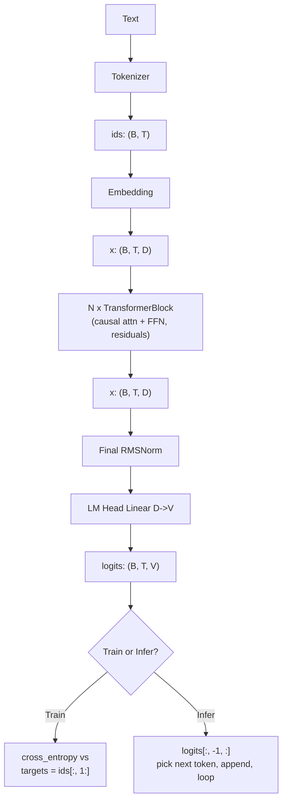

## 9. Training Loss: One Call, Many Predictions

Cross-entropy is computed across **all** `B · T` positions simultaneously, then
averaged into a single scalar loss:

```python
inputs  = ids[:, :-1]
targets = ids[:, 1:]
logits  = model(inputs)                 # (B, T, V)   ONE forward pass

loss = F.cross_entropy(
    logits.reshape(-1, V),              # (B*T, V)
    targets.reshape(-1),                # (B*T,)
)                                       # scalar
loss.backward()                         # ONE backward pass
```

Mathematically (with default `reduction='mean'`):

$$\mathcal{L} = \frac{1}{B \cdot T} \sum_{b, t} -\log p_{b, t, \text{target}_{b, t}}$$

Each position contributes one term. Gradients from all `B·T` terms flow back
through the shared weights via a single `.backward()` call.

**Why one forward pass suffices:** the causal mask in attention forces position
`t` to only attend to positions `0..t`, so all `T` predictions are *consistent
with* the autoregressive constraint even though they share computation. This is
the transformer's massive efficiency advantage over RNNs for LM training: `T`
training examples per forward pass.

## 10. Causal Mask: How One Pass Produces T Predictions

The mask is what makes the parallel-prediction trick safe. Inside scaled
dot-product attention:

```
attention scores = Q @ K.T / sqrt(d_k)              # (T, T)
scores += mask                                       # mask future to -inf
weights = softmax(scores, dim=-1)                    # (T, T), rows sum to 1
output  = weights @ V                                # (T, d_k)
```

For `T = 4`:

```
        keys: 0      1      2      3
queries:
   0    [    0,  -inf,  -inf,  -inf ]   ← position 0 attends to {0}
   1    [    0,     0,  -inf,  -inf ]   ← position 1 attends to {0, 1}
   2    [    0,     0,     0,  -inf ]   ← position 2 attends to {0, 1, 2}
   3    [    0,     0,     0,     0 ]   ← position 3 attends to {0, 1, 2, 3}
```

After softmax, `-inf` cells become exactly 0 attention weight → **no
information leakage from future tokens**.

This is why "Position 0's input was effectively just `[3]`" is true, even
though `model([3, 7, 1, 5])` was called with all four tokens at once: the mask
physically prevents position 0's attention from incorporating tokens 7, 1, 5.

## 11. Teacher Forcing vs Autoregressive Generation

The **same model** is used for both, but the **input-feeding policy** differs:

| Aspect | Training (teacher forcing) | Inference (autoregressive) |
|---|---|---|
| What's fed as input? | True tokens from the dataset | Model's own previous predictions |
| Forward passes per sequence | **1** (all positions in parallel) | **T** (one per generated token) |
| Loss? | Yes, averaged over `B·T` positions | None (no targets) |
| Backward? | Yes, one per training step | None |
| Which output is "useful"? | All `T` distributions (each is a training example) | Only `logits[:, -1, :]` (the new next-token prediction) |
| Speed | Fast (one big matmul) | Slow (T sequential matmuls, KV cache helps) |

### Generation loop

```python
def generate(model, prompt_ids, max_new_tokens, eos_id):
    ids = prompt_ids                                       # (1, T0)
    for _ in range(max_new_tokens):
        logits = model(ids)                                # (1, T, V)
        next_id = logits[:, -1, :].argmax(-1, keepdim=True)  # greedy
        ids = torch.cat([ids, next_id], dim=1)             # grow by 1
        if next_id.item() == eos_id:
            break
    return ids
```

Visualized:

```
step 0: ids = [3]              → logits[:, -1, :] → pick 7 → ids = [3, 7]
step 1: ids = [3, 7]           → logits[:, -1, :] → pick 1 → ids = [3, 7, 1]
step 2: ids = [3, 7, 1]        → logits[:, -1, :] → pick 5 → ids = [3, 7, 1, 5]
...
```

Each step is a separate forward call. Earlier positions' predictions are
ignored — we already used them in previous steps.

### Exposure bias

This train/infer asymmetry has a name: **exposure bias**. During training the
model only sees correct prefixes; during inference it sees its own (sometimes
wrong) prefixes. An early generation mistake puts the model in an input
distribution it never saw during training. In practice modern LMs handle this
remarkably well, but it's why long generations can drift into nonsense.

### Practical decoding for this assignment

The model returns **logits**, not probabilities:

```python
logits = model(input_ids)          # (batch, sequence_length, vocab_size)
next_logits = logits[0, -1, :]     # (vocab_size,)
```

For generation, only the last position matters because it predicts the token
after the whole current prefix. Earlier positions predicted earlier next-token
distributions, which are no longer needed.

Basic sampling step:

```python
next_logits = next_logits / temperature
probs = torch.softmax(next_logits, dim=-1)
next_id = torch.multinomial(probs, num_samples=1)
```

Important controls:

- `temperature < 1.0`: sharper distribution, safer and more repetitive.
- `temperature = 1.0`: use the model's natural logit scale.
- `temperature > 1.0`: flatter distribution, more random and more error-prone.
- `temperature -> 0`: equivalent to greedy decoding with `argmax`.
- `top_p`: nucleus sampling. Sort probabilities high-to-low, keep the smallest
  set whose cumulative probability is at least `p`, renormalize, then sample
  only from that set.

Generation stop conditions:

- Stop when the sampled token is the `<|endoftext|>` token.
- Also stop when `max_new_tokens` is reached, so bad generations cannot run
  forever.

Context length detail for this repo:

```python
model_input = generated_ids[:, -context_length:]
```

The TinyStories model was trained with `context_length = 256`, so after the
generated sequence grows past 256 tokens, feed only the most recent 256 tokens
back into the model. This is a simple sliding-window decode; it avoids calling
the model with a sequence longer than its RoPE/cache length.

Minimal full loop shape:

```python
@torch.no_grad()
def generate_ids(model, prompt_ids, max_new_tokens, context_length, eos_id,
                 temperature=1.0, top_p=None):
    generated = prompt_ids.clone()
    model.eval()

    for _ in range(max_new_tokens):
        model_input = generated[:, -context_length:]
        logits = model(model_input)
        next_logits = logits[0, -1, :]

        if temperature <= 0:
            next_id = torch.argmax(next_logits).view(1, 1)
        else:
            probs = torch.softmax(next_logits / temperature, dim=-1)
            # If top_p is set, filter probs before this multinomial call.
            next_id = torch.multinomial(probs, num_samples=1).view(1, 1)

        generated = torch.cat([generated, next_id.to(generated.device)], dim=1)
        if eos_id is not None and next_id.item() == eos_id:
            break

    return generated
```

Tokenizer connection:

```python
prompt_ids = tokenizer.encode(prompt)
input_ids = torch.tensor([prompt_ids], dtype=torch.long, device=device)
output_ids = generate_ids(model, input_ids, ...)
text = tokenizer.decode(output_ids[0].tolist())
```

Training uses `torch.long` token IDs for embeddings and cross-entropy targets;
generation should also feed `torch.long` IDs into the model.

## 12. Q&A: Common Stumbling Blocks

### Q: How is the loss calculated? Once for the whole sequence, or once per position?

**Both views are correct.** Computationally, it's *one* `F.cross_entropy` call
producing a single scalar. Conceptually, that scalar is the *average* of `B·T`
per-position cross-entropy losses. One backward pass updates all parameters
based on the gradient signal from every position.

### Q: Does `logits = model(inputs)` contain a prediction for every input position?

**Yes.** For input shape `(B, T)`, the logits have shape `(B, T, V)`. The slice
`logits[b, t, :]` is a distribution predicting what token should come *after*
position `t` of sample `b`. So a length-`T` input yields `T` next-token
predictions, computed in **one** forward pass.

### Q: During training, do we always feed the *correct* tokens as input, or do we feed the model's own predictions?

**Always the correct tokens** during training — this is called **teacher
forcing**. Even if at position 1 the model predicts token 99 instead of the
target token 1, at position 2 we still feed the *true* `[3, 7, 1]`, not
`[3, 7, 99]`. Reasons:

- **Parallelism.** Using true tokens lets all `T` positions be processed in one
  forward pass.
- **Stability.** Cascading the model's own (initially random) predictions would
  create garbage training signal.

### Q: Then during inference, how do we generate text?

**Autoregressively**, using the model's own previous predictions. We have no
"true next tokens" at inference time, so:

1. Start with a prompt.
2. Run forward, take the **last position's** distribution.
3. Pick a token (argmax / sample / top-k / etc.).
4. Append it to the input.
5. Repeat.

### Q: How can position 0's prediction not "see" tokens at positions 1, 2, 3 if we passed them all in together?

The **causal mask** inside attention sets the upper triangle of the score
matrix to `-inf` before softmax. After softmax those cells become exactly 0
attention weight, so position 0 literally cannot pull any information from
later positions. The mask is what makes one parallel forward pass equivalent
to `T` sequential ones — but vastly faster on GPU.

### Q: At inference, isn't it wasteful that `model([3, 7, 1])` re-computes positions 0 and 1 that we already saw at the previous step?

**Yes — that's exactly what the KV cache solves.** When generating token `t+1`,
positions `0..t-1` would produce the same key and value vectors as before
(weights and inputs unchanged). The KV cache stores `K[0..t-1]` and `V[0..t-1]`
across generation steps, so each new step only needs to compute the new
position's Q/K/V and one row of attention. This turns generation from O(T²)
per token into O(T). We don't implement KV cache in this assignment, but it's
standard in production inference (vLLM, TGI, llama.cpp, etc.).

### Q: Why predict at every position during training if at inference we only use the last?

Because it's **free supervision**. The forward pass produces all `T`
distributions whether we use them or not (parallel matmul). Throwing away `T-1`
of them at training time would waste `T`-fold training signal. At inference we
discard the earlier predictions because we already used them in previous
generation steps — they're not new information.

### Q: Why the `ids[:, :-1]` / `ids[:, 1:]` shift in the training step?

The model at position `t` sees tokens `0..t` and is asked to predict token
`t+1`. To get supervised training signal for every position:

- **Inputs** = `ids[:, :-1]` (tokens 0 through T-2): what the model sees.
- **Targets** = `ids[:, 1:]` (tokens 1 through T-1): what it should predict.

They're parallel arrays of length `T-1`, where `inputs[t]` aligns with
`targets[t]` = "what comes after `inputs[t]`."

## 13. Encoder vs Decoder vs Encoder-Decoder

"Encoder" and "decoder" are two flavors of transformer block. **The only
architectural difference is the attention mask.** Same matmuls, same FFN, same
norms.

| Aspect | **Encoder** | **Decoder** |
|---|---|---|
| Attention mask | **Bidirectional** (no mask — every position sees every other) | **Causal** (each position sees only positions ≤ itself) |
| Goal | Build rich contextual representations of the *whole* input | Generate output token by token, autoregressively |
| Output shape | `(B, T, D)` — embeddings, *not* logits over vocab | `(B, T, V)` — distribution over next token at every position |
| Trained on | Masked LM (predict masked positions from context) | Causal LM (predict next token from previous) |
| Example models | BERT, RoBERTa, DeBERTa, ModernBERT | GPT, LLaMA, Mistral, Qwen, this assignment |
| Inference style | One forward pass → embedding(s) | Loop: token by token, autoregressively |

### Encoder-Decoder

The original Transformer (2017) had **both**: an encoder over the source
sequence, plus a decoder that attends to the source via **cross-attention**
while autoregressively producing the target.

```
encoder(source) → memory ─┐
                          ▼
decoder(target_so_far, memory) → next target token
```

Examples: T5, BART, original Transformer (translation), Whisper (speech).

### Which to Use for What

| Task | Best choice | Why |
|---|---|---|
| Text generation, chat, code | **Decoder-only** | Autoregressive output is the whole point |
| Classification (sentiment, NLI) | Encoder-only | One forward pass → pool → classifier head |
| Embeddings, retrieval, search | Encoder-only | Bidirectional context yields better dense embeddings |
| NER, token tagging | Encoder-only | Per-token labels, no generation |
| Translation, summarization | Encoder-decoder *or* decoder-only with prompt | Traditional vs modern LLM style |
| Speech-to-text | Encoder-decoder (Whisper) | Encoder over audio frames, decoder for text |
| Masked LM pre-training | Encoder | MLM objective requires bidirectionality |
| Vision-language multimodal | Vision encoder + text decoder | Standard pattern (LLaVA, etc.) |

### Modern Trend: Decoder-Only Dominates

Since GPT-3, the field has converged on decoder-only for almost everything:

- **Simpler scaling**: one architecture, one objective, throw more compute at it.
- **Prompting handles "encoder" tasks**: classification becomes
  `"Is this positive or negative? [text] →"`. Slower than a tiny encoder but
  far more flexible.
- **Easier fine-tuning**: no separate vocabularies, no cross-attention plumbing.

But encoders haven't disappeared:

- **Embeddings models** (E5, BGE, GTE, ModernBERT) are still encoder-based —
  much faster than decoder-based embeddings for retrieval at scale.
- **Reranking** at search inference time is overwhelmingly encoder-only.
- **Token classification** (NER, POS) — encoder still wins on
  quality-per-FLOP.

### In This Assignment

You build a **decoder-only Transformer LM** (GPT/LLaMA-style). The causal mask
is the defining feature. Concretely:

- Input: token IDs `(B, T)`.
- Output: next-token logits `(B, T, V)`.
- Training: teacher-forced cross-entropy on next-token prediction.
- Inference: autoregressive generation.

No encoder, no cross-attention. The simpler and more powerful design that
powers modern LLMs.

### Q: Are "encoder" and "decoder" really just about the attention mask?

For the most part, **yes**. The block structure (attention → residual → norm →
FFN → residual → norm) is identical. Three differences in practice:

1. **Mask** — bidirectional (encoder) vs causal (decoder). The defining one.
2. **Training objective** — MLM (encoder) vs causal LM (decoder) vs
   seq2seq (encoder-decoder). The objective influences what you put on top
   (an MLM head vs an LM head vs a classification head).
3. **Cross-attention** — only encoder-decoder models have a second attention
   sublayer in the decoder that queries the encoder's output. Pure
   decoder-only models don't have this.

### Q: If decoder-only is so flexible, why do encoder models still exist?

Two reasons: **embedding quality** (bidirectional attention sees both sides
of every token, which produces better dense representations) and
**efficiency** (a 100M-parameter encoder can match a 7B decoder for
classification/embedding tasks, and runs orders of magnitude faster). For
production search/retrieval/classification at scale, encoders are still the
right tool.

## 14. Einsum and Einops Patterns

`einsum` describes tensor operations by **naming each axis** instead of
relying on positional shapes. Two rules cover everything:

1. **Axis name in inputs but not in output → contract** (multiply along that
   axis, then sum out).
2. **Axis name in both inputs → broadcast-multiply** along that axis (same
   index across all inputs).

Everything else (axes only in one input + output, axes carried through to
output) is "batch-like" — passed through unchanged.

### Worked example: `Y = D @ A.T` made readable

```python
from einops import einsum

# D: (batch, sequence, d_in),  A: (d_out, d_in)
Y = einsum(D, A, "batch sequence d_in, d_out d_in -> batch sequence d_out")
```

Axes analysis:

| Axis | In D? | In A? | In output? | Action |
|---|---|---|---|---|
| `batch`    | ✓ | ✗ | ✓ | carried through |
| `sequence` | ✓ | ✗ | ✓ | carried through |
| `d_in`     | ✓ | ✓ | ✗ | **contracted** (the matmul) |
| `d_out`    | ✗ | ✓ | ✓ | carried through |

Formula:

$$Y[b, s, o] = \sum_{i} D[b, s, i] \cdot A[o, i]$$

Compared to `D @ A.T`, the einsum line is **self-documenting** (axis names
are visible) and **rank-agnostic** (`D` can have arbitrary leading dims).

### The `...` ellipsis: any number of leading dims

```python
Y = einsum(D, A, "... d_in, d_out d_in -> ... d_out")
```

Works for every rank of `D`:

| Input D shape | Output Y shape |
|---|---|
| `(d_in,)` | `(d_out,)` |
| `(B, d_in)` | `(B, d_out)` |
| `(B, T, d_in)` | `(B, T, d_out)` |
| `(B, T, H, d_in)` | `(B, T, H, d_out)` |

This is how a generic `Linear` forward is written in one line — no `reshape`
gymnastics, no rank-special-casing.

### Seven patterns you'll use repeatedly

```python
# 1. Dot product (sum out everything)
einsum(a, b, "i, i -> ")                       # → scalar

# 2. Outer product (no shared axis)
einsum(a, b, "i, j -> i j")                    # → (len(a), len(b))

# 3. Matrix multiply
einsum(M, N, "i k, k j -> i j")                # M @ N

# 4. Batched matmul
einsum(M, N, "b i k, b k j -> b i j")          # torch.bmm(M, N)

# 5. Attention scores: queries (t) vs keys (s), sum over feature dim (d)
scores = einsum(Q, K, "b h t d, b h s d -> b h t s")
# Same as Q @ K.transpose(-2, -1) but reads as the math.

# 6. Attention output: weighted sum of values
out = einsum(weights, V, "b h t s, b h s d -> b h t d")
# Same as weights @ V along the s axis.

# 7. Transpose / split / merge / reduce — use rearrange / reduce, not einsum
rearrange(x, "b t h d -> b h t d")             # permute
rearrange(x, "b t (h d) -> b h t d", h=8)      # split last dim into heads
rearrange(x, "b h t d -> b t (h d)")           # merge heads back
reduce(x, "b t d -> b d", "mean")              # mean over time
```

### Mental translation recipe

When reading `einsum(X, Y, "expr1, expr2 -> out_expr")`:

1. Axis names in both inputs → broadcast-multiply along that axis.
2. Axis names in inputs but not in output → sum out (contract).
3. Axis names only on one side → broadcast.
4. Output formula:
   $\text{out}[\ldots] = \sum_{\text{contracted}} X[\ldots] \cdot Y[\ldots]$

### Why prefer einsum over `@` and `.transpose()`

```python
# Confusing — which axes? which order?
scores = (Q @ K.transpose(-2, -1)) / math.sqrt(d_k)

# Self-documenting
scores = einsum(Q, K, "b h t d, b h s d -> b h t s") / math.sqrt(d_k)
```

The einsum line makes it obvious that `t` is the query position, `s` is the
key position, and `d` is the contracted feature dim. That clarity matters
hugely when debugging multi-head attention, RoPE rotations, and cross-attention
shapes — you can spot a wrong axis name where a wrong `.transpose(...)`
argument would be invisible.

### Trade-offs

- **`torch.einsum`** is built-in but uses single-letter dummy indices, which
  loses the self-documentation. Prefer **`einops.einsum`** which accepts the
  named-axis syntax shown above.
- A small overhead vs raw `@` for the path-finding step. Usually negligible,
  and `torch.compile` eliminates it. If your innermost hot loop is einsum-bound,
  re-write that single line in raw matmul + transpose.
- Memory: einsum picks an order of contraction; for >2 inputs, manually
  reordering via `opt_einsum` (or splitting into multiple einsums) can avoid
  giant intermediates.

### Q: When is `rearrange` better than `einsum`?

When you're **not** doing a multiply/sum — just permuting, splitting, or
merging axes:

```python
rearrange(x, "b t h d -> b h t d")              # permute heads next to batch
rearrange(x, "b t (h d) -> b h t d", h=8)       # split d_model into heads
rearrange(x, "b h t d -> b t (h d)")            # merge heads after attention
```

`einsum` does multiply-and-sum; `rearrange` does no-op axis reordering or
splitting. Don't conflate the two.

### Q: When should I drop back to raw PyTorch?

- Tight inner loops where einsum's overhead matters (rare; profile first).
- Operations that don't fit the "multiply + sum over named axes" template,
  like `softmax`, `sigmoid`, `topk`, `scatter`. Use the regular PyTorch ops.
- When you want to call a fused kernel like `F.scaled_dot_product_attention`
  that wraps the whole attention computation — that's faster than writing
  out the einsum yourself, by a wide margin.

## 15. Row Vectors vs Column Vectors (Math ↔ PyTorch)

Course math is written in **column-vector form**; PyTorch code is written in
**row-vector form**. Same math, different conventions — you must mentally
flip between them when implementing.

### The two conventions

| Aspect | Row-vector (ML papers, NumPy, PyTorch) | Column-vector (math textbooks) |
|---|---|---|
| Vector shape | `(1, d)` — a row | `(d, 1)` — a column |
| Linear transform | $y = xW^\top$ | $y = Wx$ |
| `W` shape | `(d_out, d_in)` | `(d_out, d_in)` |
| Batch shape | `(B, d_in)` — batch **first** | `(d_in, B)` — batch **last** |
| Batched form | $Y = XW^\top$ | $\tilde Y = W \tilde X$ |

Both produce identical numbers. The only difference is *where the batch axis
sits* in memory.

### Why ML chose row vectors

PyTorch / NumPy store arrays in **row-major (C-order)** memory: adjacent rows
are contiguous in RAM. Putting the batch dim first means each sample is a
contiguous slice — cache-friendly, GPU-friendly. Languages with column-major
memory (Matlab, Julia, Fortran) put batch *last* for the same reason in their
direction.

### Concrete numerical example

Math (column form):

$$y = Wx \quad \text{with} \quad W = \begin{pmatrix} 1 & 2 & 3 \\ 4 & 5 & 6 \end{pmatrix}, \quad x = \begin{pmatrix} 1 \\ 2 \\ 3 \end{pmatrix} \;\Rightarrow\; y = \begin{pmatrix} 14 \\ 32 \end{pmatrix}$$

PyTorch (row form):

```python
W = torch.tensor([[1., 2., 3.],
                  [4., 5., 6.]])      # (d_out=2, d_in=3)
x = torch.tensor([1., 2., 3.])        # (d_in=3,) — row-like
y = x @ W.T                            # (2,) = [14, 32]  ✓
```

Same answer; `x` "is a row" implicitly because PyTorch 1-D tensors broadcast
that way.

### Batched version

Math: $\tilde Y = W \tilde X$ with $\tilde X \in \mathbb{R}^{3 \times 4}$.

PyTorch — **batch dim moves to the front**:

```python
X = torch.randn(4, 3)      # (batch=4, d_in=3)
Y = X @ W.T                # (4, 2)
```

### Quick translation table

| Math (column form)              | PyTorch (row form)                       | Einsum (no flipping needed)                                              |
|---------------------------------|------------------------------------------|--------------------------------------------------------------------------|
| $y = Wx$                        | `x @ W.T`                                | `einsum(x, W, "d_in, d_out d_in -> d_out")`                              |
| $\tilde Y = W \tilde X$         | `X @ W.T` (batch first)                  | `einsum(X, W, "b d_in, d_out d_in -> b d_out")`                          |
| $z = W_2 \,\sigma(W_1 x)$       | `sigma(x @ W1.T) @ W2.T`                 | chained einsums                                                          |
| $A = QK^\top / \sqrt{d_k}$      | `(Q @ K.transpose(-2,-1)) / sqrt(d_k)`   | `einsum(Q, K, "b h t d, b h s d -> b h t s") / sqrt(d_k)`                |

### Einsum sidesteps the whole issue

Because einsum **names** each axis (`batch`, `d_in`, `d_out`), there's no
ambiguity about row vs column. The same string works whether you mentally
modeled `x` as a row or a column:

```python
Y = einsum(X, W, "batch d_in, d_out d_in -> batch d_out")
```

This is what the course PDF means by *"If you use einsum for your linear
algebra operations, this should be a non-issue as long as you label your axes
correctly."* When in doubt, write the einsum form.

### Rules of thumb

1. **Math says $Wx$, code writes `x @ W.T`.** Always.
2. **Batch dim goes first in PyTorch.** Math may put it last; flip when implementing.
3. **`W` in PyTorch is `(d_out, d_in)`** — matches
   `nn.Linear(in_features, out_features)` which stores `weight` as
   `(out_features, in_features)`.
4. **Use einsum when there are 3+ axes** (batch, head, sequence, feature). Saves
   the mental flip every time.
5. **Trust shape printouts**, not your gut. `print(x.shape, W.shape, (x @ W.T).shape)`
   is the fastest debugger.

### Q: Why does PyTorch's `nn.Linear` store weight as `(out, in)` instead of `(in, out)`?

Because the row-vector convention `y = xW^\top` requires `W` to be
`(d_out, d_in)` so that `W.T` is `(d_in, d_out)` and `x @ W.T` produces a
`(B, d_out)` output. Storing as `(out, in)` keeps the math and the storage
shape aligned: the i-th row of `W` is exactly "the weight vector for output
unit i," which is also how you'd describe it on paper.

### Q: My code crashes with "size mismatch". How do I debug?

Print three shapes and check:

```python
print("x:", x.shape, "  W:", W.shape, "  expected y:", (x.shape[:-1] + (W.shape[0],)))
```

- `x.shape[-1]` must equal `W.shape[-1]` (the `d_in` axis).
- The leading dims of `x` are preserved as the leading dims of `y`.
- `y.shape[-1]` will be `W.shape[0]` (the `d_out` axis).

If your error message says "mat1 and mat2 shapes cannot be multiplied
(B×d_in and d_out×d_in)", you forgot the `.T` on `W`. If it says
"...(B×d_in and d_in×d_out)", you transposed when you shouldn't have.

### Q: What about column-major languages (Matlab/Julia)?

Same math, mirrored convention. In Julia/Matlab `W * X` works directly with
column-batched `X ∈ R^(d_in × B)` because their memory layout makes column
access contiguous. If you translate code between PyTorch and Julia, you'll
typically need to **transpose every matrix and reverse the batch axis**. Same
algorithm, mirrored on both axes.

## 16. Parameter Initialization

The default `torch.randn(d_out, d_in)` gives weights with variance 1. Stacked
through many layers, that **multiplies the activation variance** at every
matmul, so signals either explode (→ `NaN`) or collapse (→ 0) within a few
layers. Proper init keeps the **variance of activations roughly constant** as
the signal flows forward, and gradients roughly constant as they flow back.

### Xavier / Glorot init (what the assignment requires)

For a linear layer mapping `d_in → d_out`, draw weights from

$$W_{ij} \sim \mathcal{N}\!\left(0,\;\sigma^2\right) \quad\text{with}\quad \sigma^2 = \frac{2}{d_{in} + d_{out}}$$

The `2 / (d_in + d_out)` denominator is the **average** of the "forward
variance-preserving" choice (`1/d_in`) and the "backward variance-preserving"
choice (`1/d_out`). It's a compromise that's good for both passes.

### Why `1/d_in` preserves forward variance

For a single output unit $y_i = \sum_{j=1}^{d_{in}} W_{ij} x_j$ with
independent zero-mean $W_{ij}$ and $x_j$:

$$\mathrm{Var}(y_i) = \sum_{j=1}^{d_{in}} \mathrm{Var}(W_{ij}) \cdot \mathrm{Var}(x_j) = d_{in}\cdot\sigma^2\cdot\mathrm{Var}(x)$$

To keep $\mathrm{Var}(y) = \mathrm{Var}(x)$, set $\sigma^2 = 1/d_{in}$.
Symmetric argument for the backward pass gives $1/d_{out}$. Xavier averages
the two.

### Truncated normal: why ±3σ?

The assignment specifies **truncated** normal: clip samples to $[-3\sigma,
+3\sigma]$ and resample. Reasons:

- A vanilla normal has heavy tails — a single outlier weight of value $7\sigma$
  in a freshly-initialized matrix can dominate one neuron's output and slow
  early training.
- $\pm 3\sigma$ keeps $\approx 99.7\%$ of the mass, so the variance is barely
  changed but the worst-case magnitudes are bounded.
- PyTorch provides this directly:
  ```python
  torch.nn.init.trunc_normal_(W, mean=0.0, std=sigma, a=-3*sigma, b=3*sigma)
  ```

### The pattern in code (what we used for `Linear`)

```python
self.weights = torch.nn.Parameter(torch.empty(d_out, d_in))
sigma = (2.0 / (d_in + d_out)) ** 0.5
torch.nn.init.trunc_normal_(
    self.weights, mean=0.0, std=sigma, a=-3*sigma, b=3*sigma
)
```

Note: **`torch.empty` not `torch.randn`** — we're about to overwrite every
entry, so allocating uninitialized memory is the idiomatic (and faster) choice.

### Sanity check: variance preservation across a deep stack

```python
import torch
torch.manual_seed(0)
d = 512
x = torch.randn(1024, d)              # input variance ≈ 1
print(f"in:   var={x.var().item():.3f}")
for i in range(6):
    W = torch.empty(d, d)
    sigma = (2.0 / (d + d)) ** 0.5    # = 1/sqrt(d)
    torch.nn.init.trunc_normal_(W, std=sigma, a=-3*sigma, b=3*sigma)
    x = x @ W.T
    print(f"L{i+1}: var={x.var().item():.3f}")
```

Output (deterministic):
```
in:   var=1.000
L1:   var≈1.0
L2:   var≈1.0
...
L6:   var≈1.0
```

Compare with the broken init (`torch.randn`, variance 1 per weight): variance
multiplies by `d=512` each layer, hitting `~10^15` after 6 layers — exactly
the kind of `NaN` you get from a "works on toy data, explodes on real
training" bug.

### Initialization scheme for each module type

| Module | Parameter | Init |
|---|---|---|
| `Linear` (`Wx`) | `weights (d_out, d_in)` | trunc_normal, $\sigma = \sqrt{2/(d_{in}+d_{out})}$ |
| `Embedding` | `embedding (V, d_model)` | $\mathcal{N}(0, 1)$ truncated to $[-3, 3]$ (course spec) |
| `RMSNorm` | `gain (d_model,)` | all ones |
| Biases (if used) | `(d_out,)` | zeros |

The course's Linear and Embedding both use the same `trunc_normal_` recipe but
with different $\sigma$. RMSNorm starts as the identity (gain = 1) so the
first forward pass is just normalization.

### Comparison with other init schemes

| Name | Std formula | When to use |
|---|---|---|
| **Xavier / Glorot** | $\sqrt{2/(d_{in}+d_{out})}$ | Symmetric activations (tanh, linear, SiLU/GeLU) — what we use |
| **Kaiming / He** | $\sqrt{2/d_{in}}$ | ReLU networks — accounts for ReLU killing half the variance |
| **LeCun** | $\sqrt{1/d_{in}}$ | SELU / self-normalizing nets |
| **GPT-2 style** | Xavier, but **output projections scaled by** $1/\sqrt{2L}$ | Deep transformers — counteracts residual-stream variance growth |

For this assignment, plain Xavier with `trunc_normal_` is sufficient. GPT-2's
extra `1/sqrt(2L)` scaling on `c_proj` (attention output) and `mlp.c_proj`
(MLP output) is an optional refinement that helps for very deep stacks.

### Quick reference

| What | Code |
|---|---|
| Allocate uninitialized | `torch.empty(d_out, d_in)` |
| Compute Xavier σ | `sigma = (2.0 / (d_in + d_out)) ** 0.5` |
| Fill in place | `torch.nn.init.trunc_normal_(W, mean=0., std=sigma, a=-3*sigma, b=3*sigma)` |
| Wrap as parameter | `self.weights = torch.nn.Parameter(W)` (or combine: param of `empty` then init the `.data`) |
| Embedding | same recipe, `sigma=1.0`, bounds `[-3, 3]` |
| RMSNorm gain | `torch.nn.Parameter(torch.ones(d_model))` |

### Rules of thumb

1. **Never start a learnable matrix with `torch.randn` alone** — variance 1
   per weight explodes through any non-trivial stack.
2. **`torch.empty` + in-place init** is the idiomatic pattern (skip the cost
   of filling with random bytes you're about to overwrite).
3. **Match the activation**: SiLU/GeLU/tanh → Xavier; ReLU → Kaiming.
4. **Norm layers start as identity**: gain = 1, bias = 0 (if any).
5. **When loss is `NaN` in the first few iterations**, check init first
   before chasing learning-rate or data bugs.

## 17. Embedding Layer: Float Parameter, Integer Input

An embedding layer is conceptually "a lookup table" — but the table itself is
**learnable floats**, while what you use to look things up is **integer token
IDs**. Two different dtypes live in the same operation.

### The two dtypes

| Tensor | dtype | Why |
|---|---|---|
| `self.embedding` (the table) | `float32` (or `bfloat16` mixed-precision) | It's a **learnable parameter**. PyTorch only computes gradients for floating-point tensors — `requires_grad=True` on an int tensor raises a `RuntimeError`. |
| `token_ids` (input) | `int64` (`torch.long`) | Token IDs are **discrete indices** into the vocab. There's no such thing as "token 5.3". Advanced indexing requires integer indices. |
| Output `embedding[token_ids]` | `float32` | Same dtype as the parameter being indexed — indexing preserves the source dtype. |

### Type signature

```python
from jaxtyping import Float, Int

def forward(
    self,
    token_ids: Int[Tensor, " ... seq"],
) -> Float[Tensor, " ... seq d_model"]:
    return self.embedding[token_ids]
```

The output gains one trailing axis (`d_model`) and inherits all leading dims
of `token_ids` — including the batch dim.

### Init differs from Linear

| Layer | σ | Reason |
|---|---|---|
| `Linear` | $\sqrt{2/(d_{in}+d_{out})}$ (Xavier) | Output is a **sum** over `d_in` inputs; variance scales with fan-in. |
| `Embedding` | $1.0$ (course spec) | Output is **a single row** selected by index — no summation, no fan-in. |

Both still use `trunc_normal_` truncated at $\pm 3\sigma$ to bound outliers.

```python
self.embedding = torch.nn.Parameter(torch.empty(num_embeddings, embedding_dim))
torch.nn.init.trunc_normal_(self.embedding, mean=0.0, std=1.0, a=-3.0, b=3.0)
```

### Why indexing, not matmul?

Mathematically, embedding lookup is equivalent to multiplying a **one-hot
vector** by the embedding matrix:

$$e = \mathbf{1}_{\text{id}}^\top E \quad \text{where } \mathbf{1}_{\text{id}} \in \{0,1\}^V$$

But you'd never compute it that way:

| Method | Compute cost | Memory cost |
|---|---|---|
| One-hot × matmul | $O(V \cdot d_{model})$ per token | $V$ bytes for the one-hot |
| Direct indexing `E[id]` | $O(d_{model})$ per token | none |

For `V = 50k` and `d_model = 768`, that's a **50,000×** speedup. PyTorch's
`E[token_ids]` (and `nn.Embedding.forward`) does exactly this — a memory
gather, not a matmul.

### Gradient through indexing

Even though the forward pass is a gather, **backprop still works** because
`__getitem__` is a differentiable op in PyTorch. Conceptually:

$$\frac{\partial L}{\partial E[i]} = \sum_{\text{positions where token = } i} \frac{\partial L}{\partial \text{output}}$$

In words: only the rows that were *looked up* receive gradient, and rows that
were looked up multiple times in the batch get their gradients **summed**.
This is why embedding tables get sparse updates — only the ~`B·T` unique IDs
in a batch are touched per step.

### Common mistake: passing floats

```python
emb(torch.tensor([0.0, 1.0, 2.0]))     # TypeError or weird behavior
emb(torch.tensor([0, 1, 2]))           # ✓ int64 by default
emb(torch.tensor([0, 1, 2], dtype=torch.long))  # ✓ explicit
```

If your token IDs come from `np.array(..., dtype=np.int32)`, cast to `long`
before feeding to embedding: `torch.from_numpy(ids).long()`.

### Quick reference

| What | Code |
|---|---|
| Define the table | `torch.nn.Parameter(torch.empty(V, d_model))` |
| Initialize (course spec) | `trunc_normal_(E, mean=0, std=1.0, a=-3, b=3)` |
| Forward | `E[token_ids]` — same as `F.embedding(token_ids, E)` |
| Input dtype | `torch.long` (int64) |
| Output dtype | same as `E` (float32 by default) |
| Output shape | `token_ids.shape + (d_model,)` |

## 18. Pre-Norm vs Post-Norm Transformer Block

The single most important architectural detail that distinguishes modern LLMs
(GPT-2/3, LLaMA, PaLM, Mistral, Qwen) from the original 2017 Transformer:
**where the LayerNorm sits relative to the residual connection.**

### The two sub-layers (unchanged since 2017)

Every Transformer block has exactly two sub-layers, in order:

1. **Multi-head self-attention** — each token looks at others for context.
2. **Position-wise FFN** — a 2-layer MLP applied independently per position
   (SwiGLU in our case).

Both sub-layers are wrapped in a **residual connection** `out = in + sublayer(in)`.
That much is unchanged. The only debate is **where the norm goes**.

### Post-norm (original Vaswani 2017)

$$x_{\text{out}} = \text{LN}(x + \text{SubLayer}(x))$$

```
       x ─┬──────────────────────┐
          │                      │
          ▼                      │
       SubLayer                  │
          │                      │
          └──────► (+) ◄─────────┘
                   │
                   ▼
                LayerNorm
                   │
                   ▼
                x_out
```

Norm sits **after** the residual addition — it's on the trunk. Every layer the
residual stream gets re-normalized.

### Pre-norm (modern: GPT-2/3, LLaMA — what we implement)

$$x_{\text{out}} = x + \text{SubLayer}(\text{LN}(x))$$

```
       x ─┬──────────────────────┐
          │                      │
          ▼                      │
      LayerNorm                  │
          │                      │
          ▼                      │
       SubLayer                  │
          │                      │
          └──────► (+) ◄─────────┘
                   │
                   ▼
                x_out
```

Norm sits **inside the residual branch**, before the sub-layer. The trunk
carrying `x` flows from input embeddings to final output **untouched** — only
added to.

### Full block (both sub-layers)

```python
# Pre-norm (what we'll implement)
y = x + Attention(RMSNorm(x))      # attention sub-layer
z = y + FFN(RMSNorm(y))            # FFN sub-layer
return z
```

```python
# Post-norm (Vaswani 2017)
y = LN(x + Attention(x))
z = LN(y + FFN(y))
return z
```

### The "residual stream" picture

Think of the network as a vertical pipe — the **residual stream** — that token
embeddings flow up through. Each layer is a *side branch* that reads from the
stream, computes something, and adds its output back.

| | Post-norm | Pre-norm |
|---|---|---|
| What happens to the stream at each layer | Re-normalized | **Untouched** — only added to |
| Gradient path from output to input | Compressed by norm Jacobians at every layer | Direct identity highway |
| Init / LR sensitivity | High (needs warmup, careful LR) | Low |
| Stability at depth (60+ layers) | Often diverges | Trains fine |

### Why pre-norm preserves gradients (math)

For a stack of $L$ pre-norm blocks, the residual identity gives:

$$x_L = x_0 + \sum_{\ell=1}^{L} \text{SubLayer}_\ell(\text{LN}(x_{\ell-1}))$$

So $\partial x_L / \partial x_0 = I + (\text{stuff})$ — there's always a
**direct identity term** $I$. Gradient flows from output to input with no
shrinkage.

In post-norm:

$$x_\ell = \text{LN}(x_{\ell-1} + \text{SubLayer}_\ell(x_{\ell-1}))$$

LayerNorm's Jacobian sits **on the residual path**. Stacking $L$ blocks
multiplies $L$ Jacobians together — they shrink the gradient.
Result: needs LR warmup, vanishing gradients, hard to scale past ~12 layers
without tricks.

This is **the** reason pre-norm "improves training stability" — it's literally
why GPT-3 (96 layers) and LLaMA-405B (126 layers) are trainable at all.

### The "extra" final norm

Because pre-norm never normalizes the trunk *inside* the stack, the residual
stream's magnitude **grows** as more sub-layer outputs accumulate. By the time
we reach the LM head, activations can be huge. So pre-norm models add **one
final norm** after the last block, before the unembedding:

```python
# Full pre-norm transformer
x = embed(token_ids)
for block in blocks:
    x = block(x)              # x + Attn(LN(x)); x + FFN(LN(x))
x = final_norm(x)             # ← the "additional" norm the passage mentions
logits = lm_head(x)
```

LLaMA, GPT-2, GPT-3, PaLM all do this. We will too.

### What the TransformerBlock will look like

```python
class TransformerBlock(nn.Module):
    def __init__(self, d_model, num_heads, d_ff, ...):
        super().__init__()
        self.norm1 = RMSNorm(d_model)
        self.attn  = MultiHeadSelfAttention(d_model, num_heads, ...)
        self.norm2 = RMSNorm(d_model)
        self.ffn   = SwiGLU(d_model, d_ff)

    def forward(self, x):
        x = x + self.attn(self.norm1(x))   # pre-norm around attention
        x = x + self.ffn(self.norm2(x))    # pre-norm around FFN
        return x
```

Two norms per block, no norm *after* the residual addition, `x +` on both
sub-layers. That's it — internalize this pattern and you've internalized 90%
of modern Transformer block design.

### Mnemonic

- **Post-norm**: norm is the *last* thing in each layer → norm sits **on** the
  residual stream → stream is re-normalized at every layer.
- **Pre-norm**: norm is the *first* thing in each sub-layer's branch → norm
  sits **off** the residual stream → stream is a clean identity highway from
  embeddings to logits, with two extra contributions added per block.

### Rules of thumb

1. **Pre-norm = identity trunk + side branches.** No norm should ever touch
   the residual `x` directly inside a block — only the branch input gets
   normalized.
2. **One final norm before the LM head.** Don't forget it; without it the
   logit magnitudes are unbounded.
3. **Two norms per block, not one.** One around attention, one around FFN.
4. **Use RMSNorm, not LayerNorm**, in modern models — same stability benefits,
   ~10% faster, no learnable bias to worry about.

## 19. RMSNorm: Why and How

The normalization that goes inside every pre-norm block. Modern LLMs (LLaMA,
Mistral, Qwen) all use it instead of LayerNorm.

### Why normalize at all

Without normalization, activation magnitudes drift wildly between layers:
input variance might be 0.01 at one layer and 1000 at the next. Each layer's
weights were initialized assuming **unit-ish variance inputs** (Xavier's
implicit assumption). Mismatched magnitudes → exploding or vanishing
gradients → training collapses.

Normalization fixes this by rescaling activations to a **consistent magnitude
at every layer**, regardless of what the previous layer produced.

### Evolution: BatchNorm → LayerNorm → RMSNorm

| Year | Method | Statistic axis | Formula |
|---|---|---|---|
| 2015 | BatchNorm | Across **batch** | $(x - \mu_B)/\sigma_B$ |
| 2016 | LayerNorm | Across **feature** | $(x - \mu_L)/\sigma_L$ |
| 2019 | RMSNorm | Across **feature** | $x / \text{RMS}(x)$ |

- **Why LayerNorm replaced BatchNorm in NLP**: variable sequence lengths and
  batch=1 inference make batch statistics unreliable. LayerNorm uses
  per-sample, per-position statistics — deterministic, works at any batch size.
- **Why RMSNorm replaced LayerNorm**: the mean-subtraction step contributes
  almost nothing to stability — the dominant effect is the rescaling. Drop
  the mean → simpler, ~10% faster, ~equal quality.

### The formula, decoded

$$\text{RMSNorm}(a_i) = \frac{a_i}{\text{RMS}(a)} \cdot g_i$$

$$\text{RMS}(a) = \sqrt{\frac{1}{d_{\text{model}}} \sum_{j=1}^{d_{\text{model}}} a_j^2 + \varepsilon}$$

| Symbol | What it is | Shape |
|---|---|---|
| $a$ | Activation vector at one position | `(d_model,)` |
| $\sum a_j^2$ | Sum of squares across features | scalar |
| $\frac{1}{d}\sum a_j^2$ | Mean of squares | scalar |
| $\text{RMS}(a)$ | "Size" of vector $a$ | scalar |
| $a_i / \text{RMS}(a)$ | Each entry divided by that size | `(d_model,)` |
| $g_i$ | Learnable per-feature gain | `(d_model,)` |
| $\varepsilon$ | Tiny constant (e.g., `1e-5`) | scalar |

After dividing by RMS, the vector has **unit RMS magnitude** (components have
mean-square 1). Then multiply by a learnable gain `g`, so the model can decide
*how big* each feature should ultimately be.

### Geometric picture

The vector $a$ has some "length" (RMS). Dividing by RMS **projects it onto
the unit sphere** (in an RMS sense). The gain $g$ then rescales each axis
independently.

> RMSNorm = **"strip the magnitude, then let the model relearn the per-feature scale."**

### Role of ε

If all `d_model` entries of $a$ are zero (rare, but possible after dead ReLU
or extreme dropout), RMS would be 0 and we'd divide by zero → `NaN`. The ε
inside the sqrt prevents that. `1e-5` is standard — tiny enough to be
invisible when RMS is normal-sized.

### RMSNorm vs LayerNorm side-by-side

LayerNorm:
$$\text{LayerNorm}(a_i) = \frac{a_i - \mu}{\sqrt{\sigma^2 + \varepsilon}} \cdot \gamma_i + \beta_i$$

RMSNorm:
$$\text{RMSNorm}(a_i) = \frac{a_i}{\sqrt{\frac{1}{d}\sum a_j^2 + \varepsilon}} \cdot g_i$$

| | LayerNorm | RMSNorm |
|---|---|---|
| Subtract mean | Yes | **No** |
| Learnable shift β | Yes | **No** |
| Learnable gain | γ | g |
| Statistic | Variance | Mean of squares |
| Params per layer | `2 · d_model` | `d_model` |
| Passes over input | Two (μ then σ²) | One (Σ a²) |

RMSNorm = LayerNorm with $\mu := 0$ and $\beta := 0$. Same shape of operation,
fewer arithmetic steps.

### Why upcast to float32 (the practical bit)

Mixed-precision training uses bf16/fp16 for activations to save memory and
speed up GPUs. But:

- **bfloat16** has range ~$\pm 3.4\times 10^{38}$ but only **~3 decimal digits
  of precision**. Summing thousands of squares loses precision rapidly.
- **float16** has range only $\pm 65504$ — squaring `300.0` already gives
  `90000` which **overflows to inf**.

Standard recipe:

```python
in_dtype = x.dtype
x = x.to(torch.float32)        # upcast for squaring and summing
# ... compute RMS, divide, multiply by gain ...
return result.to(in_dtype)     # downcast back
```

This pattern — compute statistics in higher precision, downcast the result —
is **standard across all modern normalization layers**.

### Shape semantics for `(B, T, d_model)` input

Math says "vector $a$", but in practice the input is batched:

```python
x: (B, T, d_model)
ms  = x.pow(2).mean(dim=-1, keepdim=True)   # (B, T, 1)
rms = torch.sqrt(ms + self.eps)             # (B, T, 1)
x_normed = x / rms                          # (B, T, d_model), broadcasts
out = x_normed * self.gain                  # (B, T, d_model), gain shape (d_model,)
```

Each `(b, t)` position is normalized **independently**. No cross-batch or
cross-time interaction — that's why it works with variable sequence lengths
and any batch size.

`keepdim=True` is critical — it preserves the trailing `1` so broadcasting
divides each feature row by its own RMS scalar.

### Reference implementation

```python
class RMSNorm(nn.Module):
    def __init__(self, d_model, eps=1e-5, device=None, dtype=None):
        super().__init__()
        self.eps = eps
        self.gain = nn.Parameter(torch.ones(d_model, device=device, dtype=dtype))

    def forward(self, x):  # x: (..., d_model)
        in_dtype = x.dtype
        x = x.to(torch.float32)
        ms = x.pow(2).mean(dim=-1, keepdim=True)
        rms = torch.sqrt(ms + self.eps)
        result = (x / rms) * self.gain
        return result.to(in_dtype)
```

Notes:
- **`gain` is initialized to ones** — at start of training, RMSNorm is pure
  normalization. The model learns the gains.
- **`eps` goes inside the sqrt**, not added afterward — prevents
  div-by-zero AND keeps the derivative well-defined when RMS is zero.
- **No bias parameter** — that's the whole point vs LayerNorm.
- Einops alternative for the mean: `reduce(x.pow(2), "... d -> ... 1", "mean")`.

### Scale invariance (the key property)

For any positive scalar $\alpha$:

$$\text{RMSNorm}(\alpha \cdot x) = \text{RMSNorm}(x)$$

(Multiply numerator and denominator by $\alpha$ — they cancel.) This is
exactly the stability property we want in pre-norm: no matter how big the
residual stream grows, the input to each sub-layer always has unit RMS.

### Mental model

> RMSNorm answers: *"This vector has some magnitude — I don't want the next
> layer to care about that magnitude. Strip it. But also let the model
> relearn a per-feature scale because some features really should be larger."*

### Quick reference

| What | Code |
|---|---|
| Parameter | `gain = nn.Parameter(torch.ones(d_model))` |
| Statistic | `ms = x.pow(2).mean(dim=-1, keepdim=True)` |
| Divisor | `rms = torch.sqrt(ms + eps)` |
| Output | `(x / rms) * gain` |
| Upcast / downcast | `x.to(torch.float32)` / `result.to(in_dtype)` |
| ε placement | **Inside** the sqrt |
| Reduction axis | **Last** (`dim=-1`), with `keepdim=True` |

### Rules of thumb

1. **Always upcast to float32** for the squaring step — overflow in fp16 is
   silent and catastrophic.
2. **Always `keepdim=True`** when reducing for normalization — you need the
   trailing `1` for broadcasting.
3. **`eps` inside the sqrt**, not outside.
4. **Gain initialized to ones**, never random — model starts as pure normalization.
5. **No bias** — RMSNorm has gain only. If you see a `β` parameter, you've
   accidentally implemented LayerNorm.

### Why ones init doesn't break symmetry

The usual rule for `nn.Linear` weights is "never initialize all entries to the
same value or every neuron becomes identical and stays identical forever"
(symmetry breaking failure). So why is `gain = torch.ones(d_model)` safe?

**Because each $g_i$ multiplies a *different* feature $a_i/\text{RMS}(a)$.**
The gradient is:

$$\frac{\partial L}{\partial g_i} = \frac{\partial L}{\partial \text{out}_i} \cdot \frac{a_i}{\text{RMS}(a)}$$

The second factor is **different for every $i$** because each feature is
different. So even with identical initial values, each `gain[i]` receives a
**different gradient** and diverges from step 1.

Contrast with `nn.Linear` weights init to ones: every output unit would
compute $y_j = \sum_i x_i \cdot 1 = \sum_i x_i$ — identical for every $j$,
identical gradients, permanent symmetry. RMSNorm's gain has no such symmetry
to break because **the features themselves provide the asymmetry**.

The genuinely bad init is `torch.zeros(d_model)`:

| Init | Status | Why |
|---|---|---|
| `torch.ones(d)` | ✅ Correct | Different gradients per feature; identity-at-init |
| `torch.zeros(d)` | ❌ Dead layer | Output is zero, upstream gradient is zero |
| `torch.randn(d)` | ⚠️ Bad starting point | Model must unlearn arbitrary scales |

**Same logic applies to LoRA's `B = 0` init**: looks suspicious but works
because the upstream signal $Ax$ provides the asymmetry. The rule is: *zero
or ones init is safe whenever the multiplied-in signal is itself diverse.*

### Naming gotcha: `Parameter` vs `parameter`

| Path | What it is |
|---|---|
| `torch.nn.Parameter` (capital P) | The **class** — wraps a tensor as a learnable parameter |
| `torch.nn.parameter` (lowercase) | The **submodule** that contains the class |
| `torch.nn.parameter.Parameter` | Same class, accessed via module path |

`torch.nn.parameter(...)` raises `TypeError: 'module' object is not callable`.
Always capital `P`.

### Storage dtype vs computation dtype

RMSNorm has **two different dtypes** in play, intentionally:

| What | Dtype | Why |
|---|---|---|
| `self.gain` (parameter) | Whatever `dtype=` arg said (typically bf16 or fp32) | Storage of the learnable weight |
| Internal computation | Always **float32** (via `x.to(torch.float32)`) | Prevents overflow when squaring |
| Output | Same as input `x.dtype` (via `.to(in_dtype)`) | Preserves mixed-precision contract |

The `dtype=` argument to `__init__` only controls the **storage** dtype of
`gain` — the inner math still runs in fp32. PyTorch's auto-promotion handles
the bf16-gain × fp32-normalized broadcast; the final `.to(in_dtype)` puts
everything back to whatever the caller's pipeline uses.

`eps` is a Python `float`, so it needs no `device`/`dtype` — it auto-promotes
when added to a tensor.

## 20. Position-Wise FFN: SiLU → SwiGLU

The FFN is the second sub-layer in every transformer block, and where most
of a transformer's parameters live (~2/3 of each block).

### What "position-wise" means

The FFN sees `(B, T, d_model)` but treats each `(b, t)` slice independently:
**no cross-position mixing** — that's attention's job. Same weights applied
to every position. In code: a single `Linear(x)` call works because PyTorch
matmul on `(B, T, d_model) @ (d_model, d_ff)` automatically broadcasts.

> **Attention mixes positions. FFN transforms each position independently.**
> Their jobs are complementary.

### From ReLU FFN to SwiGLU in 4 steps

**Step A — Vaswani 2017 (ReLU FFN):**
$$\text{FFN}(x) = W_2 \cdot \text{ReLU}(W_1 x)$$
Two matrices, one activation. `d_ff = 4 · d_model` canonically.

**Step B — Replace ReLU with SiLU:**
$$\text{FFN}(x) = W_2 \cdot \text{SiLU}(W_1 x), \quad \text{SiLU}(x) = x \cdot \sigma(x)$$

| Property | ReLU | SiLU |
|---|---|---|
| At $x = -3$ | exactly 0 | ≈ -0.14 |
| Derivative at 0 | undefined (0 → 1 jump) | smoothly 0.5 |
| Negative gradient | always 0 (dying ReLU) | small but nonzero (recoverable) |
| Smoothness | kinked at 0 | $C^\infty$ everywhere |

**Step C — Add gating (GLU):**
$$\text{GLU}(x, W_1, W_3) = \sigma(W_1 x) \odot (W_3 x)$$
Two branches, multiplied element-wise. One branch acts as a learned gate
controlling the other.

**Step D — Use SiLU as the gate → SwiGLU (eq. 7 from spec):**
$$\boxed{\text{SwiGLU}(x, W_1, W_2, W_3) = W_2 \cdot \big(\text{SiLU}(W_1 x) \odot W_3 x\big)}$$

Three matrices: $W_1, W_3 \in \mathbb{R}^{d_{ff} \times d_{model}}$ (up),
$W_2 \in \mathbb{R}^{d_{model} \times d_{ff}}$ (down).

### Data flow diagram

```
                    ┌──► [ W₁ ] ──── pre_gate ──── SiLU ────► gate ───┐
   x ───────────────┤      (d_ff)                   (d_ff)            │
 (d_model)          │                                                 ▼
                    │                                              [ ⊙ ]  ──► h ──► [ W₂ ] ──► out
                    │                                                 ▲      (d_ff)         (d_model)
                    └──► [ W₃ ] ─────────── value ────────────────────┘
                          (d_ff)              (d_ff)
```

Two branches from input, element-wise product in the wide `d_ff` space,
project back down. **Gating happens only at the `⊙` node** — everything
else is matmul.

### The intuition: gating = learned multiplicative routing

Three views of the same idea:

**View 1 — Physical valves.** Each of the `d_ff` channels is a pipe carrying
a "water" value. Above each pipe is a valve. The gate branch sets valve
positions, the value branch sets water amounts. Output = valve × water.

**View 2 — Two-question decomposition:**
- `W₁`: *"How relevant is each channel?"* → gate
- `W₃`: *"What value should each channel have?"* → value
- `⊙`:  *"Modulate value by relevance, per channel."*

A plain MLP forces the activation function to answer both at once.
SwiGLU splits them into separately-learned weights.

**View 3 — Conditional spotlight.** `value` projects into a large vocabulary
of features (4× wider than input); `gate` is a learned spotlight that
highlights only the relevant subset for *this particular input*.

### Per-channel worked example

`d_ff = 4`, one position:

| channel | `value` (W₃x) | `pre-gate` (W₁x) | `gate` SiLU(W₁x) | `output` = g·v |
|---|---|---|---|---|
| 0 | +2.1 | +5.0 | +4.97 | **+10.4** (amplified) |
| 1 | -0.8 | -3.0 | -0.14 | +0.11 (gated off) |
| 2 | +3.4 | -0.2 | -0.09 | -0.31 (gated off) |
| 3 | +0.5 | +1.5 | +1.23 | +0.62 (passes) |

Channel 2 has a *big* value but the model decided it's irrelevant for this
input — gate dampens it. A plain ReLU MLP can't express "ignore this
channel based on what some other channel says" — only SwiGLU can.

### Why multiplicative is more powerful than additive

| Operation | Can express |
|---|---|
| `a + b` | Linear combinations only |
| `a * b` | Conditional logic — "if `a` is small, output is small regardless of `b`" |
| `gate(a) * b` | Soft if/then control flow |

XOR can't be solved by a linear/additive model. Multiplication brings that
expressiveness into every FFN, not just attention.

### Why $d_{ff} = \frac{8}{3} d_{model}$

To compare SwiGLU to the original FFN **at matched parameter count**:

- Old FFN params: $2 \cdot d_{model} \cdot d_{ff}$. With $d_{ff} = 4 d_{model}$
  → $8 d_{model}^2$.
- SwiGLU params: $3 \cdot d_{model} \cdot d_{ff}$.
- Set equal: $3 \cdot d_{model} \cdot d_{ff} = 8 d_{model}^2 \Rightarrow d_{ff} = \frac{8}{3} d_{model}$.

So $\frac{8}{3}$ is **not magic** — it's the ratio that keeps the parameter
budget fixed. SwiGLU trades "wider hidden dim" for "third matrix and gating
mechanism" at the same param count.

**Worked example** ($d_{model} = 768$):
- Old FFN: $d_{ff} = 3072$, params $= 2 \cdot 768 \cdot 3072 = 4{,}718{,}592$.
- SwiGLU: $d_{ff} = 2048$, params $= 3 \cdot 768 \cdot 2048 = 4{,}718{,}592$ ✓.

**"Round to a nearby multiple of 64"** = GPU tensor-core efficiency. For
$d_{model} = 1024$: $\frac{8}{3} \cdot 1024 = 2730.67$ → round to 2752 or 2688.

### No biases

Modern LLMs (PaLM, LLaMA, Qwen) drop bias terms from Linear layers:
- Quality impact is negligible at scale.
- Saves params and a small amount of compute.
- One fewer thing to initialize/load/forget.

So `W_i x`, not `W_i x + b_i`. Our `Linear` already has no bias.

### Reference implementation

```python
import torch.nn.functional as F

class SwiGLU(torch.nn.Module):
    def __init__(self, d_model, d_ff, device=None, dtype=None):
        super().__init__()
        self.w1 = Linear(d_model, d_ff, device=device, dtype=dtype)  # gate
        self.w3 = Linear(d_model, d_ff, device=device, dtype=dtype)  # value
        self.w2 = Linear(d_ff, d_model, device=device, dtype=dtype)  # down

    def forward(self, x):                       # x: (..., d_model)
        gate  = F.silu(self.w1(x))              # (..., d_ff)
        value = self.w3(x)                      # (..., d_ff)
        return self.w2(gate * value)            # (..., d_model)
```

Or implement SiLU yourself for the assignment:

```python
def silu(x):
    return x * torch.sigmoid(x)
```

### Common confusions

**"Is GLU gating the same as attention?"** No — completely different.

| | Attention | GLU |
|---|---|---|
| Mixes positions? | Yes — `softmax(QKᵀ) @ V` | No — element-wise within one position |
| Mixes features? | Linearly | Multiplicatively |
| "Weight" comes from | Other tokens (Q·K) | Same input (W₁ x) |

**"Why not sigmoid for the gate?"** Sigmoid saturates at $\pm \infty$
(gradient → 0). SiLU grows linearly for large positive $x$, so the gate can
amplify without saturating. Empirically SiLU gates train better.

**"Why three matrices instead of one wider one?"** Because the gate and
value branches need to be *learned separately*. Fusing them removes the
whole point of GLU — the model loses the ability to express "gate by one
function, value by another."

**"Are gates binary 0/1?"** No, continuous. SiLU gates can be anywhere in
roughly $[-0.28, +\infty)$. The "gating" is a soft, smooth modulation, not
a hard switch.

### Shapes walkthrough

`B = 2, T = 5, d_model = 8, d_ff = 16`:

```
x:       (2, 5, 8)                          ← input
W1.w:    (16, 8)         gate = silu(x@W1.T)   → (2, 5, 16)
W3.w:    (16, 8)         value = x@W3.T         → (2, 5, 16)
                         h = gate * value       → (2, 5, 16)   ← elementwise
W2.w:    (8, 16)         out = h @ W2.T        → (2, 5, 8)    ← back to d_model
```

### Design rationale cheat sheet

| Decision | Why |
|---|---|
| ReLU → SiLU | Smooth, no dying-neuron, small negative signal aids gradient flow |
| Add gating | Learned per-channel multiplicative routing; richer than fixed activation |
| SiLU gate (not sigmoid) | Doesn't saturate; better gradient at large activations |
| 3 matrices (W₁, W₂, W₃) | Gate and value branches need separate weights |
| $d_{ff} = \frac{8}{3} d_{model}$ | Param-matched to original FFN with $d_{ff} = 4 d_{model}$ |
| Round `d_ff` to multiple of 64 | GPU tensor-core throughput |
| Drop biases | Negligible quality impact at scale |

### Mental checklist

When you see SwiGLU code, think:

```python
gate  = silu(self.w1(x))    # "How relevant is each channel?"   (learned)
value = self.w3(x)          # "What value should each have?"     (learned)
h     = gate * value        # "Modulate value by relevance"      (element-wise)
out   = self.w2(h)          # "Project back to model dim"
```

Four lines. Gate, value, multiply, project.

### Rules of thumb

1. **FFN = position-wise**: never mix across the time axis in this sub-layer.
2. **SwiGLU has three Linears, not two** — gate, value, down-project.
3. **Element-wise product (`*`), not matmul**, between gate and value.
4. **Use $d_{ff} = \frac{8}{3} d_{model}$** rounded to a multiple of 64 for
   param-matched fair comparison vs ReLU FFN.
5. **No biases** in any of the three Linears.
6. **`F.silu` exists** — use it in production code; implement by hand once
   for understanding.

### What "we attribute their success to divine benevolence" means

The honest answer to *"why does SwiGLU beat ReLU FFN?"* is: **nobody knows
for sure**. Shazeer's famous quote acknowledges that gated variants
empirically win across architectures, datasets, and scales, but there's no
satisfying first-principles derivation. The DL community has learned to
accept that some architectural improvements work without us fully
understanding them — measure, keep what wins.


## 21. RoPE (Rotary Position Embedding): The Full Story

RoPE injects positional information into attention by **rotating** 2-D pairs
of query/key features by an angle that depends on the token's position.
This section builds it from scratch — the big problem it solves, why
rotations specifically, why pairing, why multi-scale frequencies, the
geometry, and the implementation. Figures are generated by
[notebooks/generate_figures.ipynb](notebooks/generate_figures.ipynb) and
saved under [figures/](figures/).

> **One-sentence summary.** RoPE rotates each pair of Q/K dimensions by an
> angle proportional to the token's position. The dot product of two rotated
> vectors depends only on the *difference* of rotation angles, so attention
> scores naturally encode **relative** position. No learned parameters.
> Applied to Q and K only, never V.

#### The core idea — what RoPE actually does to the dot product

With RoPE, position rotates each pair by $i\theta_k$ on the query side and
$j\theta_k$ on the key side **before** the dot product. For pair $k$:

$$\text{pair}_k\!\bigl(R(i\theta_k)\,q,\; R(j\theta_k)\,k\bigr) \;=\; \|q^{(k)}\|\,\|k^{(k)}\|\;\cos\!\Bigl(\underbrace{\Delta\varphi}_{\text{content angle}} \;+\; \underbrace{(j-i)\,\theta_k}_{\text{position-induced angle}}\Bigr)$$

So position **shifts the angle inside the cosine** — it doesn't change
magnitudes, it doesn't add a separate term, it just **rotates the
alignment between Q and K**.

> **RoPE turns the pair-wise dot product from "how aligned are they in
> content?" into "how aligned are they in content, **after I shift their
> relative angle by an amount proportional to their position gap**?"**

Everything else in this section — the multi-frequency design, the pairing,
the rotation derivation — is machinery to make this one formula work
cleanly and at every scale.

---

### 21.1 The big problem: attention is position-blind

Self-attention computes scores via dot products:
$\text{score}(q, k) = q \cdot k / \sqrt{d_k}$. If you permute the input
tokens, the queries and keys permute the same way, and the resulting
attention pattern just permutes correspondingly. **The mechanism itself has
no preference for "the previous word" vs "a word 50 positions back."**

For language modeling that is a fatal flaw — word order matters enormously.
Something has to inject positional information.

| Approach | Where | What's learned | Encodes |
|---|---|---|---|
| **Sinusoidal PE** (Vaswani 2017) | Added to embeddings *before layer 1* | Nothing (fixed formula) | Absolute position |
| **Learned PE** (BERT, GPT-2) | Added to embeddings *before layer 1* | One vector per position | Absolute position |
| **RoPE** (LLaMA, Qwen, GPT-NeoX) | **Applied to Q and K *inside every attention layer*** | **Nothing (fixed formula)** | **Relative position naturally emerges** |

RoPE wins on three axes:

1. **Relative position emerges automatically** — exactly what language needs.
2. **No learned parameters** — same as sinusoidal, smaller model.
3. **Doesn't mix into the value stream** — token content stays clean.

The last point is subtle but important. Additive PE permanently entangles
"what this token is" with "where it sits" inside every layer. RoPE only
modulates the *attention computation*; the values flowing through residual
streams stay positionally clean.

---

### 21.2 What is a 2-D vector, really? (basics)

A 2-D vector $v = (v_x, v_y)$ is just an arrow from the origin to the point
$(v_x, v_y)$. It has two equivalent descriptions:

| Form | Numbers | Meaning |
|---|---|---|
| **Cartesian** | $(v_x, v_y)$ | Go $v_x$ right, $v_y$ up |
| **Polar** | $r = \|v\|$, $\phi$ | Go distance $r$ at angle $\phi$ |

Relationship:

$$v_x = r\cos\phi, \quad v_y = r\sin\phi, \quad r = \sqrt{v_x^2 + v_y^2}, \quad \phi = \arctan\!\tfrac{v_y}{v_x}$$

**Key insight**: rotation is most naturally described in polar form — it
only changes $\phi$, leaving $r$ alone.

---

### 21.3 What a rotation actually is

A rotation by angle $\theta$ (counter-clockwise) is the linear map

$$R(\theta) = \begin{pmatrix} \cos\theta & -\sin\theta \\ \sin\theta & \cos\theta \end{pmatrix}$$

Two defining facts:

1. **Length is preserved**: $\|R(\theta) v\| = \|v\|$ for every $v$.
2. **The angle between two vectors is preserved when *both* are rotated
   by the same $\theta$.** So $\langle R u, R v\rangle = \langle u, v\rangle$.

The figure below shows a single vector $v = (3, 4)$ rotated through several
angles. All arrows have **identical length 5** — only the direction
changes, so the tip traces a circle.

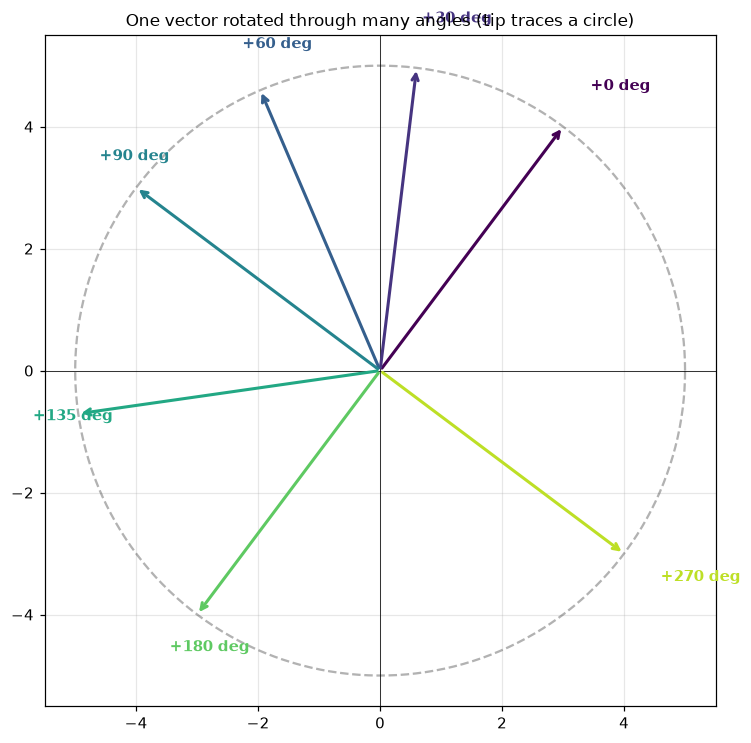

**Concrete check** with $v = (3, 4)$ (length 5, angle $\approx 53°$):

| $\theta$ | Polar after | Cartesian after | Length |
|---|---|---|---|
| $0°$   | $(5, 53°)$  | $(3.00,  4.00)$  | 5 ✓ |
| $30°$  | $(5, 83°)$  | $(0.60,  4.96)$  | 5 ✓ |
| $90°$  | $(5, 143°)$ | $(-4.00, 3.00)$  | 5 ✓ |
| $180°$ | $(5, 233°)$ | $(-3.00, -4.00)$ | 5 ✓ |
| $360°$ | back to $(5, 53°)$ | $(3.00, 4.00)$ | full revolution |

---

### 21.4 Where the rotation matrix comes from

Why those exact entries? Apply the rotation to the basis vectors and see
where they land:

- $\hat{x} = (1, 0)$ lands at $(\cos\theta, \sin\theta)$.
- $\hat{y} = (0, 1)$ lands at $(-\sin\theta, \cos\theta)$.

The columns of $R(\theta)$ are **literally "where the basis vectors end
up."** Any vector $v = v_x \hat{x} + v_y \hat{y}$ then rotates by linearity
to $v_x (\cos\theta, \sin\theta) + v_y (-\sin\theta, \cos\theta)$ — exactly
the matrix formula.

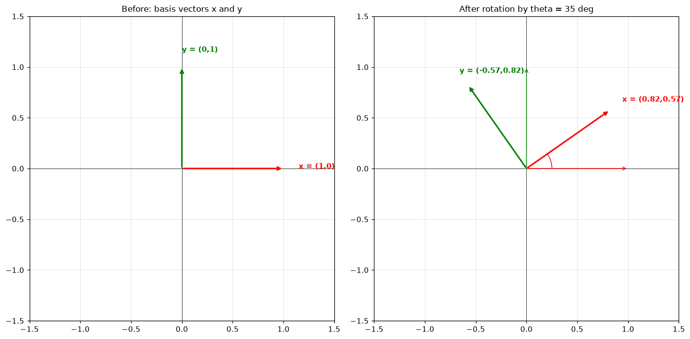

Sanity check at $\theta = 90°$ ($\cos = 0, \sin = 1$):

$$R(90°) \begin{pmatrix} 1 \\ 0 \end{pmatrix} = \begin{pmatrix} 0 \\ 1 \end{pmatrix} \;\; (\text{right} \to \text{up}), \qquad R(90°) \begin{pmatrix} 0 \\ 1 \end{pmatrix} = \begin{pmatrix} -1 \\ 0 \end{pmatrix} \;\; (\text{up} \to \text{left})$$

---

### 21.5 The central trick: rotation makes dot products see only differences

Combine two facts:

- **Composition adds angles**: $R(\alpha) \cdot R(\beta) = R(\alpha + \beta)$.
- **Rotating both by the same angle preserves dot product**.

Then:

$$\langle R(\alpha) u,\; R(\beta) v \rangle = \langle u,\; R(\beta - \alpha) v \rangle$$

The dot product depends **only on the difference** of the two rotation
angles. Now set $\alpha = i\theta$ (query at position $i$) and
$\beta = j\theta$ (key at position $j$):

$$\langle R(i\theta) q,\; R(j\theta) k \rangle = \langle q,\; R((j-i)\theta) k \rangle$$

The attention score depends on $(j - i)$ — the **relative** distance
between query and key positions. Absolute positions vanish.

The figure shows the same $q$ and $k$ vectors placed at three different
absolute positions, all with gap $j - i = 2$: the dot product is identical
in all three panels.

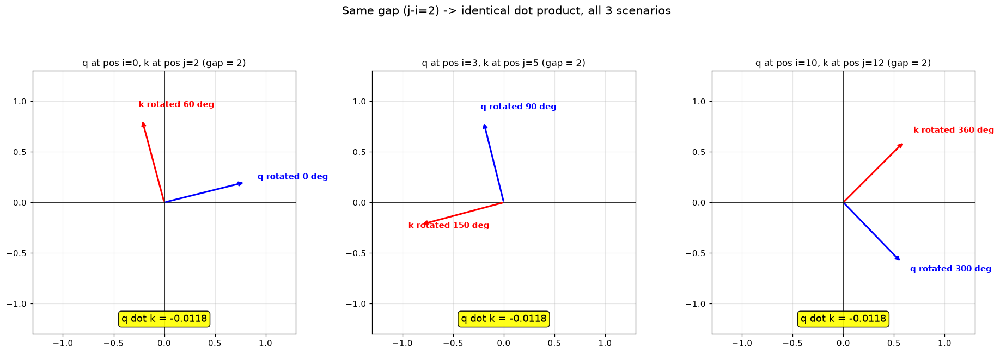

#### Unpacking $R(\alpha)\cdot R(\beta) = R(\alpha + \beta)$

This one identity does most of the work in RoPE. Reading right-to-left
(matrices act on the vector on the right): rotating by $\beta$ first and
then by $\alpha$ is the same as one rotation by $(\alpha + \beta)$.
**Composing rotations *adds* their angles.**

**Why it's true (algebraic proof).** Multiply the matrices and use the
angle-addition identities:

$$R(\alpha)\,R(\beta)
= \begin{pmatrix} \cos\alpha & -\sin\alpha \\ \sin\alpha & \cos\alpha \end{pmatrix}
  \begin{pmatrix} \cos\beta & -\sin\beta \\ \sin\beta & \cos\beta \end{pmatrix}
= \begin{pmatrix} \cos(\alpha+\beta) & -\sin(\alpha+\beta) \\ \sin(\alpha+\beta) & \cos(\alpha+\beta) \end{pmatrix}$$

using

$$\cos(\alpha+\beta) = \cos\alpha\cos\beta - \sin\alpha\sin\beta, \qquad
\sin(\alpha+\beta) = \sin\alpha\cos\beta + \cos\alpha\sin\beta.$$

The matrix identity **is** the trig angle-addition formula in disguise.

**Six immediate consequences.**

1. **Iterated rotations → multiplication.**
   $R(\theta)^n = R(n\theta)$. This is exactly RoPE at position $i$:
   $R(\theta)^i = R(i\theta)$.

2. **Inverse = rotate the other way.**
   $R(\theta)^{-1} = R(-\theta) = R(\theta)^\top$ (rotations are
   orthogonal: $R^\top R = I$).

3. **Commutativity (in 2-D only).**
   $R(\alpha) R(\beta) = R(\beta) R(\alpha)$ because angle addition is
   commutative. In 3-D, rotations around different axes do **not** commute
   — which is why airplane orientations are tricky.

4. **The RoPE relative-position derivation.** Plug consequences 1–2 in:

   $$\langle R(i\theta)\,q,\, R(j\theta)\,k\rangle
   = q^\top R(i\theta)^\top R(j\theta)\,k
   = q^\top R(-i\theta)\,R(j\theta)\,k
   = q^\top R\!\bigl((j-i)\theta\bigr)\,k.$$

   The vanishing of absolute positions $i$ and $j$ comes **directly** from
   $R(\alpha)R(\beta) = R(\alpha+\beta)$.

5. **Complex-number view.** Identifying 2-D vectors with complex numbers,
   $R(\theta)$ becomes multiplication by $e^{i\theta}$, and the formula
   becomes the exponential law

   $$e^{i\alpha} \cdot e^{i\beta} = e^{i(\alpha+\beta)}.$$

   Same fact, two notations.

6. **Group-theory framing (the deep "why").** The set
   $\{R(\theta) : \theta \in \mathbb{R}\}$ with matrix multiplication is a
   **group** — a one-parameter subgroup of $SO(2)$. The map

   $$\theta \;\longmapsto\; R(\theta)$$

   is a **group homomorphism** from $(\mathbb{R}, +)$ to $(SO(2), \cdot)$:
   it sends addition of angles to multiplication of matrices. When people
   say "RoPE uses a one-parameter subgroup of the orthogonal group," this
   single identity is the entire structure they mean.

> **One-liner takeaway.** Because rotations satisfy
> $R(\alpha)R(\beta) = R(\alpha+\beta)$, two rotation angles **subtract**
> inside the dot product — which is exactly what makes attention scores
> see only the *relative* position $(j - i)$. No other simple
> transformation has this property.

#### Q: "Does $(q(i), k(j))$ give the same score as $(k(i), q(j))$?"

Short answer: **no, in general** — and that's a feature, not a bug. RoPE
encodes a **signed** relative offset, so direction matters.

There are actually two distinct "swaps" worth distinguishing:

**Swap A — same vectors, swap the positions.** Put $q$ at position $j$ and
$k$ at position $i$:

$$\langle R(j\theta)\,q,\, R(i\theta)\,k\rangle = q^\top R\bigl((i-j)\theta\bigr) k = q^\top R\bigl(-(j-i)\theta\bigr) k$$

The gap flipped sign. The score for "key is 5 tokens after query" is *not*
the same as "key is 5 tokens before query." This signed direction is
exactly what causal language modeling needs — "the previous word" feels
different from "the next word."

**Swap B — same positions, swap the roles of $q$ and $k$.** This is what
your question literally asks:

$$\langle R(i\theta)\,k,\, R(j\theta)\,q\rangle
= k^\top R\bigl((j-i)\theta\bigr) q
= q^\top R\bigl((j-i)\theta\bigr)^\top k
= q^\top R\bigl(-(j-i)\theta\bigr) k$$

(using $u^\top M v = v^\top M^\top u$ and $R(\alpha)^\top = R(-\alpha)$.)

Same conclusion: **swapping $q$ and $k$ also flips the sign of the offset
inside the dot product**, so it generally gives a different score.

**The symmetry that *does* hold:**

$$\text{score}\bigl((q,i),(k,j)\bigr) \;=\; \text{score}\bigl((k,j),(q,i)\bigr) \;\text{ when both swaps are applied simultaneously.}$$

That is, swapping $q \leftrightarrow k$ **and** swapping the positions
gives the original score back. Geometrically: the angle between the two
rotated vectors only cares about the absolute gap; reversing both
together undoes the sign flip.

**Side note: ordinary attention isn't symmetric in $(q, k)$ either.** Even
without RoPE, $q$ and $k$ come from *different* projection matrices
$W_q$ and $W_k$:

$$(W_q x_i) \cdot (W_k x_j) \;\ne\; (W_q x_j) \cdot (W_k x_i)$$

in general. RoPE just adds another (intentional) source of directional
asymmetry on top of this.

> **TL;DR.** RoPE distinguishes direction. Swapping positions, or swapping
> $q$/$k$, both flip the sign of the relative offset $(j - i)$ inside the
> dot product. Doing both swaps together cancels out. This signed
> directionality is essential for causal language modeling.

---

### 21.6 Q: "Why do we need rotation to get relative distance? Is it just for easy implementation?"

**No — rotations are forced by the requirements, not chosen for
convenience.** Let me list what we need from a position-injection scheme
$f(q, i)$ and rule out candidates:

**Requirement 1: Relative-position-only.** $\langle f(q,i), f(k,j)\rangle$
must depend only on $(j - i)$.

**Requirement 2: Norm-preserving.** Softmax is sensitive to scale; if $f$
shrunk vectors at large positions, attention temperatures would silently
shift. So $\|f(q, i)\| = \|q\|$ for all $q, i$.

**Requirement 3: Cheap and differentiable.** Applied $\sim 64{,}000$ times
per forward pass in a 32-layer/2k-context model. Must be $O(d)$.

Candidates:

| Candidate | Definition | Relative-only? | Norm-preserving? |
|---|---|---|---|
| **Add a position vector** | $f(q, i) = q + p_i$ | ❌ Cross terms $q \cdot p_j$ depend on $j$ alone | ❌ Adding changes length |
| **Multiply by a scalar** | $f(q, i) = c_i q$ | ❌ Factor $c_i c_j$ depends on product, not difference | ❌ Stretching changes length |
| **General linear map** | $f(q, i) = M_i q$ | Need $M_i^\top M_j$ depends only on $j-i$ | Need $M_i^\top M_i = I$ (orthogonal) |

Requirement 2 alone narrows $M_i$ to **orthogonal matrices**. Combining
with Requirement 1: the family $\{M_i\}$ must satisfy
$M_i^\top M_j = M_{j-i}$. Theorem: such families are exactly
**one-parameter subgroups of the orthogonal group** — i.e., powers of a
single rotation. In 2D that means $M_i = R(i\theta)$; in higher dim it
means **block-diagonal rotations**. Exactly RoPE.

> **Rotations aren't a clever pick. They are uniquely determined by the
> requirements.** The fact that they also happen to be cheap to compute is a
> happy bonus, not the reason they were chosen.

---

### 21.7 Complex-number view (a slicker derivation)

Pair up dimensions and view each pair $(q_{2k}, q_{2k+1})$ as a **complex
number** $z_k = q_{2k} + i\, q_{2k+1}$. Then:

- Dot product over a pair: $\operatorname{Re}(\bar{z}_q\, z_k)$.
- "Rotation by angle $\alpha$": multiplication by the unit complex number
  $e^{i\alpha}$, i.e. $z \mapsto e^{i\alpha} z$.

If we set $f(z, i) = e^{i\,i\theta}\, z$:

$$\overline{f(z_q, i)} \cdot f(z_k, j) = \overline{e^{ii\theta} z_q}\cdot e^{ij\theta} z_k = e^{i(j-i)\theta}\,\bar{z}_q z_k$$

Real part depends only on $(j - i)$ ✅.

> **RoPE = multiplying each dimension-pair by a unit complex number whose
> phase rotates linearly with position.** Same operation as 2-D rotation,
> just in complex notation.

---

### 21.8 Q: "Why pair them? What's the purpose? What does RoPE produce?"

This was the right thing to be confused about. The previous treatment was
too abstract; here is the bottom-up motivation.

**Step A — What RoPE wants to produce.** A modified Q/K vector such that:

1. **Same shape** as the input ($d_k \to d_k$).
2. **Same magnitude** as the input ($\|f(q)\| = \|q\|$).
3. **The dot product $q' \cdot k'$ depends only on $(j - i)$.**

Property 3 is the entire payoff. Every design choice in RoPE — pairing,
per-pair frequencies, the constant $\Theta = 10000$ — exists to make it
true.

**Step B — Why pair: rotations are inherently 2-D.** The math operation
"rotation by angle $\theta$" only lives in 2-D (or as a chain of 2-D
rotations in higher dim). A real Q/K vector has dimension 64 or 128. There
is no single "angle" that rotates a 64-D vector. So we face a mismatch:

- The trick we want (rotations) lives in 2-D.
- Our vectors live in 64-D.

**RoPE's solution: chop the 64-D vector into 32 separate 2-D vectors and
rotate each one independently.** That is the entire purpose of pairing.

```text
q = (q₀, q₁, q₂, q₃, q₄, q₅, ...)
     └pair0┘  └pair1┘  └pair2┘
```

The numbers haven't changed — we are just choosing to **read** the 64-D
vector as 32 little 2-D vectors so we can rotate them.

**Step C — Why the property survives summing.** The big dot product
decomposes naturally over the pairs:

$$q \cdot k = (q_0 k_0 + q_1 k_1) + (q_2 k_2 + q_3 k_3) + \cdots$$

If each pair's contribution depends only on $(j - i)$, the sum does too:

$$\langle R^i q, R^j k\rangle = \sum_k \langle R(i\theta_k) q^{(k)}, R(j\theta_k) k^{(k)}\rangle = \sum_k g_k(q^{(k)}, k^{(k)}, j - i)$$

Each pair contributes its own "depends only on $(j-i)$" piece; their sum
still depends only on $(j-i)$.

> **Pairing isn't a hack; it's the natural way to lift the 2-D rotation
> trick into high-dim. Slice into pairs, rotate each pair, reassemble.**

---

### 21.9 Different frequencies per pair (multi-scale)

OK we have to pair — that's forced by the 2-D-only nature of rotation. Why
do different pairs rotate at different *frequencies*?

If every pair rotated by the same angle $i\theta$, the whole vector would
basically rotate together and the model would have only one "scale" of
position information. By giving pair $k$ a different frequency $\theta_k$,
**each pair samples position at its own resolution**:

$$\theta_k = \Theta^{-2k/d_k}, \quad k = 0, 1, \dots, d_k/2 - 1, \quad \Theta = 10000$$

| Pair $k$ | Frequency | Behavior |
|---|---|---|
| $k = 0$ (fastest) | $\Theta^0 = 1$ rad/pos | One radian per token; full revolution every $\sim 6$ tokens |
| $k = d_k/2 - 1$ (slowest) | $\Theta^{-1} = 10^{-4}$ rad/pos | Needs $\sim 63000$ tokens to complete one revolution |

- **Fast pairs** (small $k$): change a lot per step → distinguish **nearby**
  positions (token 5 vs token 6).
- **Slow pairs** (large $k$): change little per step → register **large**
  position differences (paragraph 1 vs paragraph 10).

The combined state of all $d_k/2$ pairs at position $i$ is a unique
**multi-scale fingerprint** of that position — same idea as Fourier
features or wavelet bases, covering many frequency scales so any position
pattern can be reconstructed.

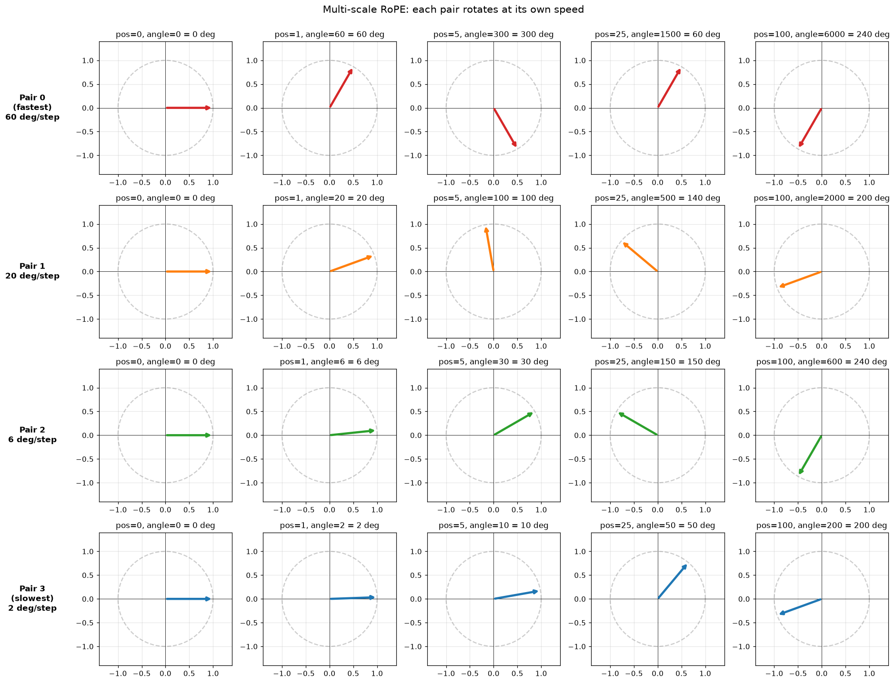

**Why $\Theta = 10000$?** Inherited from sinusoidal embeddings. Gives a
useful range of frequencies (~1 rad/pos down to ~0.0001 rad/pos) that suits
typical sequence lengths (hundreds to thousands of tokens). Long-context
models sometimes use $\Theta = 500{,}000$ to stretch the frequencies —
the **"RoPE base scaling"** trick.

#### Q: "What is the purpose of frequency here, and how does the gap impact the computation?"

**Frequency = rotation speed.** $\theta_k$ is the number of radians pair
$k$'s clock hand advances per **one-position step**. So the angle
accumulated at position $i$ on pair $k$ is

$$\text{angle}(i, k) = i \cdot \theta_k.$$

| Pair $k$ | $\theta_k$ (rad/step) | What 1 position step does |
|---|---|---|
| 0   | $1.0$        | Hand sweeps $\approx 57°$ |
| 5   | $\approx 0.46$ | Hand sweeps $\approx 26°$ |
| 16  | $0.01$       | Hand sweeps $\approx 0.57°$ |
| 31  | $\approx 10^{-4}$ | Hand sweeps $\approx 0.006°$ |

**Why different frequencies?** To resolve position at many scales
simultaneously, like a clock with hour/minute/second hands. A clock with
only a second hand pinpoints seconds but is useless for distinguishing
3pm from 4pm; an hour-only clock is the opposite. You need both.

| Pair speed | Good at distinguishing | Bad at |
|---|---|---|
| Fast clocks (small $k$) | Close positions ("token 5 vs 6") | Far positions (aliasing: pos 10 and pos 16 may both land at 0°) |
| Slow clocks (large $k$) | Far positions ("paragraph 1 vs 10") | Close positions (change between adjacent tokens too small) |

**How the gap enters the dot product.** From §21.5, the dot product of a
rotated Q and a rotated K depends only on the **gap** $(j - i)$:

$$\langle R(i\theta) q,\; R(j\theta) k\rangle = q^\top R\!\bigl((j - i)\theta\bigr) k.$$

So when attention is scored, **for each pair $k$**, the rotation applied
inside the dot product is by angle

$$\boxed{\;\text{relative angle}_k = (j - i) \cdot \theta_k\;}$$

That is: **gap $\times$ frequency**.

**Concrete numbers** ($d_k = 64$, $\Theta = 10000$), showing what each
pair "sees" for three different gaps:

| Gap $(j-i)$ | Pair 0 ($\theta_0 = 1$) | Pair 16 ($\theta_{16} = 0.01$) | Pair 31 ($\theta_{31} \approx 10^{-4}$) |
|---|---|---|---|
| 1    | $1$ rad $\approx 57°$   | $0.01$ rad $\approx 0.6°$  | $10^{-4}$ rad $\approx 0.006°$ |
| 10   | $10$ rad $\equiv 213°$  | $0.1$ rad $\approx 5.7°$   | $10^{-3}$ rad $\approx 0.06°$  |
| 100  | $100$ rad $\equiv 220°$ | $1$ rad $\approx 57°$      | $0.01$ rad $\approx 0.6°$      |
| 1000 | $1000$ rad $\equiv 304°$| $10$ rad $\equiv 213°$     | $0.1$ rad $\approx 5.7°$       |

Reading each column:

- **Pair 0 (fast)**: gap = 1 already swings the hand 57°; by gap = 100 it
  has wrapped many times. Great for telling gap 1 from gap 5; useless for
  telling gap 100 from gap 1000.
- **Pair 16 (medium)**: imperceptible at gap = 1, but a clean $\sim 57°$
  rotation by gap = 100, fully wrapping by gap = 1000.
- **Pair 31 (slow)**: barely moves at gap = 100; only at gap = 1000 does
  it produce a noticeable $5.7°$ rotation.

**Each pair is "tuned" to a different scale of gap.** The gap is the
*signal*; the frequency is *how each pair scales that signal into an
angle*.

**Fourier-series view.** The contribution from pair $k$ to the attention
score, as a function of gap $d$, is

$$f_k(d) \;=\; a_k \cos(d \cdot \theta_k) \;+\; b_k \sin(d \cdot \theta_k)$$

where $a_k, b_k$ depend on $q^{(k)}, k^{(k)}$. The total attention score
is the **sum** of these waves — a mixture of cosines at many frequencies,
i.e. a Fourier series in $d$. Different combinations of $\{a_k, b_k\}$
(learned through $W_q$, $W_k$) let the model construct attention patterns
that emphasize any distance scale it cares about (short-range syntax vs
long-range topical structure).

> **One-liner.** Frequencies give RoPE different *resolutions* of distance.
> The gap $(j-i)$ scales each frequency into a rotation angle, and the
> resulting per-pair rotations together determine how the attention dot
> product depends on relative position.

#### Q: "Are $i, j, k$ positions of input tokens, or positions of some weight vector?"

They are **two completely different kinds of indices**:

| Symbol | What it indexes | Lives in | Range |
|---|---|---|---|
| $i$ | position of the **query token** in the sentence | sequence | $0 \dots \text{seq\_len}-1$ |
| $j$ | position of the **key token** in the sentence | sequence | $0 \dots \text{seq\_len}-1$ |
| $k$ | which **pair slot** inside one Q/K vector | inside one head's vector | $0 \dots d_k/2 - 1$ |

So:

- $i$ and $j$ are positions of **actual tokens in the input stream**.
  $(j - i)$ is the **token-position gap**.
- $k$ is **not a position at all**. A head's Q/K vector of length $d_k$ is
  chopped into $d_k/2$ consecutive pairs; $k$ picks **which pair** ("which
  clock"). Each pair has its own frequency $\theta_k$.

There is **no weight-vector position**. The weights $W_q, W_k$ are applied
identically to every token — they have no notion of position. Position
information enters *only* through RoPE's rotation, indexed by the token's
own $i$ or $j$.

So the formula

$$\text{relative angle}_k \;=\; (j - i) \cdot \theta_k$$

reads as: "for **pair $k$** (a slice of the Q/K vector), the rotation that
appears inside the dot product is the **token-position gap** times that
pair's frequency."

#### Q: "Why don't we use a single frequency, since $(j-i)$ already gives us the distance?"

Because with one frequency the attention score becomes a **single cosine
of the gap**, and one cosine cannot represent useful relative-position
patterns. Three problems pile up:

**Setup with one frequency.** If every pair shared a single $\theta$,
RoPE's relative-rotation theorem (§21.5) collapses the position-dependent
part of the dot product to one wave:

$$\langle R(i\theta) q,\; R(j\theta) k\rangle \;=\; A\cos\!\bigl((j-i)\theta\bigr) \;+\; B\sin\!\bigl((j-i)\theta\bigr) \;=\; C\cos\!\bigl(d\theta + \varphi\bigr)$$

where $d = j - i$. That is **a single sinusoid** as a function of the gap.

**Problem A — Aliasing.** A cosine repeats every $2\pi/\theta$ steps, so
many distinct gaps map to the same angle:

$$\cos(d\theta) \;=\; \cos\!\bigl((d + 2\pi/\theta)\theta\bigr).$$

The model literally **cannot tell those gaps apart from position alone**.

**Problem B — Resolution vs range trade-off.** A single $\theta$ forces
a choice you can't escape:

| Choose | Effect | Cost |
|---|---|---|
| Large $\theta$ (fast clock) | Adjacent gaps differ a lot → great short-range resolution | Wraps quickly → cannot distinguish gap 50 from gap 500 |
| Small $\theta$ (slow clock) | Distinguishes far ends of context | Gaps 1, 2, 3 collapse to nearly the same angle → no short-range resolution |

Multi-frequency dodges this: fast clocks for "is this the next token?",
slow clocks for "is this several paragraphs back?" — **all scales at once**.

**Problem C — Only one shape of relative-position pattern.** With a
single frequency, the per-head pattern as a function of gap is always
$C\cos(d\theta + \varphi)$ — a one-parameter family. Real attention needs:

- monotone decay (closer tokens matter more),
- local windows ("only the previous 5 tokens"),
- specific offsets ("the token 64 back"),
- broad topical attention.

Each of these requires combining sinusoids of **different frequencies** —
that's the Fourier-series statement:

$$\text{any function of } d \;\approx\; \sum_k \bigl[a_k \cos(d \theta_k) + b_k \sin(d \theta_k)\bigr].$$

One frequency = one term in the sum = no Fourier basis.

**Clock analogy.** A clock with **only a second hand** reads seconds
precisely but can't tell 2pm from 3pm from last Tuesday. A clock with
hour + minute + second hands gives an unambiguous timestamp across a huge
range. RoPE's $\theta_k = \Theta^{-2k/d_k}$ is exactly that: a logarithmic
ladder of clocks from "second" down to "century."

| With one $\theta$ | With many $\theta_k$ |
|---|---|
| Score is a single $\cos(d\theta + \varphi)$ | Score is $\sum_k a_k\cos(d\theta_k) + b_k\sin(d\theta_k)$ |
| Aliasing: distinct gaps collapse | Combined fingerprint is unique over useful range |
| Pick *either* short- or long-range | Both simultaneously |
| Only one shape of pattern | Any shape (decay, windows, offsets) |

So $(j-i)$ alone isn't enough — a single frequency throws away most of
the information in that gap. Multi-frequency is what turns the raw gap
into a **rich, distinguishable, learnable** representation of distance.

#### Q: "Can you draw the flow from token → Q/K vectors → RoPE → attention to make $i, j$ vs pair $k$ concrete?"

**Layer 1 — A sentence as a sequence of tokens.** $i$ and $j$ are
**slots in the sentence**:

```
position:    0       1       2       3       4       5       6
token:     "The"  "cat"   "sat"   "on"    "the"  "mat"   "."
              ↑                                    ↑
              i = 0 (query)                        j = 5 (key)
              gap (j-i) = 5
```

**Layer 2 — Each token becomes one Q vector and one K vector (per head).**
For one head with tiny $d_k = 8$:

```
token at position i=0 ("The")
       │
       │  W_q · embedding         W_k · embedding
       ▼                          ▼
   q_0 =  [ q0  q1 | q2  q3 | q4  q5 | q6  q7 ]      ← length d_k = 8
   k_0 =  [ k0  k1 | k2  k3 | k4  k5 | k6  k7 ]
            └─────┘ └─────┘ └─────┘ └─────┘
            pair 0  pair 1  pair 2  pair 3      ← d_k/2 = 4 pairs
              ↑       ↑       ↑       ↑
              k=0     k=1     k=2     k=3       ← the "pair index k"
```

Every token gets the same shape vector. The vector is **chopped into
pairs**. Index $k$ says "which pair."

**Layer 3 — RoPE rotates each pair by an angle that depends on both the
token's position and the pair's frequency.** For a token at position $i$,
pair $k$ is rotated by angle $i \cdot \theta_k$:

```
                            pair 0          pair 1          pair 2          pair 3
                         θ_0 (fastest)    θ_1            θ_2            θ_3 (slowest)

position i=0 ("The"):    rotate by 0·θ_0  rotate by 0·θ_1  rotate by 0·θ_2  rotate by 0·θ_3
                            = 0°            = 0°            = 0°            = 0°

position j=5 ("mat"):    rotate by 5·θ_0  rotate by 5·θ_1  rotate by 5·θ_2  rotate by 5·θ_3
                          (huge angle)    (medium)        (small)         (tiny)
```

Picture each pair as a **little clock** stamped onto the vector:

```
   pair 0          pair 1         pair 2          pair 3
   ┌──────┐       ┌──────┐       ┌──────┐        ┌──────┐
   │  ⟲   │       │  ↻   │       │  ·   │        │  ·   │
   │ fast │       │ med  │       │ slow │        │ very │
   │      │       │      │       │      │        │ slow │
   └──────┘       └──────┘       └──────┘        └──────┘
   θ_0=1.00       θ_1≈0.18       θ_2≈0.03        θ_3=0.001     ← rad per position
```

Same token → different pairs rotate at different speeds. Same pair →
different tokens start at different angles.

**Layer 4 — Attention score between token $i$ and token $j$.** Computed
pair-by-pair and summed:

```
score(i, j) =     ⟨rotated_q_i,  rotated_k_j⟩
            =     pair 0 contribution     ← depends on (j-i)·θ_0
                + pair 1 contribution     ← depends on (j-i)·θ_1
                + pair 2 contribution     ← depends on (j-i)·θ_2
                + pair 3 contribution     ← depends on (j-i)·θ_3
                  ─────────────────────
                  one number
```

By the relative-rotation theorem, each pair's contribution depends **only
on the gap** $j - i$, not on $i$ and $j$ individually:

$$\text{pair } k \text{ contribution} \;=\; a_k \cos\!\bigl((j-i)\,\theta_k\bigr) + b_k \sin\!\bigl((j-i)\,\theta_k\bigr)$$

where $a_k, b_k$ come from the actual learned values inside pair $k$ of
$q_i$ and $k_j$.

**Layer 5 — Whole flow as one diagram.**

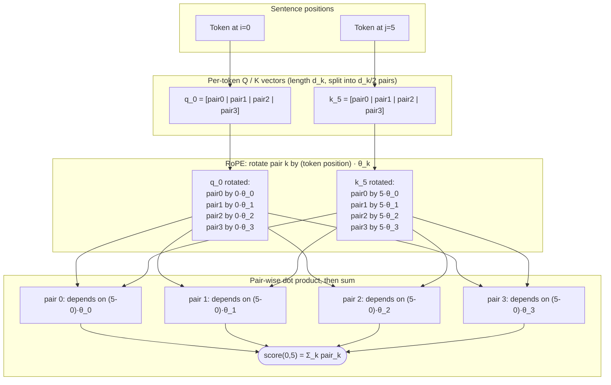

**Two axes you must keep straight.**

```
                              ┌──────────────────┐
                              │  pair index k    │   ← within ONE vector
                              │  k = 0..d_k/2-1  │      (which "clock")
                              └─────────┬────────┘
                                        │
                                        ▼
sentence ─────────────────────────────────────────────────────►
position    0       1       2       3       4       5       6
            T       T       T       T       T       T       T
            │       │       │       │       │       │       │
            ▼       ▼       ▼       ▼       ▼       ▼       ▼
          q_0     q_1     q_2     q_3     q_4     q_5     q_6     ← each is a vector
          k_0     k_1     k_2     k_3     k_4     k_5     k_6        of d_k/2 pairs

attention pair (i, j) = pick two columns and dot-product them
                    ─────────────────────────────────────────
                    score depends on the GAP (j-i) at every pair k
```

- **Horizontal axis** = positions in the sentence → that's $i, j$.
- **Vertical axis** (inside one token's vector) = pair slots → that's $k$.

> **Mental model in one sentence.** Each token gets a vector of $d_k/2$
> little clocks (the pair index $k$ picks the clock). The clock at slot
> $k$ on the token at position $i$ has been wound forward by angle
> $i \cdot \theta_k$. When token $i$ attends to token $j$, every pair
> contributes a number that depends only on **how much further pair $k$'s
> clock advanced from $i$ to $j$** — namely $(j - i) \cdot \theta_k$.

#### Q: "Angles wrap past 360°, but sequences can have thousands of positions — how is that handled?"

Short answer: **angles do wrap, but `cos`/`sin` handle wraparound
automatically and multi-frequency design makes confusion between distinct
positions practically impossible.**

For pair 0 at $\theta_0 = 1$ rad/step ($\approx 57°$/step):

| Position $i$ | Angle $i\theta_0$ | $\pmod{2\pi}$ |
|---|---|---|
| 0    | $0$    | $0°$ |
| 6    | $6$    | $344°$ |
| 7    | $7$    | $41°$ ← already wrapped past 360° |
| 100  | $100$  | $\approx 220°$ |
| 1000 | $1000$ | $\approx 304°$ |

Pair 0 alone *cannot* distinguish position 7 from a later position landing
at the same angle modulo $2\pi$. **That's fine, for two reasons:**

1. **Many clocks, many speeds.** RoPE has $d_k/2$ pairs at very different
   frequencies. Two distinct positions would have to alias on *every*
   clock simultaneously — the combined period is the LCM of all
   individual periods, which is astronomical. Think combination lock: any
   single dial repeats, but the full combination is unique up to a
   colossal cycle length.

2. **`cos`/`sin` evaluate the un-wrapped angle directly.** Code computes
   `cos(i * theta)` and `sin(i * theta)`. The hardware happily evaluates
   $\cos(1000.0)$ and returns $\approx 0.562$ — no manual modular
   arithmetic needed. The wraparound is lossless (up to float precision).

The real failure mode isn't 360° wraparound — it's **extrapolation past
`max_seq_len` seen during training** (covered in the next Q&A).

#### Q: "Is the difference between gap 99 and gap 9999 actually large?"

**Mathematically: yes, enormous.** Practically: depends on what the model
saw during training.

For $d_k = 64$, $\Theta = 10000$:

| Pair $k$ | $\theta_k$ (rad/step) | angle at gap=99 | angle at gap=9999 |
|---|---|---|---|
| 0 (fastest) | $1$               | $99$ rad $\equiv 272°$  | $9999$ rad $\equiv 170°$ |
| 16 (middle) | $0.01$            | $0.99$ rad $\approx 57°$ | $99.99$ rad $\equiv 329°$ |
| 31 (slowest)| $\sim 1.15 \times 10^{-4}$ | $0.011$ rad $\approx 0.65°$ | $1.15$ rad $\approx 66°$ |

Look at the slowest pair: it barely moves at gap 99 (<1°) but rotates
through ~66° at gap 9999. That is exactly the signal RoPE uses to
distinguish "100 tokens apart" from "10000 tokens apart." Without the slow
clocks, only the fast clocks remain — and those alias, unable to separate
the two gaps meaningfully.

So `⟨R(1θ) q, R(100θ) k⟩` and `⟨R(1θ) q, R(10000θ) k⟩` will, in general,
be **very different numbers**. RoPE has no trouble separating these gaps
mathematically.

**The practical caveat — training context length:**

- A model trained at `max_seq_len = 2048` only ever saw the slow clocks
  rotate within $\sim [0, 2048 \cdot 1.15\times 10^{-4}] \approx [0, 13°]$.
- At inference with gap 9999, those slow clocks land at $\sim 66°$ — a
  regime the model has **never been trained to interpret**. Perplexity
  spikes; outputs degrade.

This is the famous "**RoPE doesn't extrapolate**" problem. The math
distinguishes the gaps perfectly; the *learned weights* don't know what
to do with the new angles. Solutions:

| Technique | Idea |
|---|---|
| **Position interpolation** (Chen et al. 2023) | Rescale positions by `train_len / target_len` so slow clocks stay in trained range |
| **NTK-aware scaling** | Increase $\Theta$ so the frequency spectrum stretches without retraining |
| **YaRN** | Hybrid: scale only the slow frequencies, leave the fast ones alone |
| **RoPE base scaling** | LLaMA-2-32k uses $\Theta = 500{,}000$ from day one |
| **Retrain with longer context** | Expensive but correct |

All of these keep the **slow** clocks' angles inside the range the model
has learned to interpret. The fast clocks' constant wraparound was never
a problem.

> **TL;DR.** The angle wraps; that's harmless because `cos`/`sin` handle
> it and the slow clocks provide unambiguous coarse position. The real
> long-context problem is **distribution shift** of the slow clock
> angles past what training covered — solved by interpolation, NTK
> scaling, YaRN, or RoPE base scaling.

#### Q: "Why split the vector into pairs at all?"

The split serves **two distinct purposes** — one forced by math, one
chosen for capacity.

**Reason A (forced) — rotation is a 2-D operation.**
A "rotation" needs a **plane**, and the smallest object with a plane is
**2 numbers**. You cannot rotate a single scalar. The 2-D rotation by
angle $\alpha$ is

$$\begin{pmatrix} a' \\ b' \end{pmatrix} = \begin{pmatrix} \cos\alpha & -\sin\alpha \\ \sin\alpha & \cos\alpha \end{pmatrix}\begin{pmatrix} a \\ b \end{pmatrix}.$$

Higher-dimensional rotations exist, but **any orthogonal rotation in
$\mathbb{R}^{d_k}$ that preserves the dot product can be decomposed into
independent 2-D rotations on $d_k/2$ planes**. So if you want to encode
position with rotations, you **must** group dimensions into pairs.

**Reason B (chosen) — many independent position channels.**
OK, pairing is forced. But why $d_k/2$ **different** pairs, each with its
own frequency? Because the model needs many independent position signals,
not one. Each pair becomes one "channel" carrying position information
at a particular scale:

```
   ┌──────────┐ ┌──────────┐ ┌──────────┐  ...  ┌──────────┐
   │ pair 0   │ │ pair 1   │ │ pair 2   │       │ pair 31  │
   │ rotates  │ │ rotates  │ │ rotates  │       │ rotates  │
   │ fast     │ │ a bit    │ │ slower   │       │ glacial  │
   │ θ_0 = 1  │ │ slower   │ │ θ_2≈.32  │       │ θ_31≈1e-4│
   └──────────┘ └──────────┘ └──────────┘       └──────────┘
        │            │            │                  │
        ▼            ▼            ▼                  ▼
   short-range   short-mid    medium-range       long-range
   "next token?" "1-5 back?"  "this sentence?"   "this chapter?"
```

Through learned $W_q, W_k$, the model decides which pairs (rulers) to use
for which job:

- A "previous-token" head emphasizes pairs 0–2 (short rulers).
- A long-range topical head emphasizes pairs 28–31 (long rulers).
- A "every 8 tokens" head combines medium pairs so $\cos(8\theta_k)$ rings.

This is the **Fourier basis** view: many frequencies → many shapes of
relative-position pattern expressible.

**Hierarchy of "why pairs".**

```
Q: Why split into pairs?
│
├─ Reason A (forced):  Rotation is a 2-D operation.
│                      Can't rotate a single number.
│                      → Pair size = 2 is the minimum unit.
│
└─ Reason B (chosen):  Want many independent position signals
                       across many scales.
                       → Use d_k/2 pairs, each with its own θ_k.
                       → Gives a Fourier basis the model uses to
                         build any pattern of relative attention.
```

**What if we did *not* split into pairs?**

| Design | Problem |
|---|---|
| 1-D "rotation" (scale by $\cos\theta$) | Not a rotation; not orthogonal; loses information |
| Rotate the whole $d_k$-D vector by a single $\theta$ | Only one frequency available → single cosine → aliasing |
| One pair only ($d_k = 2$), leave other dims untouched | Position info crammed into 2 of 64 dims → washed out by content |
| **$d_k/2$ pairs, each with its own $\theta_k$** ← RoPE | Every dim carries position info at some scale; full Fourier basis |

> **Mental image.** One pair = one clock face. The clock needs two hands
> (x, y) to rotate. Different clocks tick at different speeds. The model
> wears a wristful of clocks so it can read time at every scale at once.

#### Q: "Is the frequency $\theta_k$ basically a weight on the pair? Why not set them all to 1 to make pairs equally important — and why use rotation in the first place?"

Two ideas are being conflated. Untangling them is the whole point.

**$\theta_k$ is not importance.** It is **how fast pair $k$'s clock
ticks per position step.** Importance comes from learned $W_q, W_k$:

| Concept | Set by | Same across pairs? |
|---|---|---|
| **Frequency $\theta_k$** | RoPE design (fixed) | **No** — deliberately different (multi-scale) |
| **Importance / content $(a_k, b_k)$** | Learned via $W_q, W_k$ | **No, and learned** |

So "make them equally important" is already handled — the model controls
importance through learned content. Making all $\theta_k = 1$ does **not**
equalize importance; it makes every pair carry the **same redundant
position signal**. You have $d_k/2$ pairs but only one independent ruler.

**What concretely breaks if $\theta_k = 1$ everywhere?** Every pair
produces the same wave $\cos(d)$, so the attention score collapses to
$C\cos(d + \varphi)$ — a single cosine of the gap. All three failures of
single-frequency design return: aliasing, no long-range resolution, only
one shape of attention-vs-distance pattern.

**Why rotation, not "just add $(j-i)$ as a number"?** RoPE needs four
things simultaneously, and rotation is the only simple operation that
satisfies all four:

| Property | Why it matters |
|---|---|
| **Relative-only emerging from absolute encoding** | Each token's Q/K is computed independently (cacheable), yet the dot product depends only on $(j-i)$ — true because $R(\alpha)R(\beta) = R(\alpha+\beta)$. |
| **Norm preservation** | Rotation is orthogonal: $\|R(\alpha)v\| = \|v\|$. Position changes direction, not magnitude → no scale drift in softmax. |
| **Bounded encoding of unbounded position** | $\cos, \sin \in [-1, 1]$ no matter how big $i$ gets → no exploding activations. |
| **Composition is angle addition** | $R(\alpha)R(\beta) = R(\alpha+\beta)$ → the algebraic identity that makes the relative-only property work. |

**Comparing candidates:**

| Candidate position-op | Relative-only? | Norm-preserving? | Bounded? | Multi-scale possible? |
|---|---|---|---|---|
| Add $(j-i)$ as scalar | yes | no (grows) | no | clumsy |
| Add learned vector $p_i$ to embedding | no (absolute) | no | yes | yes |
| Multiply by $(j-i)$ | yes | no (blows up) | no | clumsy |
| **Rotation $R(i\theta_k)$ per pair** ← RoPE | **yes** | **yes** | **yes** | **yes** |

> **One-liner.** Different frequencies are not different *weights* —
> they are different *rulers*. Using $\theta = 1$ for every pair is like
> measuring everything from millimeters to kilometers with a single
> millimeter ruler. Rotation is the mechanism that turns "where in the
> sentence" into "by how much to rotate" so the dot product automatically
> yields a **relative, bounded, multi-scale** signal — no other simple
> operation does all of that.

#### Q: "So $\theta_k$ controls how strongly position twists the pair-wise dot product? Without rotation = pure content similarity, with rotation = content + position phase shift?"

**Yes — exactly that.** This is the cleanest way to think about RoPE.

**Without RoPE.** For one pair $k$, the dot product is pure content
alignment:

$$\text{pair}_k(q, k) \;=\; \|q^{(k)}\|\,\|k^{(k)}\|\,\cos(\Delta\varphi)$$

where $\Delta\varphi$ is the angle between $q^{(k)}$ and $k^{(k)}$.
**Same score whether the tokens are 1 apart or 1000 apart.**

**With RoPE.** Position rotates each pair before the dot product, and
because $R(\alpha)R(\beta) = R(\alpha+\beta)$, only the **gap** survives:

$$\text{pair}_k\bigl(R(i\theta_k)q,\;R(j\theta_k)k\bigr) \;=\; \|q^{(k)}\|\,\|k^{(k)}\|\,\cos\!\Bigl(\underbrace{\Delta\varphi}_{\text{content angle}} + \underbrace{(j-i)\theta_k}_{\text{position twist}}\Bigr)$$

Magnitudes untouched. No extra term. Just **a phase shift on the cosine.**

**The role of $\theta_k$.** It is the *dial* setting **how many radians
of phase shift one position step contributes for pair $k$**:

| Pair | $\theta_k$ | Rotation per step | Effect on similarity |
|---|---|---|---|
| Pair 0  | $1.0$    | $\sim 57°$    | Big swing — even gap 1 changes alignment a lot |
| Pair 16 | $0.01$   | $\sim 0.6°$   | Tiny swing — barely shifts unless gap is large |
| Pair 31 | $10^{-4}$| $\sim 0.006°$ | Imperceptible at small gaps; noticeable only at huge gaps |

**Concrete numbers.** Suppose $q^{(k)}$ and $k^{(k)}$ start perfectly
aligned (content angle $\Delta\varphi = 0$, similarity $= 1$). Without RoPE,
every pair returns $1.0$ regardless of position. **With RoPE:**

| Gap $(j-i)$ | Pair 0 similarity | Pair 16 similarity | Pair 31 similarity |
|---|---|---|---|
| 1    | $\cos(57°) = 0.54$  | $\cos(0.6°) \approx 1.00$ | $\cos(0.006°) \approx 1.00$ |
| 100  | wraps, $\sim 0.86$  | $\cos(57°) = 0.54$        | $\cos(0.6°) \approx 1.00$   |
| 1000 | wraps chaotically   | wraps                     | $\cos(5.7°) \approx 0.99$   |

Same starting content, **different scales of position-induced fall-off**,
because each pair's $\theta_k$ controls how quickly position rotates the
content out of alignment.

**The full score, with everything on the table.**

$$\text{score}(i, j) \;=\; \sum_k \|q^{(k)}\|\,\|k^{(k)}\|\,\cos\!\bigl(\Delta\varphi_k + (j-i)\theta_k\bigr)$$

The model controls (via learned $W_q, W_k$):

- **Content angles** $\Delta\varphi_k$ — how Q and K align per pair.
- **Magnitudes** $\|q^{(k)}\|\,\|k^{(k)}\|$ — how loud each pair is.

RoPE fixes (no learned parameters):

- **Position twists** $(j-i)\theta_k$ — a fixed ladder of frequencies.

So the model learns *which content angles* to produce so that the position
twists *constructively interfere* into whatever shape of attention-vs-
distance it wants — decay, sharp peak at some offset, broad topical
attention, etc.

> **One-sentence summary.** Without RoPE the pair-wise dot product is
> just content similarity; with RoPE, $\theta_k$ acts as the **dial** that
> says how strongly position twists the content alignment of pair $k$,
> and the sum across all pairs gives the model a multi-scale Fourier basis
> to express any relative-position pattern it needs.

#### Q: "What does `forward(x, token_positions)` in the RoPE module actually do?"

It takes a Q (or K) tensor and the positions of its tokens, and returns
the **same-shaped tensor** with every consecutive pair of features in the
last dimension **rotated** by the appropriate angle. No parameters, no
learning, no Q·K dot product (that's attention's job).

**Inputs.**

| Tensor | Shape | What it is |
|---|---|---|
| `x` | `(..., seq_len, d_k)` | Un-rotated Q or K vectors |
| `token_positions` | `(..., seq_len)`, `int64` | Absolute position of each slot in `x` |

**Output.** Same shape as `x`, with rotations applied.

**The four steps inside `forward`:**

```
1. Split x's last dim into pairs:
   x has shape (..., seq_len, d_k)
   view it as (..., seq_len, d_k/2, 2)
   → each pair (x_even, x_odd) is a 2-D vector to rotate

2. Look up cos/sin for the requested positions:
   cos = self.cos_cache[token_positions]   # (..., seq_len, d_k/2)
   sin = self.sin_cache[token_positions]   # (..., seq_len, d_k/2)

3. Apply 2-D rotation per pair:
   [x_even']   [ cos -sin ] [x_even]
   [x_odd' ] = [ sin  cos ] [x_odd ]

   x_even' = x_even * cos - x_odd  * sin
   x_odd'  = x_even * sin + x_odd  * cos

4. Reshape back to (..., seq_len, d_k) and return.
```

**Why `token_positions` instead of just `range(seq_len)`?** Because the
same slot in `x` can correspond to different absolute positions:

| Scenario | Typical `token_positions` |
|---|---|
| Normal training | `[0, 1, 2, ..., seq_len-1]` |
| KV-cache, generating token 1024 | `[[1024]]` (with `seq_len=1`) |
| Packed sequences (two sentences in one row) | `[0,1,2, 0,1,2,3,4]` |
| Sliding window starting at offset 100 | `[100, 101, 102, 103]` |

So the cache is looked up at **exactly** the positions you supply via
`self.cos_cache[token_positions]` — the advanced-indexing pattern from
[python.md](python.md).

**Visual: what changes between input and output.**

```
Input x at slot s, pair k:                Output at same slot, same pair:
  ┌─────────────────┐                      ┌──────────────────────────┐
  │ x_even   x_odd  │                      │ x_even'        x_odd'    │
  │   (a)     (b)   │ ── rotate by α ──►   │ a·cosα - b·sinα          │
  │                 │   α = pos(s) · θ_k   │ a·sinα + b·cosα          │
  └─────────────────┘                      └──────────────────────────┘

  magnitude √(a²+b²) is unchanged           direction rotated by α
```

> **One-liner.** `forward` is a pure tensor op: split into pairs, look
> up cos/sin at the given positions, rotate each pair, glue back.
> Same shape in, same shape out — but now position-aware.

#### Q: "What do the actual values in `x` and `token_positions` look like?"

Concrete tiny example with `batch=2`, `seq_len=4`, `d_k=4` (so 2 pairs):

**`x` — floats, shape `(2, 4, 4)`.** Output of `W_q @ embedding` (or
`W_k @ embedding`) for each token:

```python
x = tensor([
    # batch 0
    [[ 0.10,  0.20,  0.30,  0.40],   # token at slot 0 → pair0=(0.10,0.20), pair1=(0.30,0.40)
     [ 0.50, -0.10,  0.05,  0.60],   # slot 1
     [-0.20,  0.30, -0.40,  0.10],   # slot 2
     [ 0.15,  0.25,  0.35,  0.45]],  # slot 3
    # batch 1
    [[ 0.00,  1.00, -0.50,  0.50],
     [ 0.20,  0.20,  0.20,  0.20],
     [-0.30,  0.40,  0.10, -0.10],
     [ 0.90,  0.10,  0.00,  0.05]],
])
```

Anatomy of one row:

```
       d_k = 4 features
       ┌───────────────────────────┐
       │ pair 0           pair 1   │
       │ ┌──────┐         ┌──────┐ │
       │ │ 0.10 │   0.20  │ 0.30 │  0.40
       │ └──────┘         └──────┘ │
       │   x_even  x_odd    x_even x_odd
       └───────────────────────────┘
       indices:  0      1      2      3
```

**`token_positions` — integers, shape `(2, 4)`.** Tells RoPE the absolute
position of each slot:

```python
# Normal training:
token_positions = tensor([
    [0, 1, 2, 3],
    [0, 1, 2, 3],
])    # dtype torch.int64
```

**How they pair up.** Element `token_positions[b, s]` tells RoPE: "the
vector `x[b, s, :]` lives at absolute position $p$." Worked example for
`x[0, 2, :] = [-0.20, 0.30, -0.40, 0.10]` with $p = 2$ and
$\theta_0 = 1.0$, $\theta_1 = 0.1$:

```
angles = p * [θ_0, θ_1] = [2.0, 0.2]
cos    = [cos(2.0), cos(0.2)] = [-0.416,  0.980]
sin    = [sin(2.0), sin(0.2)] = [ 0.909,  0.199]

pair 0: (x_even=-0.20, x_odd= 0.30)
   new_even = -0.20·(-0.416) - 0.30·( 0.909) = -0.190
   new_odd  = -0.20·( 0.909) + 0.30·(-0.416) = -0.307

pair 1: (x_even=-0.40, x_odd= 0.10)
   new_even = -0.40·( 0.980) - 0.10·( 0.199) = -0.412
   new_odd  = -0.40·( 0.199) + 0.10·( 0.980) = -0.182

x_rotated[0, 2, :] = [-0.190, -0.307, -0.412, -0.182]
```

Magnitude per pair is preserved: $\sqrt{(-0.20)^2 + 0.30^2} = 0.361$
matches $\sqrt{(-0.190)^2 + (-0.307)^2} = 0.361$. ✓

**Quick reference:**

| Tensor | Shape | Dtype | Meaning |
|---|---|---|---|
| `x` | `(..., seq_len, d_k)` | float | Un-rotated Q or K |
| `token_positions` | `(..., seq_len)` | **`int64`** (long) | Absolute position of each slot |
| `self.cos_cache[token_positions]` | `(..., seq_len, d_k/2)` | float | Looked-up cos values |
| `self.sin_cache[token_positions]` | `(..., seq_len, d_k/2)` | float | Looked-up sin values |
| return | same as `x` | same as `x` | RoPE-rotated Q or K |

#### Q: "Does each query token go from `d_model` (embedding) down to `d_k` in the Q/K vectors?"

**Yes — that's exactly what `W_q` and `W_k` do, before RoPE.** The
embedding lives on the **residual stream at width `d_model`**, but each
attention head sees a narrower **per-head `d_k`-dim slice**.

**Where the shapes change in one layer:**

```
Input token IDs:              shape (B, T)               int
        │
        ▼  embedding lookup
Embeddings:                   shape (B, T, d_model)      float
        │                                ▲
        │                                │  "model width", shared everywhere on the residual stream
        ▼  multiply by W_q, W_k, W_v  (per head)
Q, K, V (one head):           shape (B, T, d_k)          float
        │                                ▲
        │                                │  d_k = d_model / num_heads
        ▼  RoPE on Q and K only (V untouched)
Q_rot, K_rot:                 shape (B, T, d_k)          ← same shape, just rotated
        │
        ▼  scaled dot-product attention
attention output per head:    shape (B, T, d_k)
        │
        ▼  concat heads → multiply by W_o
Final output:                 shape (B, T, d_model)      float
```

**The projection step in detail.** For one head:

```
W_q has shape (d_k, d_model)
W_k has shape (d_k, d_model)
W_v has shape (d_k, d_model)

embedding e ∈ ℝ^d_model
        │
        │  q = W_q @ e
        ▼
        q ∈ ℝ^d_k              ← what RoPE sees
```

**Why `d_k < d_model`?** Multi-head attention splits the work:

| Symbol | Typical value | Where |
|---|---|---|
| `d_model` | 512 / 768 / 4096 | embeddings, residual stream, MLP boundary |
| `num_heads` | 8 / 12 / 32 | how many parallel attention heads |
| `d_k = d_model / num_heads` | 64 / 64 / 128 | per-head Q/K/V dim; **what RoPE rotates** |
| `d_ff` | $\sim 4 \cdot d_{\text{model}}$ | SwiGLU hidden width |

`d_k = 64` with `d_k/2 = 32` pairs is a typical RoPE configuration per
head. Every head runs RoPE independently on its own `d_k`-dim Q and K,
using the **same** frequency ladder $\theta_0, \ldots, \theta_{31}$.

**Two confusions worth dispelling:**

| ✅ True | ❌ False |
|---|---|
| `W_q, W_k` project `d_model → d_k` before RoPE | RoPE is applied to the `d_model` embedding directly |
| RoPE sees only the per-head `d_k`-dim vector | RoPE has a global view of all heads at once |
| `d_k` must be even (RoPE needs pairs) | `d_model` must be even |
| Same RoPE frequencies reused across heads & layers | Each head has its own learned RoPE parameters |

> **One-liner.** Embedding is `d_model`-wide and lives on the residual
> stream. `W_q` / `W_k` cut it down to a per-head `d_k`-dim Q/K vector.
> **RoPE then rotates that `d_k`-dim vector** in `d_k/2` pairs. The
> `d_model`-dim embedding itself is never RoPE-rotated.

#### Q: "Walk me through attention for one token — which Q/K/V actually get used?"

Concrete sequence of 4 tokens, 1 head, $d_k = 4$. Goal: compute the
attention output for token at **position 2** (`"sat"`).

**Setup.** Every token has its own three vectors (Q from `W_q`, K from
`W_k`, V from `W_v`):

```
position:    0       1       2      3
token:     "The"   "cat"   "sat"   "."
           q_0     q_1     q_2     q_3
           k_0     k_1     k_2     k_3
           v_0     v_1     v_2     v_3
```

**Causal (decoder) rule.** Position $i$ may only look at positions
$0, \ldots, i$. For token 2:

| Used | Ignored |
|---|---|
| **`q_2`** only | `q_0, q_1, q_3` |
| `k_0, k_1, k_2` | `k_3` (future, masked) |
| `v_0, v_1, v_2` | `v_3` (future, masked) |

**Step 1 — Score `q_2` against each allowed key.**

```
score(2, 0) = q_2 · k_0 / √d_k    ← "how much does 'sat' care about 'The'?"
score(2, 1) = q_2 · k_1 / √d_k    ← "how much does 'sat' care about 'cat'?"
score(2, 2) = q_2 · k_2 / √d_k    ← "how much does 'sat' care about itself?"
score(2, 3) = -∞                  ← MASKED
```

Made-up numbers: $[0.8,\; 2.5,\; 1.0,\; -\infty]$.

**Step 2 — Softmax across keys → attention weights.**

```
weights = softmax([0.8, 2.5, 1.0, -∞])
        ≈ [0.13,  0.71,  0.16,  0]      ← masked slot becomes exactly 0
                                          weights sum to 1.0
```

**Step 3 — Weighted sum of values.**

```
output_2 = 0.13 · v_0
         + 0.71 · v_1
         + 0.16 · v_2
         + 0    · v_3       ← contributes nothing
```

`output_2` is a single `d_k`-dim vector — "what token 2 gathered from
the past."

**Step 4 — (Multi-head only)** concat the `H` per-head outputs into a
`d_model`-dim vector, then multiply by `W_o`.

**Which vectors participated?** Six in total:

| Vector | Source token | Used? |
|---|---|---|
| **`q_2`** | "sat" | ✅ the only query that matters here |
| `q_0, q_1, q_3` | other tokens | ❌ |
| **`k_0`** | "The" | ✅ score |
| **`k_1`** | "cat" | ✅ score |
| **`k_2`** | "sat" | ✅ score (self-attention) |
| `k_3` | "." | ❌ masked |
| **`v_0`** | "The" | ✅ weighted by 0.13 |
| **`v_1`** | "cat" | ✅ weighted by 0.71 |
| **`v_2`** | "sat" | ✅ weighted by 0.16 |
| `v_3` | "." | ❌ masked (weight 0) |

**Visual.**

```
                                          q_2
                                           │
                                           │ (compare against every allowed key)
                                           ▼
        ┌─────────┬─────────┬─────────┬─────────┐
        │  k_0    │   k_1   │   k_2   │   k_3   │
        │         │         │         │ MASKED  │
        └────┬────┴────┬────┴────┬────┴────┬────┘
       q_2·k_0   q_2·k_1   q_2·k_2        -∞
             │         │         │         │
             └────┬────┴────┬────┴────┬────┘
                  softmax across keys
            0.13      0.71      0.16       0
             │         │         │         │
             ▼         ▼         ▼         ▼
            v_0       v_1       v_2       v_3
            ×0.13    ×0.71    ×0.16     ×0
             └────────┴────┬────┴─────────┘
                           ▼
                output_2 = 0.13·v_0 + 0.71·v_1 + 0.16·v_2
```

**Where RoPE fits.** RoPE rotates `q_2` and **all** `k_j` *before* the
dot product. `v_t` is **never** rotated:

$$\text{score}(2, j) \;=\; \frac{\text{RoPE}(q_2,\,2)\;\cdot\;\text{RoPE}(k_j,\,j)}{\sqrt{d_k}} \;=\; \frac{q_2 \cdot R\!\bigl((j-2)\theta\bigr) \cdot k_j}{\sqrt{d_k}}$$

Only the **gap** $(j - 2)$ enters — that's how attention "knows" position
without any position number appearing in the score.

> **One-liner.** Computing one token's attention output uses **1 query**
> (its own), **all allowed keys**, and **all allowed values** (weighted
> by softmaxed scores). Query = "what am I looking for"; key = "what
> each token offers as a label"; value = "what each token actually
> contributes."

---

### 21.10 Q: "Give me more visual view of how a 2D vector can be rotated"

The clock-hand picture is the single most useful mental model for RoPE.
For a single pair at frequency $\theta$, the rotation applied at token
position $i$ is by angle $i\theta$. Position 0 leaves the vector alone;
each subsequent position advances by one tick:

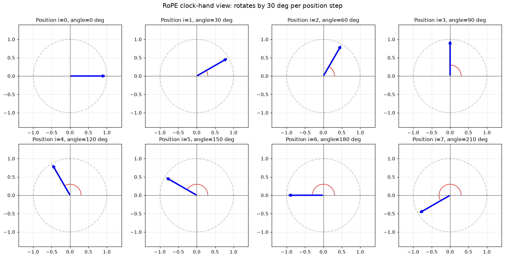

| Position $i$ | Angle = $i\theta$ (at $\theta = 30°$) | Hand points |
|---|---|---|
| $i = 0$ | $0°$ | $\to$  (3 o'clock) |
| $i = 1$ | $30°$ | $\nearrow$ |
| $i = 3$ | $90°$ | $\uparrow$ (12 o'clock) |
| $i = 6$ | $180°$ | $\leftarrow$ (9 o'clock) |
| $i = 12$ | $360° \equiv 0°$ | $\to$ (back to start — full revolution) |

For a full Q vector of size 64, you have **32 clocks running in parallel**,
each at a different speed. The combined state of all 32 hands at position
$i$ is the multi-scale fingerprint.

---

### 21.11 What changes vs what stays the same

| Quantity | After rotation by $\theta$ |
|---|---|
| Length $\|v\|$ | **Unchanged** |
| Angle $\phi$ | $\phi + \theta$ |
| $v_x$ coordinate | $v_x \cos\theta - v_y \sin\theta$ |
| $v_y$ coordinate | $v_x \sin\theta + v_y \cos\theta$ |
| Dot product with another vector rotated by same $\theta$ | **Unchanged** |
| Dot product with a vector rotated by $\alpha$ | Same as if the other vector were rotated by $(\alpha - \theta)$ |

The bottom two rows are the entire mathematical foundation of RoPE.

---

### 21.12 The block-diagonal full matrix (spec equation 9)

Writing all $d_k/2$ rotations as one big $d_k \times d_k$ matrix gives a
block-diagonal structure:

$$R^i = \begin{pmatrix} R(i\theta_0) & & & \\ & R(i\theta_1) & & \\ & & \ddots & \\ & & & R(i\theta_{d_k/2-1}) \end{pmatrix}$$

Each diagonal block is $2 \times 2$; everything off-diagonal is zero
(pairs don't mix). You *could* materialize this entire $d_k \times d_k$
matrix and do a regular matmul, but it's spectacularly wasteful: $d_k^2$
entries of which only $2 d_k$ are nonzero. **Always implement pair-wise.**

---

### 21.13 Two pairing conventions (heads-up)

There are two ways to pair dimensions; they are mathematically equivalent
but different codebases choose differently:

**Convention A — interleaved** (LLaMA's actual code; this assignment's
spec): pair adjacent elements $(q_0, q_1), (q_2, q_3), \dots$

**Convention B — split-half** (HuggingFace default): pair element $j$ with
$j + d_k/2$: $(q_0, q_{d_k/2}), (q_1, q_{d_k/2+1}), \dots$

Follow the spec (interleaved) for this assignment. Just be aware when
reading HuggingFace code that you'll see the other convention.

---

### 21.14 Efficient implementation (don't build the matrix!)

Spec quote: *"A good solution should use the properties of this matrix to
implement the transformation more efficiently."* Translation: **don't ever
materialize the $d_k \times d_k$ block-diagonal matrix.**

**Step 1 — Precompute cos/sin tables** in `__init__` for all positions
$i \in [0, T_{\max})$ and all pairs $k \in [0, d_k/2)$:

```python
position = torch.arange(max_seq_len)                 # (T_max,)
freq_idx = torch.arange(d_k // 2)                    # (d_k/2,)
inv_freq = 1.0 / (theta ** (2 * freq_idx / d_k))     # (d_k/2,)
angles = position.unsqueeze(1) * inv_freq.unsqueeze(0)  # (T_max, d_k/2)
self.register_buffer("cos_cache", angles.cos(), persistent=False)
self.register_buffer("sin_cache", angles.sin(), persistent=False)
```

**Step 2 — Apply rotation pair-by-pair** in `forward`:

```python
def forward(self, x, positions):
    # x: (..., T, d_k), positions: (T,)
    cos = self.cos_cache[positions]   # (T, d_k/2)
    sin = self.sin_cache[positions]   # (T, d_k/2)

    # Split into even/odd pairs along last dim
    x_pairs = x.reshape(*x.shape[:-1], -1, 2)   # (..., T, d_k/2, 2)
    x_even, x_odd = x_pairs.unbind(-1)          # each (..., T, d_k/2)

    # 2D rotation formula per pair
    x_even_new = x_even * cos - x_odd * sin
    x_odd_new  = x_even * sin + x_odd * cos

    # Reinterleave back to (..., T, d_k)
    out = torch.stack([x_even_new, x_odd_new], dim=-1)
    return out.reshape(*x.shape)
```

Cost: $O(T \cdot d_k)$ vs $O(T \cdot d_k^2)$ for the naive full-matrix
approach. Same answer, dramatically faster.

---

### 21.15 Q: `register_buffer(persistent=False)` — why?

The spec emphasizes this. Three ways to store a tensor in a `Module`:

| Mechanism | `requires_grad` | In `state_dict`? | Moves with `.to(device)`? | Use for |
|---|---|---|---|---|
| `self.x = torch.tensor(...)` | False | **No** | **No** ❌ | Almost never (easy to forget GPU move) |
| `nn.Parameter(...)` | True | Yes | Yes | Learnable weights |
| `register_buffer(..., persistent=True)` | False | **Yes** | Yes | Constants that should be in checkpoints (e.g., BatchNorm's `running_mean`) |
| `register_buffer(..., persistent=False)` | False | **No** | Yes | Constants that **can be recomputed** on load (RoPE cos/sin, attention masks) |

For RoPE:

- We don't want learning → not a `Parameter`.
- We need it on the right device → must use `register_buffer` (not a plain
  attribute).
- Values are fully determined by hyperparameters → no reason to save them;
  `persistent=False` skips them from `state_dict` and saves checkpoint
  space.

**Sharing across layers.** Since the cos/sin tables depend only on global
hyperparameters, one `RoPE` instance can be **shared across all
transformer blocks**. Each block's `MultiHeadAttention` holds a reference
to the same `RoPE` object → the cache exists in memory **once**, not
$L$ times.

```python
class TransformerLM(nn.Module):
    def __init__(self, ...):
        self.rope = RoPE(d_head, max_seq_len, theta)  # created once
        self.blocks = nn.ModuleList([
            TransformerBlock(..., rope=self.rope) for _ in range(num_layers)
        ])
```

---

### 21.16 Where exactly RoPE is applied

Apply to **Q and K only, before the attention dot product. Never to V.**

```python
# Inside multi-head attention
q = self.w_q(x)         # (B, H, T, d_head)
k = self.w_k(x)
v = self.w_v(x)         # V is NOT rotated

q = rope(q, positions)  # rotate Q
k = rope(k, positions)  # rotate K

scores = q @ k.transpose(-2, -1) / sqrt(d_head)
attn = softmax(scores + causal_mask, dim=-1)
out = attn @ v          # V gets weighted-summed; no rotation involved
```

**Why no rotation on V?** The rotation property only buys you something
when *both* vectors in a dot product are rotated. The Q·K dot product is
the only place that happens. V just gets weighted-summed after softmax —
no dot product, so no benefit. Rotating V would add noise without giving
the relative-position property.

**Per-head, not per-model.** $d_{\text{head}} = d_{\text{model}} / H$.
RoPE is applied to vectors of size $d_{\text{head}}$ (e.g., 64), not
$d_{\text{model}}$ (e.g., 768). Each head has its own RoPE rotation using
the same frequencies, applied independently per head.

---

### 21.17 Full data flow

```text
For each token position i = 0, 1, ..., T-1:
    x_i: (d_model,)
          ├─► W_q ─► q_i ──► RoPE(i) ──► q'_i   (rotated by angle i·θ_k per pair)
          ├─► W_k ─► k_i ──► RoPE(i) ──► k'_i   (rotated by angle i·θ_k per pair)
          └─► W_v ─► v_i ─────────────► v_i     (NOT rotated)

Attention score(i, j):
    = q'_i · k'_j / sqrt(d_head)
    = (R^i q_i) · (R^j k_j) / sqrt(d_head)
    = q_i · (R^{j-i} k_j) / sqrt(d_head)         ← depends only on (j-i)
```

That last line is the punchline: the attention pattern only sees relative
position.

---

### 21.18 RoPE vs alternatives

| Method | How position enters | Relative-aware? | Extrapolates? |
|---|---|---|---|
| Learned absolute (GPT-2, BERT) | Add learned `pos[t]` to embedding | No | Poorly (each pos learned separately) |
| Sinusoidal (Vaswani 2017) | Add fixed `sin/cos[t]` to embedding | Sort of, indirectly | Some |
| T5 relative bias | Add learned scalar to attention logits per relative bucket | Yes | Limited |
| ALiBi | Subtract `slope · |i-j|` from logits | Yes | Yes |
| **RoPE** | Rotate Q and K by position-dependent angle | **Yes (exactly)** | **Yes** |

RoPE is now the default in essentially every modern decoder LM (LLaMA,
Mistral, Qwen, DeepSeek, GPT-NeoX, Yi, Gemma, ...).

---

### 21.19 FAQ

**Q: What's the maximum position RoPE can handle?**
A: Anything up to `max_seq_len` (the size of your cos/sin cache). For
positions beyond, either (a) build a larger cache, (b) use **position
interpolation** / **YaRN** / **NTK-aware scaling** to extend the effective
range without retraining, or (c) increase $\Theta$ (RoPE base scaling).

**Q: Does RoPE generalize to longer sequences than training?**
A: Sort of. With small modifications (position interpolation), models
trained at 2k context can be stretched to 32k or 100k with minimal
fine-tuning. This is one of RoPE's killer advantages over learned
absolute embeddings.

**Q: Why must $d_k$ be even?**
A: Because RoPE pairs dimensions. Odd $d_k$ would leave one unpaired
feature with nothing to rotate against. In practice, head dimensions are
always even (64, 128).

**Q: Does it matter if I implement Convention A vs Convention B pairing?**
A: For the model itself: yes — your weights are trained against one
convention. For correctness given a chosen convention: no — the math is
equivalent. The assignment's reference implementation uses Convention A
(interleaved).

**Q: Why store cos/sin separately instead of a single complex tensor?**
A: PyTorch's autograd and CUDA kernels are far better optimized for real
tensors. Two real buffers are cheaper than complex arithmetic.

---

### 21.20 Implementation checklist

When you write `RoPE` in `transformer.py`:

1. **`__init__(d_k, max_seq_len, theta=10000)`**:
   - `inv_freq = 1 / (theta ** (2 * torch.arange(d_k // 2) / d_k))`,
     shape `(d_k/2,)`.
   - `angles = torch.arange(max_seq_len)[:, None] * inv_freq[None, :]`,
     shape `(max_seq_len, d_k/2)`.
   - Register `cos_cache = angles.cos()` and `sin_cache = angles.sin()`
     as buffers with `persistent=False`.
2. **`forward(x, positions)`**:
   - `x` has shape `(..., T, d_k)`, `positions` has shape `(T,)`.
   - Look up `cos = cos_cache[positions]`, `sin = sin_cache[positions]`.
   - Reshape `x` to `(..., T, d_k/2, 2)` to expose the pair axis.
   - Apply the rotation formula per pair.
   - Reshape back to `(..., T, d_k)`.

~20 lines total. The math looks scary; the implementation is tiny.

---

### 21.21 Mnemonic

> **RoPE = "Rotate Q and K by an angle proportional to their position."**
> The dot product of two rotated vectors only sees the *difference* of
> angles, so attention scores naturally encode **relative** position.
> Different pairs of dimensions rotate at different speeds (geometric
> progression of frequencies) to capture position at multiple scales. No
> learned parameters. Applied to Q and K only — never V.

---

## 22. KV Cache: Making Decoder-Only Inference Fast

The KV cache is the single biggest optimization for inference in
decoder-only Transformers. It exploits one simple fact: **the K and V
vectors of past tokens never change as you generate more tokens.**

> **One-sentence summary.** Cache the K and V tensors for every position
> you've already processed; on each new generation step compute Q, K, V
> only for the new token, append the new K/V to the cache, and run
> attention against the cache. Generation cost drops from $\mathcal{O}(T^3)$
> to $\mathcal{O}(T^2)$ — often 10–100× faster in practice.

### 22.1 The problem it solves

In **training** you process a length-$T$ sequence in one forward pass with
$\mathcal{O}(T^2)$ attention. Fine.

In **generation** you produce tokens one at a time:

```
step 1: input ["The"]                        → predict "cat"
step 2: input ["The", "cat"]                 → predict "sat"
step 3: input ["The", "cat", "sat"]          → predict "on"
step 4: input ["The", "cat", "sat", "on"]    → predict "the"
...
```

If you naively re-run the **full** transformer on the whole prefix every
step:

| Step | Forward pass cost | Wasted? |
|---|---|---|
| 1 | $\mathcal{O}(1^2)$ | — |
| 2 | $\mathcal{O}(2^2)$ | re-computes step 1's K, V |
| 3 | $\mathcal{O}(3^2)$ | re-computes steps 1+2's K, V |
| $T$ | $\mathcal{O}(T^2)$ | re-computes the entire prefix |

Generating $T$ tokens costs $\mathcal{O}(T^3)$ total. For long contexts
this is brutal.

### 22.2 The key insight — K and V of past tokens never change

When you append a new token, the embeddings of all **previous** tokens
are identical to what they were on the previous step. Therefore:

- The **K** vector of token at position $j$ is fixed once computed.
- The **V** vector of token at position $j$ is fixed once computed.
- The **Q** vector you need at step $t$ is **only for the new token** (position $t$).

> Cache K and V for every past position. At step $t$, compute Q, K, V
> only for the new token, append the new K/V to the cache, and run
> attention against the cache.

That's the entire idea. The name "KV cache" is literal — a stored list
of past keys and values.

### 22.3 What the cache looks like

Per layer, per head:

```
K_cache:  shape (B, num_heads, T_so_far, d_k)
V_cache:  shape (B, num_heads, T_so_far, d_k)
```

One K cache + one V cache **per attention layer**. Q, output projection,
MLP, RMSNorm — none of these are cached. **Only K and V.**

### 22.4 The two phases of inference

**Phase A — Prefill (process the prompt).** You have the whole prompt of
length $T_{\text{prefill}}$ at once. Run the model normally:

```
input:  (B, T_prefill, d_model)
        ↓
Q, K, V per head: (B, T_prefill, d_k)
        ↓
attention with causal mask → (B, T_prefill, d_k)
        ↓
write K, V into the cache at positions [0, T_prefill)
        ↓
emit the LAST token's logits → sample first generated token
```

Cost: $\mathcal{O}(T_{\text{prefill}}^2)$. Unavoidable — you must encode
the prompt.

**Phase B — Decode (one new token at a time).** For each new token:

```
input:                  (B, 1, d_model)         ← only the new token
        ↓
Q, K, V for new token:  (B, 1, d_k)             ← brand new, length 1
        ↓
Append new K to K_cache, new V to V_cache       ← cache grows by 1
        ↓
attention:
    scores  = Q_new @ K_cache.transpose(-2,-1) / √d_k  # (B, 1, T_so_far)
    weights = softmax(scores)                          # (B, 1, T_so_far)
    out     = weights @ V_cache                        # (B, 1, d_k)
        ↓
sample next token
```

Cost per step: $\mathcal{O}(T_{\text{so\_far}})$ — **linear**, not
quadratic. Generating $T$ new tokens: $\mathcal{O}(T^2)$ total instead of
$\mathcal{O}(T^3)$.

### 22.5 Visual: cache growing during decode

```
After prefill (prompt = "The cat sat"):

K_cache = [k_0, k_1, k_2, _, _, _, _, _]    ← 3 slots filled
V_cache = [v_0, v_1, v_2, _, _, _, _, _]

Step 1 (generate token at position 3):
  compute q_3, k_3, v_3 from the just-sampled token
  K_cache = [k_0, k_1, k_2, k_3, _, _, _, _]
  V_cache = [v_0, v_1, v_2, v_3, _, _, _, _]
  attention: q_3 · [k_0, k_1, k_2, k_3]  → weights → · [v_0, v_1, v_2, v_3]
  → output_3 → sample token at position 4

Step 2 (generate token at position 4):
  K_cache = [k_0, k_1, k_2, k_3, k_4, _, _, _]
  V_cache = [v_0, v_1, v_2, v_3, v_4, _, _, _]
  attention: q_4 · [k_0..k_4]  → · [v_0..v_4]
  → output_4 → sample token at position 5
```

Only **1 query** per step. The cache keeps growing.

### 22.6 Where RoPE fits in

This trips a lot of people up. At decode step $t$:

- New query: `q_t_rot = RoPE(q_t, position=t)`
- New key:   `k_t_rot = RoPE(k_t, position=t)` ← rotate **once** before caching
- **Store `k_t_rot` (already rotated) in the cache.**

You **do not** re-rotate cached keys every step. They were rotated at
their correct absolute position when first computed, and that rotation
is correct forever (by the relative-rotation property: the dot product
cares only about the gap, §21.5).

| ✅ Correct | ❌ Wrong |
|---|---|
| Apply RoPE to `q_t`, `k_t` with `position=t`, then cache the **rotated** `k_t` | Cache raw `k_t`, re-rotate the whole cache every step |
| `token_positions = [[t]]` for the new token only | `token_positions = [[0,1,...,t]]` redoing everything |
| `start_pos` tracks the current absolute position | RoPE uses `range(T_new)` during decode |

Values are not rotated at all — your `v_cache` is just raw `v_t` from
`W_v @ embedding_t`.

### 22.7 Memory cost — the real bottleneck

For a model with `L` layers, `H` heads, `d_k` per-head dim, batch `B`,
sequence length $T$, fp16 (2 bytes):

$$\text{KV cache bytes} \;=\; \underbrace{2}_{\text{K + V}} \cdot B \cdot L \cdot \underbrace{2}_{\text{fp16 bytes}} \cdot H \cdot T \cdot d_k$$

**Example — LLaMA-2 7B at 4k context, batch 1, fp16:**

| Quantity | Value |
|---|---|
| `L` | 32 |
| `num_heads` (H) | 32 |
| `d_k` | 128 |
| `T` | 4096 |
| **KV cache** | $2 \cdot 1 \cdot 32 \cdot 2 \cdot 32 \cdot 4096 \cdot 128 = 2.1$ **GiB** |

For batch 8 at 32k context: **~135 GiB just for the cache**. This is why
long-context serving is so memory-hungry — not the model weights, the
cache.

### 22.8 Modern optimizations

| Technique | Idea | Savings |
|---|---|---|
| **Multi-Query Attention (MQA)** | All heads share **one** K and V | KV cache ÷ num_heads |
| **Grouped-Query Attention (GQA)** | Heads grouped, each group shares K/V (LLaMA-2 70B, LLaMA-3) | KV cache ÷ group_size |
| **Sliding-window attention** (Mistral, Gemma) | Only keep last `W` tokens in cache | Cache capped at `W` |
| **PagedAttention** (vLLM) | Cache stored as fixed-size blocks like OS pages, no contiguous allocation | Eliminates fragmentation; high concurrent batch sizes |
| **KV cache quantization** | Store K, V in int8/int4 | 2–4× smaller |
| **Speculative decoding** | A small draft model proposes several tokens, big model verifies in one pass | Fewer decode steps |
| **Continuous batching** | Pack many concurrent requests, each with its own cache | Better GPU utilization |

GQA in particular is now standard: LLaMA-3 has 8 KV heads vs 32 Q heads
→ KV cache is **4× smaller** with negligible quality loss.

### 22.9 Minimal pseudo-implementation

```python
class CachedAttention(nn.Module):
    def __init__(self, d_model, num_heads, max_seq_len):
        super().__init__()
        self.d_k = d_model // num_heads
        self.num_heads = num_heads
        self.W_q = Linear(d_model, d_model)
        self.W_k = Linear(d_model, d_model)
        self.W_v = Linear(d_model, d_model)
        self.W_o = Linear(d_model, d_model)
        self.rope = RotaryPositionalEmbedding(
            theta=10000, d_k=self.d_k, max_seq_len=max_seq_len
        )

    def forward(self, x, cache=None, start_pos=0):
        # x: (B, T_new, d_model)
        # T_new = prompt length during prefill, 1 during decode
        B, T_new, _ = x.shape
        q = self.W_q(x).view(B, T_new, self.num_heads, self.d_k).transpose(1, 2)
        k = self.W_k(x).view(B, T_new, self.num_heads, self.d_k).transpose(1, 2)
        v = self.W_v(x).view(B, T_new, self.num_heads, self.d_k).transpose(1, 2)

        # Apply RoPE at the correct absolute positions
        positions = torch.arange(start_pos, start_pos + T_new, device=x.device)
        q = self.rope(q, positions)
        k = self.rope(k, positions)             # ← rotate BEFORE caching

        # Append to cache (cache holds already-rotated K and raw V)
        if cache is not None:
            k = torch.cat([cache["k"], k], dim=-2)
            v = torch.cat([cache["v"], v], dim=-2)
            cache["k"], cache["v"] = k, v

        # Attention against the full cache
        scores = q @ k.transpose(-2, -1) / (self.d_k ** 0.5)
        scores = apply_causal_mask(scores)
        weights = scores.softmax(dim=-1)
        out = weights @ v                       # (B, H, T_new, d_k)

        out = out.transpose(1, 2).reshape(B, T_new, -1)
        return self.W_o(out), cache
```

Two important flags:

- `start_pos` tells RoPE which absolute position the new token(s) live at.
- `cache` is mutated in place across steps.

### 22.10 Common pitfalls

| Pitfall | Symptom | Fix |
|---|---|---|
| RoPE applied with `range(T_new)` during decode | Generated tokens act as if at positions 0, 1, 2... | Pass absolute `[start_pos, start_pos+T_new)` |
| Caching raw (un-rotated) K | Have to re-rotate everything each step → slow / wrong | Rotate once at write time, store rotated K |
| Forgot to allocate cache before prefill | NoneType errors | Initialize with shape `(B, H, 0, d_k)` or pre-allocate `(B, H, T_max, d_k)` with a length counter |
| Cache grows past `max_seq_len` | RoPE cache OOB | Increase RoPE `max_seq_len`, use NTK/YaRN scaling, or sliding window |
| Mixed batch with different generated lengths | Hard to pack | Left-padding or paged attention |
| Re-running prefill cost every decode step | Whole point defeated | Make sure the cache is reused across steps, not freed |

### 22.11 TL;DR

| Concept | Summary |
|---|---|
| **What** | Store K and V of past tokens so decoding doesn't recompute them |
| **Why** | Turns generation from $\mathcal{O}(T^3)$ into $\mathcal{O}(T^2)$ |
| **What's cached** | K and V only — not Q, not attention output |
| **Per layer** | One K cache + one V cache, shape `(B, num_heads, T, d_k)` |
| **Decode step cost** | $\mathcal{O}(T_{\text{so\_far}} \cdot d_k)$ instead of $\mathcal{O}(T_{\text{so\_far}}^2 \cdot d_k)$ |
| **Memory bottleneck** | Cache often dwarfs weights at long contexts |
| **RoPE interaction** | Rotate K **once** at write time using the absolute position; cache the rotated K |
| **Modern tricks** | GQA / MQA / sliding window / paged attention / KV quantization |

> **One-liner.** Past tokens' keys and values are immutable — cache them,
> and decoding becomes a one-token-at-a-time append + dot product against
> history, turning quadratic-per-step cost into linear.

---

## 23. Scaled Dot-Product Attention: Why `d_k` Shows Up Twice

Two `d_k`-related questions come up constantly when reading or writing
attention code:

1. Why are `seq_q` and `seq_k` treated as **separate** lengths in the
   function signature?
2. Why divide raw scores by $\sqrt{d_k}$?

This section answers both. The formula being implemented is

$$\text{Attention}(Q, K, V) = \text{softmax}\!\left(\frac{QK^\top}{\sqrt{d_k}} + M\right) V$$

with shapes

```
Q : (..., seq_q, d_k)
K : (..., seq_k, d_k)
V : (..., seq_k, d_v)
M : (seq_q, seq_k)   bool, True = keep, False = block
out: (..., seq_q, d_v)
```

### 23.1 Why `seq_q` and `seq_k` are different

Queries and keys do **not** have to come from the same sequence. The
function is written with two separate lengths so it works uniformly across
every transformer variant:

| Scenario | `seq_q` | `seq_k` | Notes |
|---|---|---|---|
| Plain self-attention (encoder / decoder self-attn) | $T$ | $T$ | Q, K, V all from the same sequence |
| **Cross-attention** (encoder–decoder, T5, vision-language) | decoder length | encoder length | Decoder queries attend to encoder outputs |
| **KV-cache decode step** (see §22) | $1$ | $T_{\text{so\_far}}$ | One new query against the whole cache |
| Sliding-window / chunked attention | chunk size | chunk + history | Mistral, Gemma-style |
| Retrieval / prefix attention | query batch | document/prefix length | Often very different |

Crucially, the matmul shapes only require:

- `d_k` matches between Q and K (so the dot product is defined),
- `seq_k` matches between K and V (each key has a paired value).

`seq_q` is **free** — it does not need to equal `seq_k`. If your code
hard-codes `seq_q == seq_k`, KV-cache inference and cross-attention will
silently break.

**Symmetry / asymmetry summary:**

| Pair | Must match? | Why |
|---|---|---|
| `Q`'s `d_k` vs `K`'s `d_k` | ✅ yes | Same vector space for the dot product |
| `K`'s `seq_k` vs `V`'s `seq_k` | ✅ yes | Each key has a paired value |
| `Q`'s `seq_q` vs `K`'s `seq_k` | ❌ no | Queries can attend to a different-length sequence |
| `K`'s `d_k` vs `V`'s `d_v` | ❌ no | Often different; `d_v` has its own symbol |
| Batch dims across Q, K, V | ✅ yes | Or broadcast-compatible |

> **One-liner.** `seq_q` = number of things asking. `seq_k` = number of
> things being attended over. They coincide in plain self-attention but
> diverge in cross-attention, KV-cache decoding, and sliding-window
> attention — keeping them separate from the start makes one function
> handle every case.

### 23.2 Why divide raw scores by $\sqrt{d_k}$

**Short answer.** Without the divide, dot products grow with `d_k`, the
softmax saturates into a one-hot vector, and gradients vanish. Dividing
by $\sqrt{d_k}$ keeps the score scale stable regardless of head size.

#### The math: dot products grow as $\sqrt{d_k}$

Assume `q` and `k` are independent vectors of length `d_k` with entries
that are roughly mean 0, variance 1 (what Xavier init and RoPE-preserving
rotations produce). The dot product

$$q \cdot k = \sum_{i=1}^{d_k} q_i k_i$$

has, for each term, $\mathbb{E}[q_i k_i] = 0$ and $\text{Var}(q_i k_i) = 1$.
Summing $d_k$ independent terms:

$$\text{Var}(q \cdot k) = d_k, \qquad \text{Std}(q \cdot k) = \sqrt{d_k}.$$

A typical raw score is thus of magnitude $\sim\sqrt{d_k}$. Concretely:

| `d_k` | Typical raw score |
|---|---|
| 4    | $\pm 2$  |
| 64   | $\pm 8$  |
| 128  | $\pm 11$ |
| 4096 | $\pm 64$ |

#### Why big scores break softmax

Softmax exponentiates differences. If one score is even ~10 bigger than
the others, the output is essentially one-hot:

```
softmax([10, 0, 0, 0]) ≈ [0.9999, 3e-5, 3e-5, 3e-5]
softmax([20, 0, 0, 0]) ≈ [1.0,    2e-9, 2e-9, 2e-9]
softmax([50, 0, 0, 0]) ≈ [1.0,    ≈0,   ≈0,   ≈0  ]   ← saturated
```

Two consequences:

**Problem 1 — Attention collapses to "pick one".** Instead of a smooth
weighted average over many keys, the model attends to exactly one token
and discards all others.

**Problem 2 — Gradients vanish.** The Jacobian of softmax is
$p_i(\delta_{ij} - p_j)$. If $p$ is near one-hot, almost every Jacobian
entry is $0$:

```
p ≈ [1, 0, 0, 0]
Jacobian ≈ [[0, 0, 0, 0],     ← softmax is "flat" here
            [0, 0, 0, 0],         → no gradient flowing back to Q, K
            [0, 0, 0, 0],
            [0, 0, 0, 0]]
```

Backprop can't nudge `Q` and `K` to fix the attention pattern. Training
stalls.

#### What dividing by $\sqrt{d_k}$ fixes

Dividing raw scores by $\sqrt{d_k}$ returns variance to 1 regardless of
head size:

$$\text{Var}\!\left(\frac{q \cdot k}{\sqrt{d_k}}\right) = \frac{d_k}{d_k} = 1.$$

Scores are now typically in $\pm 2$ to $\pm 3$, softmax is **soft**
(multiple keys get nontrivial weight), and the Jacobian has useful
entries everywhere → healthy gradients.

```
softmax([3, 1, 0, 2]) ≈ [0.554, 0.075, 0.027, 0.204]   ← spread out
```

#### Visual: scaling fixes the variance

```
Without √d_k:
   d_k = 4    scores ~ ±2     softmax soft      ✓
   d_k = 64   scores ~ ±8     softmax peaky     ⚠
   d_k = 256  scores ~ ±16    softmax one-hot   ✗
   d_k = 4096 scores ~ ±64    softmax dead      ✗✗✗

With ÷ √d_k:
   d_k = ANY   scores ~ ±1    softmax soft      ✓ always
```

This is why **the same model recipe trains stably whether `d_k = 64` or
`d_k = 256`**. Without the scaling, you'd have to retune init and learning
rate for every head size.

#### Why $\sqrt{d_k}$ and not $d_k$?

We want **standard deviation = 1**, not variance = 1.

- Variance of the sum: $d_k$.
- Std of the sum: $\sqrt{d_k}$.
- To rescale a random variable so its std becomes 1, divide by its std.

Dividing by $d_k$ would over-correct: scores would shrink toward 0,
softmax becomes nearly uniform, and the model loses its ability to
distinguish keys.

#### Origin

This is the "Scaled" in "Scaled Dot-Product Attention", from
*Attention Is All You Need* (Vaswani et al., 2017), §3.2.1:

> "We suspect that for large values of $d_k$, the dot products grow large
> in magnitude, pushing the softmax function into regions where it has
> extremely small gradients. To counteract this effect, we scale the dot
> products by $1/\sqrt{d_k}$."

### 23.3 TL;DR

| Without $\sqrt{d_k}$ | With $\div \sqrt{d_k}$ |
|---|---|
| Scores scale as $\sqrt{d_k}$ → grow with head size | Scores stay at unit scale |
| Softmax saturates → near-one-hot weights | Softmax stays soft → distributed attention |
| Gradient through softmax ≈ 0 → training stalls | Healthy gradients → training works |
| Different `d_k` needs different learning rate | Same hyperparameters work across head sizes |

> **One-liner.** Dividing by $\sqrt{d_k}$ normalizes the score variance
> so softmax operates in its sensitive region — soft, smooth, and
> differentiable — independent of the per-head dimension.

---

## 24. Resource Accounting

This section answers the `transformer_accounting` problem by doing explicit
matrix-multiply FLOPs accounting for the assignment Transformer LM.

### 24.1 FLOPs Rule Used

For $A \in \mathbb{R}^{m \times n}$ and $B \in \mathbb{R}^{n \times p}$,

$$\text{FLOPs}(AB) = 2mnp.$$

We apply this to every major matmul in the forward pass.

### 24.2 Per-Layer Matmul Inventory (Sequence Length $T$)

Let model width be $d$, heads $h$, per-head dim $d_k=d/h$, and FFN inner dim
$d_{ff}$. For one layer:

| Component | Matmul(s) | FLOPs |
|---|---|---:|
| Q, K, V, O projections | $T\times d$ by $d\times d$ (4 times) | $8Td^2$ |
| Attention score/product | $QK^\top$ and $\text{Attn}V$ | $4T^2d$ |
| FFN (SwiGLU linears) | $w_1,w_3,w_2$ | $6Td\,d_{ff}$ |

LM head (once at end):

$$2TdV$$

where $V$ is vocab size.

So total forward FLOPs (matmuls only):

$$
	ext{FLOPs}_{\text{total}} = N\left(8Td^2 + 4T^2d + 6Td\,d_{ff}\right) + 2TdV
$$

for $N$ layers.

### 24.3 (a) GPT-2 XL-Shaped Model: Parameters and Memory

Configuration:

- $V=50{,}257$
- $T=1{,}024$
- $N=48$
- $d=1{,}600$
- $h=25$
- $d_{ff}=4{,}288$

Trainable parameter count (assignment architecture, untied input/output
embeddings):

$$
\#\theta = 2Vd + N(4d^2 + 3dd_{ff} + 2d) + d
$$

Numerically:

$$
\#\theta = 1{,}640{,}452{,}800 \text{ parameters.}
$$

At fp32 (4 bytes/parameter), model weights require:

$$
6{,}561{,}811{,}200\text{ bytes} \approx 6.11\text{ GiB}.
$$

**Deliverable (a):** This GPT-2 XL-shaped assignment model has
$1{,}640{,}452{,}800$ trainable parameters. Storing just the weights in fp32
requires about $6.11$ GiB of memory.

### 24.4 (b) GPT-2 XL-Shaped Forward FLOPs at $T=1024$

Using the formulas above:

- QKV+O projections (all layers): $1{,}006{,}632{,}960{,}000$
- Attention matmuls $(QK^\top + AV)$ (all layers): $322{,}122{,}547{,}200$
- FFN matmuls $(w_1,w_3,w_2)$ (all layers): $2{,}023{,}332{,}249{,}600$
- LM head (final): $164{,}682{,}137{,}600$

Total:

$$
3{,}516{,}769{,}894{,}400\text{ FLOPs} \approx 3.52\times 10^{12}\text{ FLOPs.}
$$

**Deliverable (b):** The required matmuls are projection linears,
attention's $QK^\top$ and $AV$, FFN linears, and the final LM head; together
they cost about $3.52\times10^{12}$ FLOPs for one forward pass at
context length 1024.

### 24.5 (c) Which Parts Dominate FLOPs?

For this XL-shaped setup at $T=1024$:

- FFN matmuls: $57.53\%$
- Projections (QKV+O): $28.62\%$
- Attention matmuls: $9.16\%$
- LM head: $4.68\%$

**Deliverable (c):** FFN matmuls dominate compute by a wide margin, followed by
the four attention projection linears. At this context length, the quadratic
attention core is comparatively smaller than FFN compute.

### 24.6 (d) Small / Medium / Large Proportional Breakdown

Assumption for assignment architecture: $d_{ff}$ is the nearest multiple of 64
to $\frac{8}{3}d$.

- Small: $N=12, d=768, h=12, d_{ff}=2048$
- Medium: $N=24, d=1024, h=16, d_{ff}=2752$
- Large: $N=36, d=1280, h=20, d_{ff}=3392$

All at $T=1024$, $V=50{,}257$.

| Model | QKV+O proj | Attn matmuls | FFN matmuls | LM head |
|---|---:|---:|---:|---:|
| Small | 19.88% | 13.25% | 39.76% | 27.10% |
| Medium | 24.83% | 12.42% | 50.05% | 12.70% |
| Large | 27.32% | 10.93% | 54.30% | 7.45% |

**Deliverable (d):** As model size increases, FFN and projection FLOPs take a
larger share, while the LM head share drops substantially. The attention-core
($QK^\top$ and $AV$) proportion decreases because it scales as $T^2d$, whereas
the dense width terms grow faster with larger $d$ and $d_{ff}$ at fixed $T$.

### 24.7 (e) GPT-2 XL with Context Length 16,384

Holding XL width/depth fixed and changing only $T:1024\to16384$:

- New total FLOPs: $133{,}577{,}729{,}638{,}400$
- Increase factor: $\approx 37.98\times$

Proportions shift to:

- Attention matmuls: $61.73\%$
- FFN matmuls: $24.24\%$
- QKV+O projections: $12.06\%$
- LM head: $1.97\%$

**Deliverable (e):** Total forward FLOPs rise by about $38\times$ when context
goes from 1024 to 16,384, because the quadratic attention terms become dominant.
At long context, the compute mix flips: attention core becomes the largest
contributor by far.

---

## 25. Training a Transformer LM - Cross-Entropy Loss

This section explains how to train a decoder-only Transformer language model
using next-token prediction and cross-entropy loss.

### 25.1 Objective in One Line

Given tokens $x_0, x_1, \dots, x_{T-1}$, train the model to predict
$x_{t+1}$ from the prefix $x_{\le t}$.

### 25.2 Input/Target Construction

From a token sequence of length $T+1$:

- model input: $x_{0:T}$ (length $T$)
- labels/targets: $x_{1:T+1}$ (length $T$)

For batched training:

- `inputs`: shape $(B, T)$, integer token IDs
- `targets`: shape $(B, T)$, integer token IDs

### 25.3 Model Output and Logits

The Transformer LM returns logits:

$$
	ext{logits} \in \mathbb{R}^{B \times T \times V}
$$

where $V$ is vocabulary size and `logits[b, t, :]` are unnormalized scores for
the next token after `inputs[b, t]`.

Important implementation note:

- During training, pass logits directly to cross-entropy.
- Do not apply softmax before cross-entropy; the loss function handles the
  normalization internally in a numerically stable way.

### 25.4 Cross-Entropy Formula

Think of cross-entropy at one token position as:

1. Convert logits into probabilities with softmax.
2. Look up the probability assigned to the correct token.
3. Take negative log of that probability.

So for one position with target class $y$ and logits $z \in \mathbb{R}^{V}$:

$$
\ell(z, y) = -\log\left(\frac{e^{z_y}}{\sum_j e^{z_j}}\right)
= -z_y + \log\sum_j e^{z_j}.
$$

Both forms are identical.

- Left form is conceptually clear: "negative log probability of the right
  class."
- Right form is algebraically expanded and is what implementations use for
  numerical stability.

Quick numeric example (one token, vocab size 4):

- logits $z = [2, 1, 0, -1]$
- target index $y=0$

Softmax probability for class 0:

$$
p(y=0) = \frac{e^2}{e^2+e^1+e^0+e^{-1}} \approx 0.6439
$$

Loss:

$$
\ell = -\log(0.6439) \approx 0.440.
$$

If the same logits had target $y=3$, then
$p(y=3) \approx 0.0321$ and $\ell \approx 3.44$ (much worse), which matches
the intuition: low probability on the true class means high penalty.

For language modeling over all tokens in a batch:

$$
\mathcal{L} = \frac{1}{BT}\sum_{b=1}^{B}\sum_{t=1}^{T}
\ell\big(\text{logits}_{b,t,:},\ \text{targets}_{b,t}\big).
$$

### 25.5 Shape Handling in Code

Most CE implementations expect shape `(N, C)` for logits and `(N,)` for target
indices. So flatten time and batch:

- `logits_2d = logits.reshape(B*T, V)`
- `targets_1d = targets.reshape(B*T)`

Then:

- `loss = cross_entropy(logits_2d, targets_1d)`

### 25.6 Why This Works for LM

Cross-entropy maximizes the log-probability of the correct next token at each
position. Since every token position provides a supervised signal, one forward
pass trains on all $B \times T$ prediction tasks simultaneously.

### 25.7 Common Pitfalls

- Applying softmax before CE (double-normalization, weaker gradients).
- Off-by-one shift mistakes (input and target not aligned by one token).
- Wrong dtype for targets (`targets` must be integer class indices).
- Ignoring causal masking in the Transformer block.

### 25.8 Minimal Training Step (Pseudo-Code)

```python
inputs, targets = get_batch(...)            # (B, T), (B, T)
logits = model(inputs)                      # (B, T, V)
loss = cross_entropy(
    logits.reshape(-1, logits.size(-1)),    # (B*T, V)
    targets.reshape(-1),                    # (B*T,)
)
loss.backward()
optimizer.step()
optimizer.zero_grad(set_to_none=True)
```

### 25.9 TL;DR

- Shift tokens by one to build `(inputs, targets)`.
- Model outputs logits for each position.
- Flatten `(B, T, V)` and `(B, T)` to `(B*T, V)` and `(B*T,)`.
- Use cross-entropy directly on logits (no pre-softmax).

---

## 26. Perplexity

Perplexity is the standard evaluation metric for language models. It is just
the exponentiated average cross-entropy loss.

### 26.1 Definition

For a sequence of length $m$ with token-level losses $\ell_1, \ldots, \ell_m$:

$$
	ext{perplexity} = \exp\left(\frac{1}{m}\sum_{i=1}^{m}\ell_i\right).
$$

### 26.2 Intuition

Think of perplexity as "how many equally likely choices the model feels it has"
on average.

- Lower perplexity means the model is more confident and more accurate.
- Perplexity of $1$ is perfect prediction.
- Larger perplexity means the model is more uncertain.

### 26.3 Relationship to Cross-Entropy

If the average cross-entropy is $\bar{\ell}$, then:

$$
	ext{perplexity} = e^{\bar{\ell}}.
$$

So:

- cross-entropy is what you minimize during training,
- perplexity is what you often report during evaluation.

### 26.4 Concrete Examples

- If $\bar{\ell} = 0$, then $\text{perplexity} = e^0 = 1$.
- If $\bar{\ell} = \log 10$, then $\text{perplexity} = 10$.

That second example means the model is, on average, about as uncertain as
choosing among 10 equally plausible options.

### 26.5 TL;DR

- Perplexity = `exp(average cross-entropy)`.
- Cross-entropy is the training loss.
- Perplexity is the evaluation metric.
- Lower is better; `1` is perfect.

---

## 27. Optimizers: SGD and AdamW

An optimizer is the rule that updates model parameters after the backward pass.
The model gives us gradients; the optimizer turns those gradients into actual
parameter changes.

### 27.1 The Training Loop

The usual sequence is:

1. Forward pass: compute logits.
2. Loss: compare logits to targets.
3. Backward pass: compute gradients.
4. Optimizer step: update parameters.

In code, this often looks like:

```python
optimizer.zero_grad()
logits = model(inputs)
loss = cross_entropy(logits, targets)
loss.backward()
optimizer.step()
```

### 27.2 SGD

Stochastic Gradient Descent (SGD) updates a parameter by moving it in the
direction that reduces the loss:

$$
	heta \leftarrow \theta - \alpha \nabla L(\theta)
$$

where:

- $\theta$ is the parameter
- $\alpha$ is the learning rate
- $\nabla L(\theta)$ is the gradient

This is the simplest optimizer: if the gradient says "go down," SGD takes a
step down.

### 27.3 AdamW

AdamW is a more advanced optimizer that keeps extra running statistics for each
parameter:

- first moment $m$: a running average of gradients
- second moment $v$: a running average of squared gradients

These help AdamW take more stable steps than plain SGD.

The running averages are updated as:

$$
m \leftarrow \beta_1 m + (1 - \beta_1) g
$$

$$
v \leftarrow \beta_2 v + (1 - \beta_2) g^2
$$

where $g$ is the current gradient.

Typical defaults are:

- $\beta_1 = 0.9$
- $\beta_2 = 0.999$

### 27.4 AdamW Update Rule

AdamW combines two effects:

1. **Weight decay**: pull parameters slowly toward zero.

$$
	heta \leftarrow \theta - \alpha \lambda \theta
$$

2. **Gradient-based update**: use the moment estimates to scale the step.

$$
	heta \leftarrow \theta - \alpha \frac{m}{\sqrt{v} + \epsilon}
$$

Combined, this is often written as:

$$
	heta \leftarrow \theta - \alpha \lambda \theta - \alpha \frac{m}{\sqrt{v} + \epsilon}
$$

### 27.5 Intuition for $m$ and $v$

- $m$ remembers the recent direction of the gradients.
- $v$ remembers how large or noisy the gradients are.

If $m$ is large, the update pushes more strongly in that direction. If $v$ is
large, the update becomes smaller because the step is divided by
$\sqrt{v} + \epsilon$.

### 27.6 Why AdamW Is Useful

AdamW usually trains large neural networks more smoothly than SGD because it
adapts to each parameter's gradient history. The extra memory cost is the price
for this stability.

### 27.7 TL;DR

- An optimizer updates parameters using gradients.
- SGD is the basic update rule.
- AdamW stores extra running averages $m$ and $v$.
- AdamW also applies weight decay separately.
- The result is usually more stable training than plain SGD.

### 27.8 What Exactly Are `m`, `v`, and `t` in Our Code

In our `adamw_cls`, optimizer state is indexed by parameter tensor `p`:

- `state = self.state[p]`

So `m`, `v`, and `t` are **not global**. They are per-parameter-tensor state.

For each parameter tensor `p`:

- `m`: tensor with the same shape as `p`
- `v`: tensor with the same shape as `p`
- `t`: one scalar step counter for that `p`

That means if a model has `K` trainable parameter tensors, it has:

- `K` separate `m` tensors
- `K` separate `v` tensors
- `K` separate `t` counters

### 27.9 Count for This `transformer_lm`

In this implementation:

- each `linear` has only one trainable tensor (`weight`, no bias)
- each `rmsnorm` has one trainable tensor (`weight`)
- each transformer block has 9 trainable tensors total

Per block:

| Component | Parameter tensors |
|---|---:|
| `ln1`, `ln2` | 2 |
| `q_proj`, `k_proj`, `v_proj`, `output_proj` | 4 |
| `ffn.w1`, `ffn.w2`, `ffn.w3` | 3 |
| Total per block | 9 |

Whole `transformer_lm`:

- token embedding: 1
- all blocks: `9 * num_layers`
- final norm: 1
- lm head: 1

So total trainable parameter tensors is:

$$
9 \cdot \text{num\_layers} + 3
$$

and the number of `m/v/t` state groups is the same:

$$
9 \cdot \text{num\_layers} + 3
$$

Example with `num_layers = 3` (the current test config):

- total parameter tensors: `30`
- total `m` tensors: `30`
- total `v` tensors: `30`
- total `t` counters: `30`

### 27.10 Memory Implication

`m` and `v` are full-size tensors, so AdamW increases optimizer memory a lot.
In fp32, a common rough budget (ignoring activations) is:

- parameters: `1x`
- gradients: `1x`
- first moment `m`: `1x`
- second moment `v`: `1x`

Total is often around `4x` parameter memory during training.

### 27.11 Learning Rate: Linear Warmup + Cosine Decay

Our schedule uses three phases controlled by:

- `T_w` = `warmup_iters`
- `T_c` = `cosine_cycle_iters`
- `alpha_max` = `max_learning_rate`
- `alpha_min` = `min_learning_rate`

For iteration `t`, the learning rate is piecewise:

$$
\alpha(t) =
\begin{cases}
\alpha_{\max}\,\frac{t}{T_w}, & t < T_w, \\
\alpha_{\min} + \frac{1}{2}\left(1 + \cos\left(\pi\frac{t-T_w}{T_c-T_w}\right)\right)(\alpha_{\max}-\alpha_{\min}), & T_w \le t \le T_c, \\
\alpha_{\min}, & t > T_c.
\end{cases}
$$

Interpretation:

- Early training: ramp up linearly from `0` to `alpha_max`.
- Main training: decay smoothly from `alpha_max` to `alpha_min` with a cosine curve.
- Late training: keep a stable floor at `alpha_min`.

Boundary checks:

- At `t = T_w`, cosine phase starts at `alpha_max`.
- At `t = T_c`, cosine phase ends at `alpha_min`.
- For all `t > T_c`, LR remains `alpha_min`.

Small example (`alpha_max=1.0`, `alpha_min=0.1`, `T_w=7`, `T_c=21`):

- `t=0` -> `0.0`
- `t=7` -> `1.0`
- `t=14` -> `0.55`
- `t=21` -> `0.1`
- `t=22` -> `0.1`

This is exactly the behavior expected by the optimizer schedule unit test.

### 27.12 Gradient Clipping (Global L2 Norm)

Gradient clipping is a safety step applied after `loss.backward()` and before
`optimizer.step()`.

Let all parameter gradients be viewed as one concatenated vector $g$. Compute:

$$
\|g\|_2 = \sqrt{\sum_i g_i^2}
$$

Given a maximum norm $M$:

- if $\|g\|_2 \le M$, keep gradients unchanged
- if $\|g\|_2 > M$, scale every gradient by

$$
	ext{scale} = \frac{M}{\|g\|_2 + \epsilon}
$$

and apply

$$
g \leftarrow g \cdot \text{scale}.
$$

This preserves gradient direction and only shrinks magnitude.

Small numeric example:

$$
\|g\|_2 = 20,\quad M=1,\quad \epsilon \approx 0
$$

$$
	ext{scale} = \frac{M}{\|g\|_2 + \epsilon} \approx \frac{1}{20} = 0.05
$$

$$
g \leftarrow 0.05\,g
$$

So the new norm is approximately $1$.

---

# Transformer Training Experiments

This section records the TinyStories Transformer experiments run on Azure ML and
the conclusions to carry into the assignment write-up.

## Learning Rate Sweep

Goal: compare several maximum learning rates under the same model, optimizer,
dataset, and batch shape, then identify a stable high-performing LR and the edge
of instability.

### Fixed Hyperparameters

These settings were held fixed for the learning-rate comparison:

| Hyperparameter | Value |
| --- | ---: |
| Dataset | TinyStories tokenized `int32` memmap binaries |
| Vocab size | 10,000 |
| Context length | 256 |
| Batch size | 32 |
| `d_model` | 512 |
| Layers | 4 |
| Attention heads | 16 |
| `d_ff` | 1344 |
| RoPE theta | 10,000 |
| Optimizer | AdamW |
| Weight decay | 0.01 |
| Gradient clipping | 1.0 |
| LR schedule | Linear warmup + cosine decay |
| Metrics backend | AzureML native run metrics |

### Run Settings And Metrics

The first five rows are 10k-step LR screening/probe runs. The final row is the
40k-step baseline rerun with metrics enabled, included as a full-budget
reference.

| Run ID | Display name | Max LR | Min LR | Warmup | Max iters | Best val loss | Final val loss | Final val ppl | Runtime | Stability |
| --- | --- | ---: | ---: | ---: | ---: | ---: | ---: | ---: | ---: | --- |
| `cyan_office_vvg3sytpy9` | `cs336-lr-1e-4-short-riKfo` | 1e-4 | 1e-5 | 1,000 | 10,000 | 1.9102 | 1.9257 | 6.86 | 460.1s | Stable, slow learning |
| `honest_lemon_mhplxq1sz6` | `cs336-lr-3e-4-short-OsGcM` | 3e-4 | 3e-5 | 1,000 | 10,000 | 1.6272 | 1.6709 | 5.32 | 458.6s | Stable baseline LR |
| `olive_pillow_jrt4mwb4cc` | `cs336-lr-1e-3-short-TXeTQ` | 1e-3 | 1e-4 | 1,000 | 10,000 | 1.4913 | 1.5021 | 4.49 | 454.9s | Stable, best short run |
| `cyan_cart_w00177qq62` | `cs336-lr-3e-3-short-dI6G0` | 3e-3 | 3e-4 | 1,000 | 10,000 | 1.5023 | 1.5023 | 4.49 | 554.1s | Stable, no divergence |
| `upbeat_lock_54rymc868v` | `cs336-lr-1e-2-short-lcNiA` | 1e-2 | 1e-3 | 1,000 | 10,000 | 2.4947 | 2.4947 | 12.12 | 465.5s | Stable but too high; degraded loss |
| `sweet_quince_8l0ndwyylm` | `cs336-transformer-tinystories-h100-basic-jSqCl` | 3e-4 | 3e-5 | 1,000 | 40,000 | 1.4004 | 1.4132 | 4.11 | 1825.8s | Stable full baseline |

### Training And Validation Loss Trends

These trend points come from the downloaded AML run logs. Training loss is logged
every 50 iterations in AML; the chart below samples every 1,000 iterations to
keep the document readable. Validation loss is logged every 500 iterations, so
the validation chart includes every evaluation point from the completed short
runs. The 40k basic run is also plotted over its first 10k steps as a full-budget
reference.

| Series | Chart color | Run status |
| --- | --- | --- |
| `1e-4` short | Red (`#dc2626`) | Completed |
| `3e-4` short | Blue (`#2563eb`) | Completed |
| `1e-3` short | Green (`#16a34a`) | Completed |
| `3e-4` basic 40k | Orange (`#f97316`) | Completed |
| `3e-3` short | Purple (`#7c3aed`) | Completed |
| `1e-2` short | Black (`#111827`) | Completed |

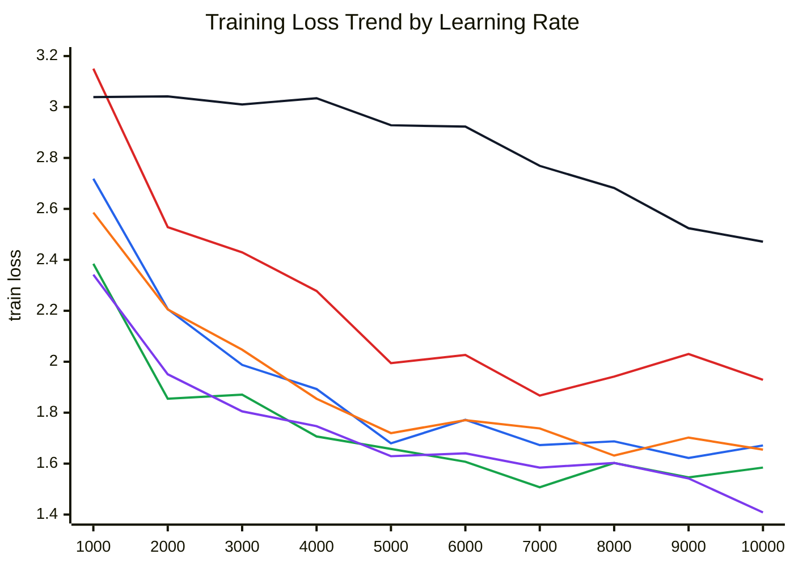

Series order: `1e-4` short red, `3e-4` short blue, `1e-3` short green,
`3e-4` basic 40k orange, `3e-3` short purple, `1e-2` short black.

| Iteration | Train loss 1e-4 short | Train loss 3e-4 short | Train loss 1e-3 short | Train loss 3e-4 basic | Train loss 3e-3 short | Train loss 1e-2 short |
| ---: | ---: | ---: | ---: | ---: | ---: | ---: |
| 1,000 | 3.1505 | 2.7182 | 2.3845 | 2.5855 | 2.3418 | 3.0389 |
| 2,000 | 2.5283 | 2.2063 | 1.8548 | 2.2055 | 1.9506 | 3.0415 |
| 3,000 | 2.4294 | 1.9876 | 1.8706 | 2.0472 | 1.8050 | 3.0099 |
| 4,000 | 2.2778 | 1.8929 | 1.7066 | 1.8547 | 1.7471 | 3.0344 |
| 5,000 | 1.9943 | 1.6796 | 1.6576 | 1.7198 | 1.6290 | 2.9284 |
| 6,000 | 2.0263 | 1.7721 | 1.6074 | 1.7706 | 1.6403 | 2.9230 |
| 7,000 | 1.8672 | 1.6725 | 1.5072 | 1.7382 | 1.5844 | 2.7689 |
| 8,000 | 1.9417 | 1.6874 | 1.6024 | 1.6314 | 1.6026 | 2.6819 |
| 9,000 | 2.0304 | 1.6221 | 1.5458 | 1.7023 | 1.5418 | 2.5241 |
| 10,000 | 1.9291 | 1.6713 | 1.5844 | 1.6549 | 1.4083 | 2.4713 |

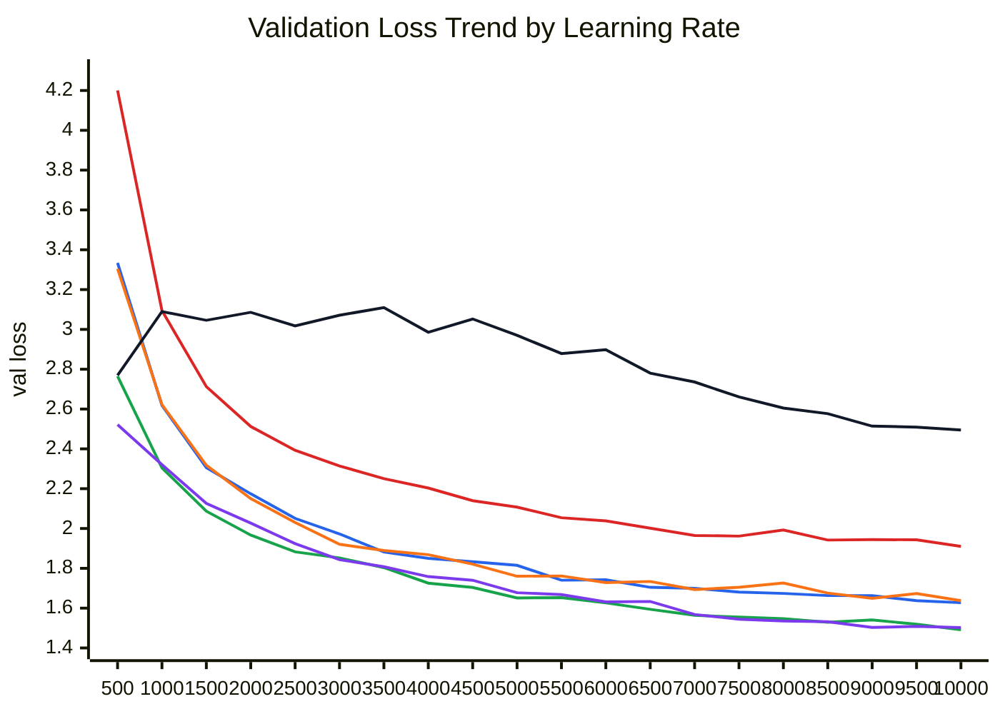

Series order: `1e-4` short red, `3e-4` short blue, `1e-3` short green,
`3e-4` basic 40k orange, `3e-3` short purple, `1e-2` short black.

| Iteration | Val loss 1e-4 short | Val loss 3e-4 short | Val loss 1e-3 short | Val loss 3e-4 basic | Val loss 3e-3 short | Val loss 1e-2 short |
| ---: | ---: | ---: | ---: | ---: | ---: | ---: |
| 500 | 4.2007 | 3.3341 | 2.7654 | 3.3044 | 2.5214 | 2.7691 |
| 1,000 | 3.0948 | 2.6183 | 2.3046 | 2.6226 | 2.3209 | 3.0896 |
| 1,500 | 2.7124 | 2.3053 | 2.0870 | 2.3177 | 2.1264 | 3.0458 |
| 2,000 | 2.5126 | 2.1743 | 1.9671 | 2.1502 | 2.0273 | 3.0858 |
| 2,500 | 2.3927 | 2.0509 | 1.8829 | 2.0305 | 1.9239 | 3.0177 |
| 3,000 | 2.3142 | 1.9728 | 1.8523 | 1.9208 | 1.8435 | 3.0711 |
| 3,500 | 2.2506 | 1.8819 | 1.8035 | 1.8894 | 1.8078 | 3.1098 |
| 4,000 | 2.2032 | 1.8503 | 1.7256 | 1.8684 | 1.7584 | 2.9857 |
| 4,500 | 2.1398 | 1.8332 | 1.7038 | 1.8210 | 1.7399 | 3.0523 |
| 5,000 | 2.1073 | 1.8151 | 1.6511 | 1.7602 | 1.6774 | 2.9702 |
| 5,500 | 2.0540 | 1.7403 | 1.6525 | 1.7618 | 1.6683 | 2.8787 |
| 6,000 | 2.0386 | 1.7424 | 1.6265 | 1.7285 | 1.6313 | 2.8978 |
| 6,500 | 2.0014 | 1.7045 | 1.5942 | 1.7339 | 1.6335 | 2.7804 |
| 7,000 | 1.9651 | 1.6994 | 1.5638 | 1.6931 | 1.5682 | 2.7358 |
| 7,500 | 1.9617 | 1.6807 | 1.5548 | 1.7050 | 1.5446 | 2.6607 |
| 8,000 | 1.9924 | 1.6739 | 1.5474 | 1.7262 | 1.5357 | 2.6049 |
| 8,500 | 1.9420 | 1.6632 | 1.5291 | 1.6756 | 1.5320 | 2.5769 |
| 9,000 | 1.9444 | 1.6628 | 1.5409 | 1.6492 | 1.5031 | 2.5142 |
| 9,500 | 1.9431 | 1.6377 | 1.5192 | 1.6736 | 1.5083 | 2.5093 |
| 10,000 | 1.9102 | 1.6272 | 1.4913 | 1.6376 | 1.5023 | 2.4947 |

### Validation Loss Chart

Lower is better. For the completed 10k-step screening runs, increasing the
learning rate from `1e-4` to `1e-3` improved both best and final validation loss.
The `3e-3` probe stayed stable but did not beat `1e-3` on best validation loss.
At `1e-2`, validation loss degraded sharply, which suggests the useful LR range
has already been exceeded even though the run did not produce NaNs.

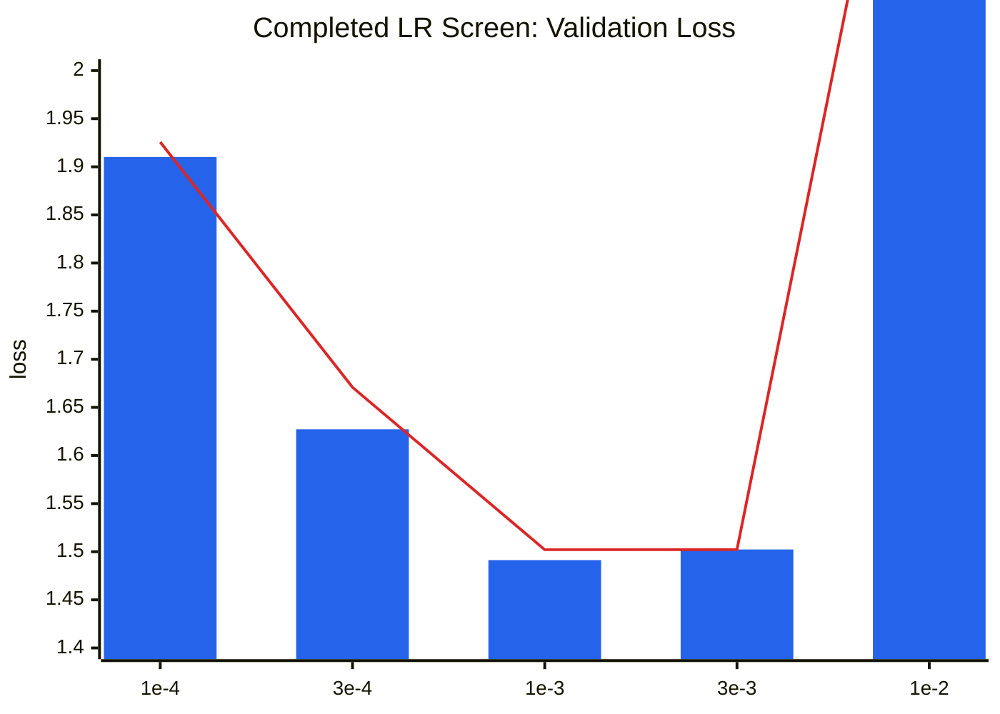

### Final Perplexity Chart

Perplexity tracks the same ranking as validation loss for the completed short
screening runs: `1e-3` was best by validation loss, `3e-3` finished with nearly
identical perplexity but a slightly worse best validation loss, and `1e-2`
degraded badly.

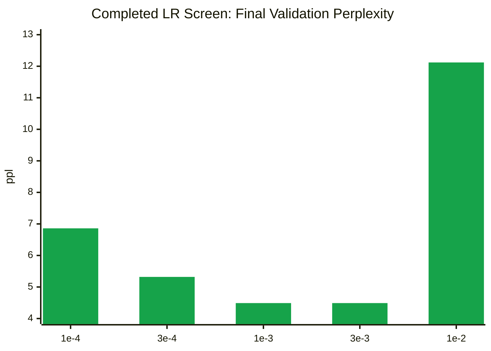

### Full-Budget Reference

The 40k-step baseline used `max_lr=3e-4`, so it is not directly comparable to the
10k-step screens by final loss alone. It shows how much additional training helps
at a stable LR.

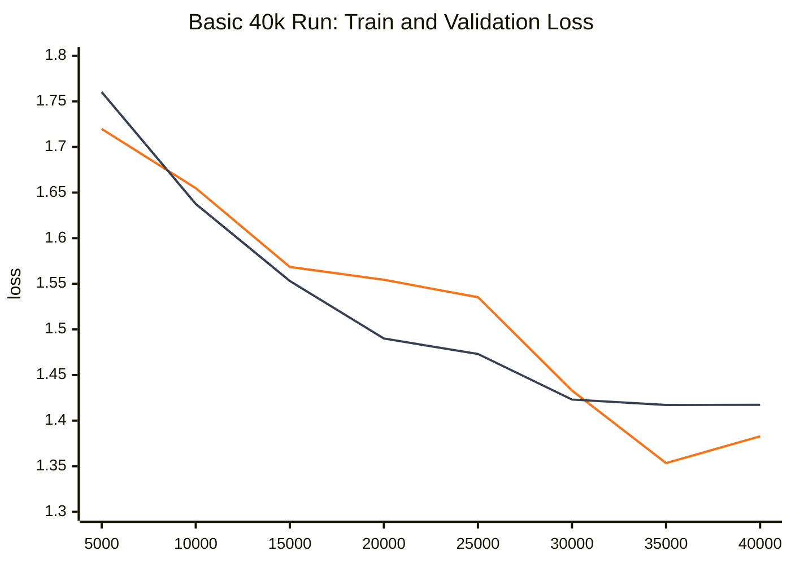

Series order: train loss orange, validation loss gray.

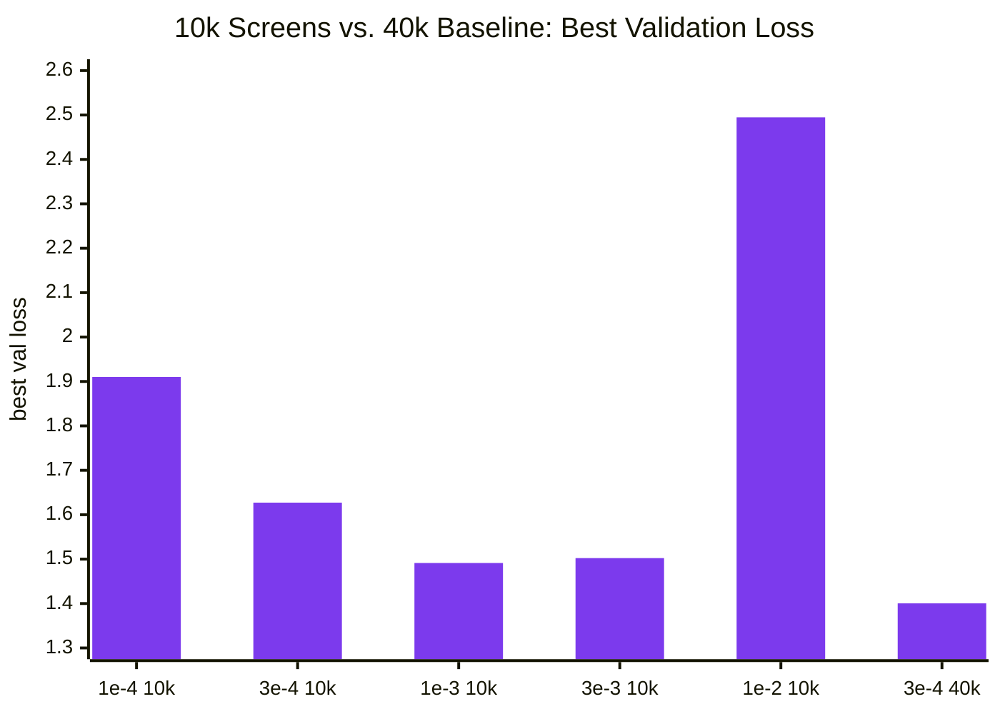

### Interpretation

- `1e-4` was stable but too conservative for the short budget. It ended at
  validation loss `1.9257`, far behind the other runs.
- `3e-4` was stable and substantially better, ending at `1.6709` in 10k steps.
- `1e-3` was the best short-run setting, reaching best validation loss `1.4913`
  and final validation loss `1.5021` without NaN/Inf or obvious loss explosion.
- `3e-3` was also stable, ending at validation loss `1.5023` and perplexity
  `4.49`. It trained more aggressively but did not improve over `1e-3`.
- `1e-2` did not numerically diverge, but it clearly exceeded the useful LR
  range: best/final validation loss was only `2.4947`, with final perplexity
  `12.12`.
- The 40k `3e-4` baseline reached best validation loss `1.4004`, showing that
  longer training at a stable LR still improves beyond the 10k screens.
- We still have not seen NaN-style divergence, but `1e-2` is functionally too
  large for quality. A stricter divergence probe would need an even larger LR,
  such as `3e-2`, if the assignment specifically requires loss explosion.

### Batch Size Experiments

The batch-size runs keep the total token budget approximately fixed at
`327,680,000` tokens by reducing `max_iters` as batch size increases. All three
runs use the same `max_lr=3e-4`, `min_lr=3e-5`, `context_length=256`, and model
shape. This makes the comparison mostly about optimizer-step count and hardware
throughput rather than total data seen.

| Run ID | Display name | Batch size | Max LR | Max iters | Tokens | Best val loss | Final val loss | Final val ppl | Runtime | Notes |
| --- | --- | ---: | ---: | ---: | ---: | ---: | ---: | ---: | ---: | --- |
| `sweet_quince_8l0ndwyylm` | `cs336-transformer-tinystories-h100-basic-jSqCl` | 32 | 3e-4 | 40,000 | 327,680,000 | 1.4004 | 1.4132 | 4.11 | 1825.8s | Original baseline. |
| `helpful_prune_8z4yxx70r8` | `cs336-bs-64-pVlMr` | 64 | 3e-4 | 20,000 | 327,680,000 | 1.4337 | 1.4442 | 4.24 | 1706.1s | Same LR as baseline; small quality drop. |
| `bold_vulture_1btmdqq51c` | `cs336-bs-128-Exiao` | 128 | 3e-4 | 10,000 | 327,680,000 | 1.4891 | 1.4891 | 4.43 | 1616.0s | Same LR as baseline; largest quality drop. |
| `keen_machine_r8h2z3s4jm` | `cs336-bs-64-lr-scaled-yBKBL` | 64 | 6e-4 | 20,000 | 327,680,000 | 1.3755 | 1.3755 | 3.96 | 1708.3s | Linear LR scaling; best final loss. |
| `loving_leg_8qkg5smb8w` | `cs336-bs-128-lr-scaled-5lavL` | 128 | 1.2e-3 | 10,000 | 327,680,000 | 1.3510 | 1.3634 | 3.91 | 1607.2s | Linear LR scaling; best validation loss. |

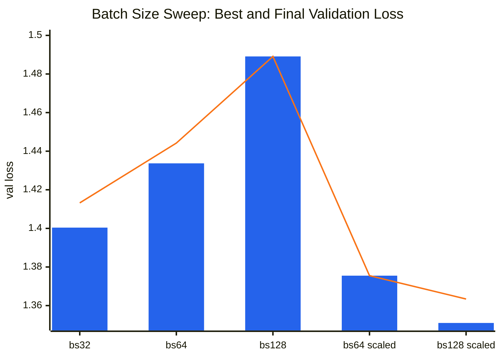

Series order: best validation loss blue, final validation loss orange.

The next chart compares validation loss at equal fractions of the total token
budget. Because each run processes the same number of tokens overall, `25%`,
`50%`, `75%`, and `100%` correspond to different iteration counts for each batch
size.

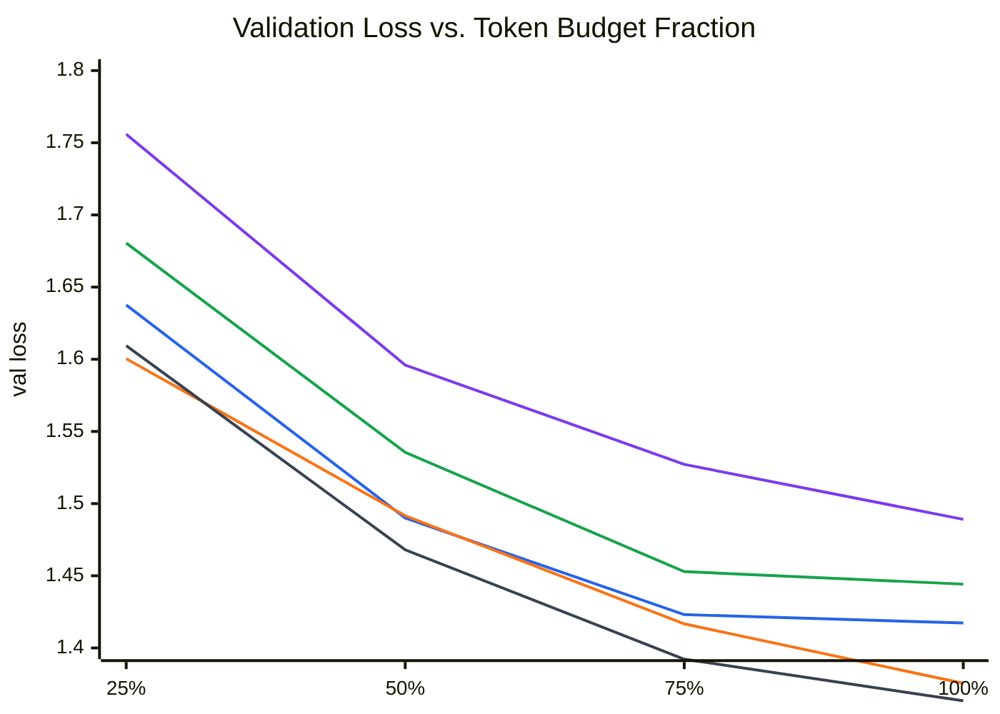

Series order: batch 32 blue, batch 64 green, batch 128 purple, batch 64 scaled
orange, batch 128 scaled gray.

| Token budget fraction | bs32 val loss | bs64 val loss | bs128 val loss | bs64 scaled val loss | bs128 scaled val loss |
| ---: | ---: | ---: | ---: | ---: | ---: |
| 25% | 1.6376 | 1.6805 | 1.7559 | 1.6004 | 1.6094 |
| 50% | 1.4900 | 1.5355 | 1.5960 | 1.4916 | 1.4680 |
| 75% | 1.4231 | 1.4529 | 1.5272 | 1.4167 | 1.3922 |
| 100% | 1.4173 | 1.4442 | 1.4891 | 1.3755 | 1.3634 |

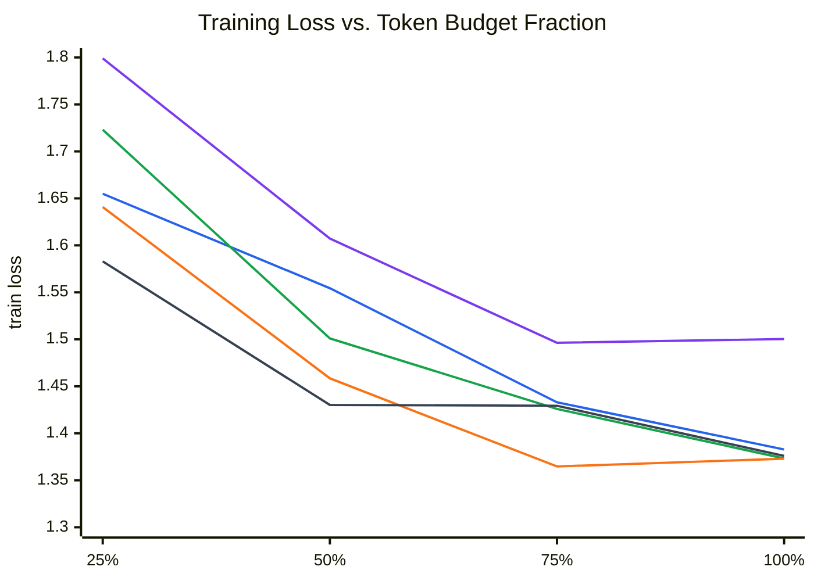

Series order: batch 32 blue, batch 64 green, batch 128 purple, batch 64 scaled
orange, batch 128 scaled gray.

| Token budget fraction | bs32 train loss | bs64 train loss | bs128 train loss | bs64 scaled train loss | bs128 scaled train loss |
| ---: | ---: | ---: | ---: | ---: | ---: |
| 25% | 1.6549 | 1.7231 | 1.7990 | 1.6408 | 1.5830 |
| 50% | 1.5544 | 1.5010 | 1.6072 | 1.4585 | 1.4302 |
| 75% | 1.4330 | 1.4259 | 1.4963 | 1.3647 | 1.4293 |
| 100% | 1.3828 | 1.3733 | 1.5003 | 1.3730 | 1.3760 |

Interpretation:

- Batch size 32 gives the best validation quality for the fixed token budget,
  likely because it gets 40k optimizer updates instead of 20k or 10k.
- Larger batches saw the same total number of tokens, but each optimizer update
  averaged over more examples. That reduces gradient noise, but it also means the
  model parameters were changed fewer times across the run. In these results, the
  lost update count mattered more than the lower-noise gradient estimate.
- The first batch-size sweep used the same `max_lr=3e-4` schedule family for all
  batch sizes. Large-batch training often needs LR retuning; a common first check
  is linear LR scaling with batch size while keeping warmup measured in tokens.
  Here that gives `max_lr=6e-4` for batch 64 and `max_lr=1.2e-3` for batch 128.
- The LR-scaled follow-ups confirm the LR-retuning hypothesis. Batch 64 improved
  from final validation loss `1.4442` to `1.3755`, and batch 128 improved from
  `1.4891` to `1.3634`.
- After LR scaling, batch size 128 gives the best validation loss and fastest
  runtime among these fixed-token runs. Batch size 64 scaled is close behind and
  is also better than the original batch 32 baseline.
- For a final quality-focused run under this token budget, the best observed
  setting is batch size 128 with `max_lr=1.2e-3`. Batch size 64 with `max_lr=6e-4`
  is a slightly more conservative alternative.

Practical summary:

- Increasing batch size alone did not help, because the larger-batch runs had
  fewer optimizer updates under the fixed token budget.
- Increasing LR for larger batches made each update more useful and recovered
  the lost progress; this is why linear LR scaling helped so much.
- Increasing LR for small batches is less safe, because smaller batches have
  noisier gradients. A modest short-run probe such as batch 32 with `max_lr=1e-3`
  is reasonable, but jumping too high can degrade quality, as seen with `1e-2`.
- The best current production choice from these experiments is batch 128 with
  `max_lr=1.2e-3`; batch 64 with `max_lr=6e-4` is a safer fallback if batch 128
  is less convenient operationally.

GPU memory-limit fit probes:

These probes used short 1000-step runs with `eval_every=100` and
`ckpt_every=100` to bracket the largest batch size that fits for this model at
`context_length=256` on the H100 instance. They are memory/throughput probes, not
quality comparisons.

| Run ID | Display name | Batch size | Status | Outcome |
| --- | --- | ---: | --- | --- |
| `heroic_owl_0n479k5wpp` | `cs336-bs-256-fit-eIiz8` | 256 | Completed | Fits; final val loss `2.1555`, final val ppl `8.63`. |
| `plum_bag_nflv2nk5nh` | `cs336-bs-512-fit-hantK` | 512 | Completed | Fits; final val loss `2.1037`, final val ppl `8.20`. |
| `elated_yuca_hrd3wytv79` | `cs336-bs-1024-fit-SHjx6` | 1024 | Failed | CUDA OOM: PyTorch had allocated `73.91 GiB` on a `79.18 GiB` H100 and failed trying to allocate another `4.00 GiB`. |

Conclusion: batch size 512 is the largest tested batch size that fits. Batch
1024 is beyond the current memory limit without memory-saving changes such as
gradient accumulation, activation checkpointing, mixed precision, or a smaller
model/context.

Attention-memory scaling:

The dominant batch-dependent memory term in standard attention is the attention
matrix. For one layer, one fp32 attention matrix has shape
`batch_size * num_heads * context_length * context_length`, so with
`num_heads=16` and `context_length=256` it costs:

```text
batch_size * 16 * 256^2 * 4 bytes
```

This implementation explicitly materializes both `scores` and `weights` in
`scaled_dot_product_attention`, so the practical per-layer attention storage is
at least two such matrices before counting backward-pass saved tensors and
temporary buffers.

| Batch size | One attention matrix | Scores + probabilities per layer | Scores + probabilities across 4 layers | QKV activations per layer | Final logits |
| ---: | ---: | ---: | ---: | ---: | ---: |
| 32 | 0.12 GiB | 0.25 GiB | 1.00 GiB | 0.05 GiB | 0.31 GiB |
| 64 | 0.25 GiB | 0.50 GiB | 2.00 GiB | 0.09 GiB | 0.61 GiB |
| 128 | 0.50 GiB | 1.00 GiB | 4.00 GiB | 0.19 GiB | 1.22 GiB |
| 256 | 1.00 GiB | 2.00 GiB | 8.00 GiB | 0.38 GiB | 2.44 GiB |
| 512 | 2.00 GiB | 4.00 GiB | 16.00 GiB | 0.75 GiB | 4.88 GiB |
| 1024 | 4.00 GiB | 8.00 GiB | 32.00 GiB | 1.50 GiB | 9.77 GiB |

For example, the batch-256 row is computed as follows:

```text
one attention matrix
= batch_size * num_heads * context_length * context_length * bytes_per_value
= 256 * 16 * 256 * 256 * 4 bytes
= 268,435,456 fp32 values * 4 bytes
= 1,073,741,824 bytes
= 1.00 GiB

scores + probabilities per layer
= 1.00 GiB for scores + 1.00 GiB for softmax probabilities
= 2.00 GiB

scores + probabilities across 4 layers
= 2.00 GiB per layer * 4 layers
= 8.00 GiB
```

The batch-1024 failure tried to allocate another `4.00 GiB`, exactly matching
one fp32 attention matrix at `batch_size=1024`. That is strong evidence that the
quadratic `batch_size * num_heads * context_length^2` attention term is the
immediate memory wall for the largest probe.

Follow-up verification runs:

| Run label | Batch size | Max LR | Min LR | Warmup | Max iters | Purpose |
| --- | ---: | ---: | ---: | ---: | ---: | --- |
| `bs_64_lr_scaled` | 64 | 6e-4 | 6e-5 | 500 | 20,000 | Confirmed: final val loss improved to `1.3755`. |
| `bs_128_lr_scaled` | 128 | 1.2e-3 | 1.2e-4 | 250 | 10,000 | Confirmed: final val loss improved to `1.3634`. |

### Generation Evaluation

Generation used the best validation-loss checkpoint from the batch-size
experiments: `loving_leg_8qkg5smb8w`, batch size 128 with linearly scaled
`max_lr=1.2e-3`. Samples are saved in `docs/generation_samples.md`.

Prompt:

```text
Once upon a time, there was a little girl named Lily
```

| Run label | Temperature | Top-p | Seed | Qualitative result |
| --- | ---: | ---: | ---: | --- |
| `greedy` | 0.0 | none | 11 | Very coherent, safe, and generic; clean magic teddy-bear story ending with `<|endoftext|>`. |
| `t0.8_p0.9` | 0.8 | 0.9 | 12 | Fluent repair-story sample; conservative and well-structured. |
| `t1.0_p0.9` | 1.0 | 0.9 | 13 | More varied, still readable; has a small causal oddity involving a mosquito and ball. |
| `t1.1_p0.95` | 1.1 | 0.95 | 14 | More diverse but less grounded; semantic drift around the magic pencil, ball, school, and microscope. |

Interpretation:

- The checkpoint clearly learned TinyStories style: simple vocabulary, short
  sentences, child protagonist, small conflict, resolution, and explicit
  `<|endoftext|>` stopping.
- Lower-temperature decoding improves coherence but becomes generic. Higher
  temperature/top-p settings add variety at the cost of consistency.
- The best practical decoding setting from these samples is `temperature=0.8,
  top_p=0.9` for reliable fluency. `temperature=1.0, top_p=0.9` is a reasonable
  alternative when more variety is desired.


