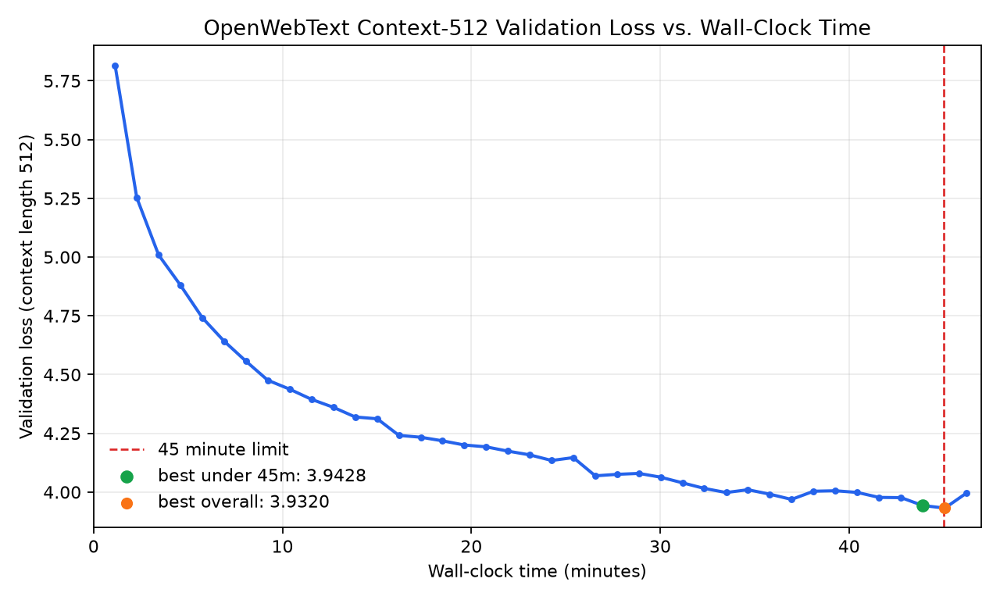
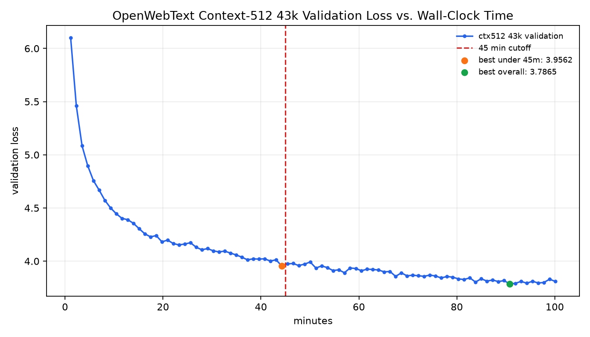

# Leaderboard Submission Draft

## Markdown Table Row

```markdown
| Pehong Chen | 3.9428 | images/owt_ctx512_wallclock_learning_curve.png |   |
```

## Pull Request Description

Final validation loss: `3.9428`

Learning curve: `images/owt_ctx512_wallclock_learning_curve.png`



What I did:

I trained the assignment Transformer language model on the provided OpenWebText
subsample with a 32k BPE vocabulary. The model used 4 Transformer layers,
`d_model=512`, 16 attention heads, `d_ff=1344`, RoPE, context length 512, batch
size 32, AdamW, weight decay 0.01, gradient clipping 1.0, linear warmup for 500
iterations, and cosine decay from `6e-4` to `6e-5` over 20000 iterations. The run
processed 327,680,000 tokens.

Validation was logged every 500 iterations at context length 512. The best
validation loss before the 45-minute cutoff was `3.9428` at 43.90 minutes. The
absolute best logged validation loss was `3.9320`, but it occurred at 45.07
minutes, just past the budget cutoff, so I am reporting the budget-compliant
`3.9428` result. The final logged validation loss was `3.9960` at 46.22 minutes.

The learning-curve image uses wall-clock time on the x-axis and shows the native
context-512 validation loss, including the 45-minute cutoff.

## Longer Context-512 Follow-Up

A later 43,000-iteration context-512 H100 run
(`hungry_kitchen_73m4w3vd00` / `cs336-owt-h100-ctx512-43k-Xv3Zh`) reached a
better overall validation loss of `3.7865` at 90.80 minutes and final validation
loss `3.7975`. Its best H100 loss before 45 minutes was `3.9562`, so this draft
keeps the stricter under-45-minute reported number `3.9428` from the 20k run.

